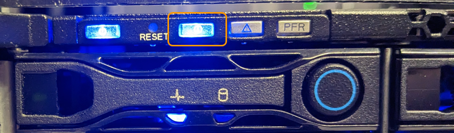

= 
:allow-uri-read: 

.Schritte
. Finden Sie die Appliance im Rechenzentrum.
+
** Achten Sie darauf, dass die blaue Identifizieren-LED auf der Vorderseite oder Rückseite des Geräts leuchtet.
+
Die ID-LED auf der Vorderseite befindet sich hinter der Frontblende und ist möglicherweise schwer zu erkennen, ob die Blende installiert ist.

+

+
Die hintere Identifizieren-LED befindet sich in der Mitte des Geräts unter dem Micro-SD-Steckplatz.

** Überprüfen Sie anhand der an der Vorderseite des Geräts angebrachten Etiketten, ob Sie das richtige Gerät gefunden haben.

. Entfernen Sie gegebenenfalls die Frontverkleidung, um Zugang zu den Bedienelementen und Anzeigen auf der Vorderseite zu erhalten.

