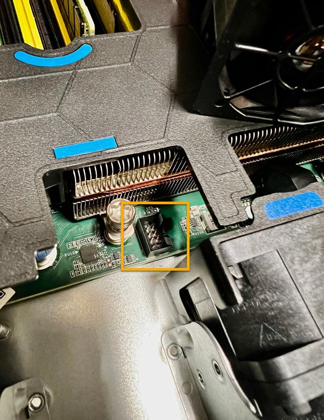

= 
:allow-uri-read: 

.Über diese Aufgabe
Um Serviceunterbrechungen zu vermeiden, vergewissern Sie sich, dass alle anderen Storage-Nodes mit dem Grid verbunden sind, bevor Sie den Lüfteraustausch starten oder den Lüfter während eines geplanten Wartungsfensters austauschen, wenn Serviceunterbrechungen akzeptabel sind. Weitere Informationen finden Sie unter https://docs.netapp.com/us-en/storagegrid-118/monitor/monitoring-system-health.html#monitor-node-connection-states["Monitoring der Verbindungsstatus der Nodes"^].

CAUTION: Wenn Sie jemals eine ILM-Regel verwendet haben, die nur eine Kopie eines Objekts erstellt, müssen Sie den Lüfter während eines geplanten Wartungsfensters ersetzen, da während dieses Vorgangs vorübergehend der Zugriff auf diese Objekte verloren geht. Siehe Informationen zu https://docs.netapp.com/us-en/storagegrid-118/ilm/why-you-should-not-use-single-copy-replication.html["Warum sollten Sie die Single-Copy-Replizierung nicht verwenden"^].

Auf den Geräteknoten kann nicht zugegriffen werden, wenn Sie den Lüfter austauschen.

Das Foto zeigt einen Ventilator für das Gerät. Der elektrische Anschluss ist markiert. Die Kühllüfter sind zugänglich, nachdem Sie die obere Abdeckung aus dem Gerät nehmen.

NOTE: Jede der beiden Netzteile enthält zudem einen Lüfter. Die Netzteillüfter sind in diesem Verfahren nicht enthalten.

image::../media/sgf6112_fan_fru.png[Lüfter-FRU]

.Schritte
. Wickeln Sie das Gurt-Ende des ESD-Armbands um Ihr Handgelenk, und befestigen Sie das Clip-Ende auf einer Metallmasse, um eine statische Entladung zu verhindern.
. Suchen Sie den Lüfter, den Sie ersetzen müssen.
+
Die acht Lüfter befinden sich in den folgenden Positionen im Gehäuse (vordere Hälfte des StorageGRID-Geräts mit entfernter oberer Abdeckung):

+
image::../media/SGF6112-fan-locations.png[Lüfterpositionen]

|===

|  | Lüftereinheit 

 a| 
1
 a| 
Fan_SYS0

 a| 
2
 a| 
Fan_SYS1

 a| 
3
 a| 
Fan_SYS2

 a| 
4
 a| 
Fan_SYS3

 a| 
5
 a| 
Fan_SYS4

 a| 
6
 a| 
Fan_SYS5

 a| 
7
 a| 
Fan_SYS6

 a| 
8
 a| 
Fan_SYS7

|===
. Heben Sie den defekten Lüfter mithilfe der blauen Laschen am Lüfter aus dem Gehäuse.
+
image::../media/fan_removal.png[Ausbau Des Lüfters]

. Schieben Sie den Ersatzlüfter in den offenen Steckplatz des Gehäuses.
+
Stellen Sie sicher, dass der Anschluss am Lüfter an der Buchse in der Platine ausgerichtet ist.

. Drücken Sie den Lüfteranschluss fest in die Platine (Buchse hervorgehoben).
+

