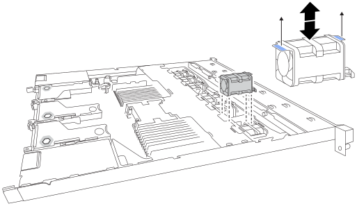

= 
:allow-uri-read: 

.Schritte
. Wickeln Sie das Gurt-Ende des ESD-Armbands um Ihr Handgelenk, und befestigen Sie das Clip-Ende auf einer Metallmasse, um eine statische Entladung zu verhindern.
. Suchen Sie den Lüfter, den Sie ersetzen müssen.
+
Die sieben Lüfter befinden sich an folgenden Positionen im Gehäuse (Vorderhälfte des StorageGRID Appliance mit abgenommener oberer Abdeckung dargestellt):

+
image::../media/drw_fan_position_ieops-2614.svg[Lüfterpositionen im StorageGRID Gerätegehäuse]

+
|===
| Chassis-Position | Lüftereinheit 

 a| 
1
 a| 
Fan_SYS0

 a| 
2
 a| 
Fan_SYS1

 a| 
3
 a| 
Fan_SYS2

 a| 
4
 a| 
Fan_SYS3

 a| 
5
 a| 
Fan_SYS4

 a| 
6
 a| 
Fan_SYS5

 a| 
7
 a| 
Fan_SYS6

|===
. Heben Sie den defekten Lüfter mithilfe der blauen Laschen am Lüfter aus dem Gehäuse.
+

. Schieben Sie den Ersatzlüfter in den offenen Steckplatz des Gehäuses.
+
Richten Sie den Stecker am Lüfter mit der Buchse auf der Platine aus.

. Drücken Sie den Lüfteranschluss fest in die Leiterplatte.

