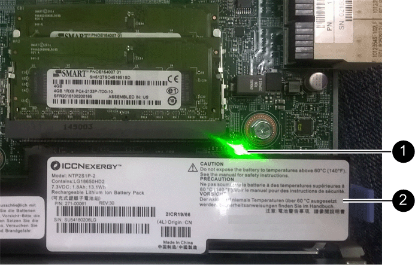
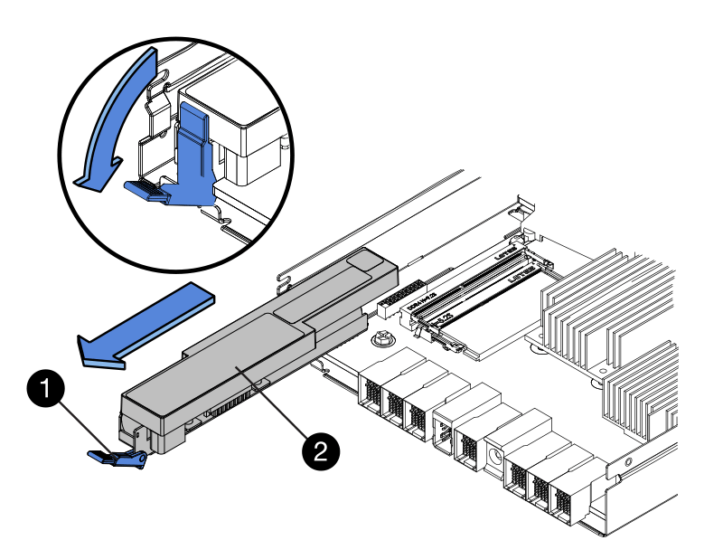
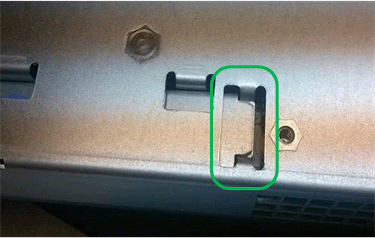

= Schritt 4: Batterie auf den neuen Controller bringen
:allow-uri-read: 

== Schritt 4: Batterie auf den neuen Controller bringen

Entfernen Sie den Akku aus dem fehlerhaften Controller, und setzen Sie ihn in den Ersatz-Controller ein.

.Schritte
. Vergewissern Sie sich, dass die grüne LED im Controller (zwischen Akku und DIMMs) aus ist.
+
Wenn diese grüne LED leuchtet, wird der Controller weiterhin mit Strom versorgt. Sie müssen warten, bis diese LED erlischt, bevor Sie Komponenten entfernen.

+

+
[cols="1a,2a"]
|===
| Element | Beschreibung 

 a| 
1
 a| 
Interne LED für aktiven Cache

 a| 
2
 a| 
Batterie

|===
. Suchen Sie den blauen Freigabehebel für die Batterie.
. Entriegeln Sie den Akku, indem Sie den Entriegelungshebel nach unten und aus dem Controller entfernen.
+

+
[cols="1a,2a"]
|===
| Element | Beschreibung 

 a| 
1
 a| 
Akkufreigaberiegel

 a| 
2
 a| 
Batterie

|===
. Heben Sie den Akku an, und schieben Sie ihn aus dem Controller.
. Entfernen Sie die Abdeckung vom Ersatzcontroller.
. Richten Sie den Ersatz-Controller so aus, dass der Steckplatz für die Batterie zu Ihnen zeigt.
. Setzen Sie den Akku in einem leichten Abwärtswinkel in den Controller ein.
+
Sie müssen den Metallflansch an der Vorderseite der Batterie in den Schlitz an der Unterseite des Controllers einsetzen und die Oberseite der Batterie unter den kleinen Ausrichtstift auf der linken Seite des Controllers schieben.

. Schieben Sie die Akkuverriegelung nach oben, um die Batterie zu sichern.
+
Wenn die Verriegelung einrastet, Haken unten an der Verriegelung in einen Metallschlitz am Gehäuse.

. Drehen Sie den Controller um, um zu bestätigen, dass der Akku korrekt installiert ist.
+

CAUTION: *Mögliche Hardwarebeschädigung* – Der Metallflansch an der Vorderseite des Akkus muss vollständig in den Steckplatz des Controllers eingesetzt sein (siehe erste Abbildung). Ist der Akku nicht korrekt eingesetzt (siehe zweite Abbildung), kann der Metallflansch die Controllerplatine berühren und diese beschädigen.

+
** *Korrekt -- der Metallflansch der Batterie ist vollständig in den Schlitz am Controller eingesetzt:*
+

** *Falsch – Der Metallflansch der Batterie ist nicht in den Schlitz am Controller eingesetzt:*
+
image::../media/e2800_battery_flange_not_ok.gif[Batterieflansch Nicht Korrekt]

. Bringen Sie die Controllerabdeckung wieder an.

