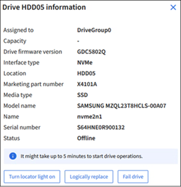

= Verwenden Sie die Registerkarte Laufwerke managen (SG110, SG1100, SGF6112 und SG6160).
:allow-uri-read: 
:icons: font
:imagesdir: ../media/

[role="lead"]
Auf der Registerkarte Laufwerke verwalten im Grid Manager können Sie Fehlerbehebungs- und Wartungsaufgaben für Laufwerke für Geräte durchführen, die diese Funktion unterstützen.

.Bevor Sie beginnen
Sie sind im Grid Manager mit einem angemeldet https://docs.netapp.com/us-en/storagegrid/admin/web-browser-requirements.html["Unterstützter Webbrowser"^].

.Über diese Aufgabe
Wenn Sie über eine Appliance verfügen, die diese Funktion unterstützt, wird auf der Seite mit den Gerätedetails die https://docs.netapp.com/us-en/storagegrid/admin/admin-group-permissions.html["Zugriffsberechtigung für den Administrator der Storage-Appliance oder den Root-Zugriff"^] Registerkarte , Laufwerke verwalten angezeigt.

NOTE: Für StorageGRID 11.8 wird die Registerkarte Laufwerke verwalten nur für die SGF6112-Appliance unterstützt.

Die Registerkarte Laufwerke managen enthält die folgenden Ansichten:

Layout:: Layout der Datenspeicherungslaufwerke in der Appliance. Wählen Sie ein Laufwerk aus, um die Laufwerkdetails anzuzeigen.
+
--
image:../media/manage_drives_tab.png["Registerkarte Laufwerke verwalten Layoutansicht"]

--
Tabelle:: Listet Informationen für jedes Laufwerk auf. Wählen Sie ein Laufwerk aus, um die Laufwerkdetails anzuzeigen.
+
--
image:../media/manage_drives_tab_table.png["Registerkarte Laufwerke verwalten Tabellenansicht"]

--
Laufwerksinformationen:: Zusammenfassung für jedes Laufwerk. Wählen Sie die entsprechende Task-Schaltfläche, wie in den Schritten unten beschrieben.
+
--

--

== Die Positionsanzeige ein- oder ausschalten

So finden Sie ein Laufwerk in der Appliance physisch:

. Wählen Sie im Grid Manager *NODES* > *_Data Center_* aus.
. Wählen Sie *_Appliance Storage Node_* > *Manage Drives* > *Layout* > *_Drive_*.
+
Das Fenster mit den Laufwerkdetails wird angezeigt.

. Wählen Sie *Positionsanzeige ein*.
+
** Für das Laufwerk wird ein Leuchtstoffsymbol image:../media/icon_drive-light-bulb.png["Glühlampe der Antriebsleuchte"] angezeigt.
** Eine gelbe LED blinkt auf dem physischen Laufwerk.

. Wenn Sie die Positionsanzeige ausschalten möchten, wählen Sie *Positionsanzeige ausschalten*.

== [[Logicy-replace-drive]]Laufwerk logisch ersetzen

Wenn ein Laufwerk in der Speicher-Appliance neu erstellt oder neu initialisiert werden muss:

. Wählen Sie im Grid Manager *NODES* > *_Data Center_* aus.
. Wählen Sie *_Appliance Storage Node_* > *Manage Drives* > *Layout* > *_Drive_*.
+
Das Fenster mit den Laufwerkdetails wird angezeigt.

. Wählen Sie *logisch ersetzen*.
+
Im Detailbereich des Laufwerks zeigt der Status des Laufwerks _Rebuilding_ an. Der Neuaufbau eines Laufwerks kann bis zu 5 Minuten dauern.

== Laufwerk ausfällt

Für die Fehlerbehebung können Sie ein Laufwerk, das vermutlich fehlerhaft ist, manuell „ausfallen“. Das System läuft dann ohne dieses Laufwerk.

. Wählen Sie im Grid Manager *NODES* > *_Data Center_* aus.
. Wählen Sie *_Appliance Storage Node_* > *Manage Drives* > *Layout* > *_Drive_*.
+
Das Fenster mit den Laufwerkdetails wird angezeigt.

. Wählen Sie *FAIL drive*.

Nach dem Ausfall eines Laufwerks müssen Sie entweder das Laufwerk oder physisch austauschen <<logically-replace-drive,Ersetzen Sie das Laufwerk logisch>>.
