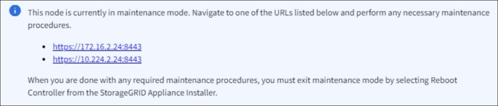

= Stellen Sie das Gerät in den Wartungsmodus
:allow-uri-read: 
:icons: font
:imagesdir: ../media/

[role="lead"]
Sie müssen das Gerät in den Wartungsmodus versetzen, bevor Sie bestimmte Wartungsarbeiten durchführen.

.Bevor Sie beginnen
* Sie sind im Grid Manager mit einem angemeldet https://docs.netapp.com/us-en/storagegrid/admin/web-browser-requirements.html["Unterstützter Webbrowser"^].
* Sie haben die Berechtigung Wartung oder Stammzugriff. Weitere Informationen finden Sie in den Anweisungen zum Verwalten von StorageGRID.

.Über diese Aufgabe
In seltenen Fällen kann es vorkommen, dass eine StorageGRID Appliance in den Wartungsmodus versetzt wird, damit die Appliance für den Remote-Zugriff nicht verfügbar ist.

NOTE: Das Passwort des Admin-Kontos und die SSH-Host-Schlüssel für eine StorageGRID-Appliance im Wartungsmodus bleiben identisch mit dem Kennwort, das zum Zeitpunkt der Wartung der Appliance vorhanden war.

.Schritte
. Wählen Sie im Grid Manager die Option *NODES* aus.
. Wählen Sie in der Strukturansicht der Seite Knoten den Appliance Storage Node aus.
. Wählen Sie *Aufgaben*.
. Wählen Sie *Wartungsmodus*. Ein Bestätigungsdialogfeld wird angezeigt.
. Geben Sie die Provisionierungs-Passphrase ein, und wählen Sie *OK*.
+
Eine Fortschrittsleiste und eine Reihe von Meldungen, darunter „Anfrage gesendet“, „StorageGRID stoppen“ und „neu booten“, geben an, dass die Appliance die Schritte zum Eintritt in den Wartungsmodus abschließt.

+
Wenn sich die Appliance im Wartungsmodus befindet, wird in einer Bestätigungsmeldung die URLs aufgeführt, mit denen Sie auf das Installationsprogramm der StorageGRID-Appliance zugreifen können.

+

. Um auf das Installationsprogramm der StorageGRID-Appliance zuzugreifen, navigieren Sie zu einer beliebigen der angezeigten URLs.
+
Verwenden Sie nach Möglichkeit die URL, die die IP-Adresse des Admin Network-Ports der Appliance enthält.

+

NOTE: Wenn Sie über eine direkte Verbindung zum Management-Port der Appliance verfügen, verwenden Sie `+https://169.254.0.1:8443+` So greifen Sie auf die Seite StorageGRID-Appliance-Installationsprogramm zu.

. Vergewissern Sie sich beim Installationsprogramm der StorageGRID Appliance, dass sich die Appliance im Wartungsmodus befindet.
. Führen Sie alle erforderlichen Wartungsaufgaben durch.
. Beenden Sie nach Abschluss der Wartungsaufgaben den Wartungsmodus und fahren Sie den normalen Node-Betrieb fort. Wählen Sie im Installationsprogramm der StorageGRID-Appliance die Option *Erweitert* > *Controller neu starten* aus, und wählen Sie dann *Neustart in StorageGRID* aus.
+
Es kann bis zu 20 Minuten dauern, bis das Gerät neu gestartet wird und sich wieder mit dem Netz verbindet.  So bestätigen Sie, dass der Neustart abgeschlossen ist und der Knoten wieder dem Grid beigetreten ist:

+
.. Wählen Sie im Grid Manager *NODES* aus.
.. Überprüfen Sie, ob der Appliance-Knoten einen normalen Status hat (grünes Häkchen-Symbolimage:../media/icon_alert_green_checkmark.png["Grünes Häkchen"] links neben dem Knotennamen), was darauf hinweist, dass keine Warnungen aktiv sind und der Knoten mit dem Grid verbunden ist.

