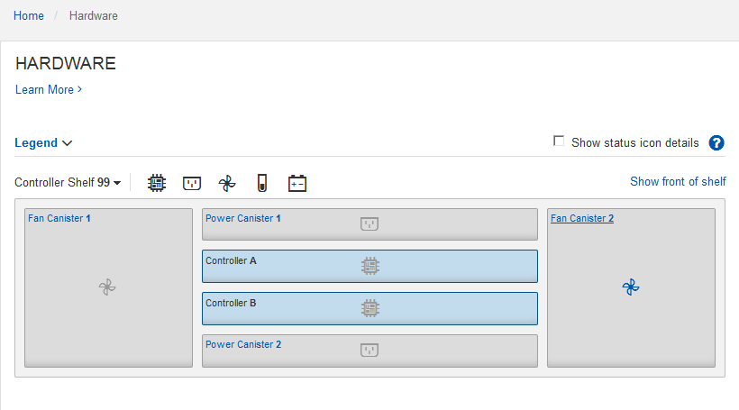

= Konfiguration von SANtricity System Manager (SG6160, SG6000, SG5700 und SG5800)
:allow-uri-read: 
:icons: font
:imagesdir: ../media/

[role="lead"]
Mit SANtricity System Manager lässt sich der Status von Storage Controllern, Storage-Festplatten und anderen Hardwarekomponenten im Storage Controller-Shelf überwachen. Sie können außerdem einen Proxy für AutoSupport der E-Series konfigurieren, mit dem Sie AutoSupport Meldungen von der Appliance senden können, ohne den Managementport zu verwenden.

== Einrichten und Zugreifen auf SANtricity System Manager

Sie müssen möglicherweise auf SANtricity System Manager auf dem Storage Controller zugreifen, um die Hardware im Storage Controller Shelf zu überwachen oder um E-Series AutoSupport zu konfigurieren.

.Bevor Sie beginnen
* Sie verwenden einen https://docs.netapp.com/us-en/storagegrid/admin/web-browser-requirements.html["Unterstützter Webbrowser"^].
* Für den Zugriff auf den SANtricity System Manager über den Grid-Manager haben Sie StorageGRID installiert, und Sie verfügen über die Berechtigung zum Administrator der Storage-Appliance oder zum Root-Zugriff.
* Um über das Installationsprogramm für das StorageGRID-Gerät auf den SANtricity-System-Manager zuzugreifen, verfügen Sie über den Benutzernamen und das Kennwort des SANtricity-System-Managers.
* Für den direkten Zugriff auf SANtricity System Manager über einen Webbrowser verfügen Sie über den Benutzernamen und das Passwort für den SANtricity System Manager Administrator.

NOTE: Sie müssen über SANtricity-Firmware 8.70 oder höher verfügen, um mithilfe des Grid-Managers oder des StorageGRID-Appliance-Installationsprogramms auf SANtricity System Manager zuzugreifen. Sie können Ihre Firmware-Version mithilfe des StorageGRID-Appliance-Installationsprogramms überprüfen und wählen *Hilfe* > *Info*.

NOTE: Der Zugriff auf den SANtricity System Manager über den Grid Manager oder über den Appliance Installer beschränkt sich im Allgemeinen nur auf die Überwachung der Hardware und die Konfiguration von E-Series AutoSupport. Viele Funktionen und Vorgänge in SANtricity System Manager, beispielsweise ein Firmware-Upgrade, gelten nicht für die Überwachung Ihrer StorageGRID Appliance. Um Probleme zu vermeiden, befolgen Sie immer die Hardware-Installations- und Wartungsanweisungen für Ihr Gerät.

.Über diese Aufgabe
Es gibt drei Möglichkeiten, auf den SANtricity System Manager zuzugreifen, je nachdem, in welcher Phase des Installations- und Konfigurationsprozesses Sie sich befinden:

* Wenn die Appliance noch nicht als Knoten in Ihrem StorageGRID-System bereitgestellt wurde, sollten Sie die Registerkarte Erweitert im StorageGRID-Appliance-Installationsprogramm verwenden.
+

NOTE: Sobald der Knoten bereitgestellt ist, können Sie den StorageGRID Appliance Installer zum Zugriff auf den SANtricity System Manager nicht mehr verwenden.

* Wenn die Appliance als Node in Ihrem StorageGRID-System bereitgestellt wurde, verwenden Sie die Registerkarte SANtricity System Manager auf der Seite Nodes im Grid Manager.
* Wenn Sie das Installationsprogramm oder den Grid-Manager der StorageGRID Appliance nicht verwenden können, können Sie über einen mit dem Managementport verbundenen Webbrowser direkt auf den SANtricity System Manager zugreifen.

Diese Vorgehensweise umfasst Schritte für den ersten Zugriff auf den SANtricity System Manager. Wenn Sie SANtricity System Manager bereits eingerichtet haben, fahren Sie mit fort  <<config_hardware_alerts_sg6000,Schritt für die Hardware-Warnmeldungen konfigurieren>>.

NOTE: Wenn Sie entweder den Grid-Manager oder den StorageGRID-Appliance-Installer verwenden, können Sie auf SANtricity System Manager zugreifen, ohne den Management-Port der Appliance konfigurieren oder verbinden zu müssen.

Mit SANtricity System Manager überwachen Sie Folgendes:

* Performance-Daten wie die Performance auf Storage-Array-Ebene, I/O-Latenz, CPU-Auslastung und Durchsatz
* Status der Hardwarekomponenten
* Unterstützung von Funktionen, einschließlich Anzeige von Diagnosedaten

Mit SANtricity System Manager können Sie die folgenden Einstellungen konfigurieren:

* E-Mail-Warnmeldungen, SNMP-Warnmeldungen oder Syslog-Warnmeldungen für die Komponenten im Storage Controller-Shelf
* AutoSupport-Einstellungen der E-Series für die Komponenten im Storage Controller Shelf
+
Weitere Informationen zu E-Series AutoSupport finden Sie im https://docs.netapp.com/us-en/e-series-family/index.html["Dokumentation zur NetApp E-Series"^].

* Laufwerkssicherheitsschlüssel, die zum Entsperren gesicherter Laufwerke erforderlich sind (dieser Schritt ist erforderlich, wenn die Laufwerksicherheitsfunktion aktiviert ist)
* Administratorpasswort für den Zugriff auf SANtricity System Manager

.Schritte
. Führen Sie einen der folgenden Schritte aus:
+
** Verwenden Sie das StorageGRID-Appliance-Installationsprogramm, und wählen Sie *Erweitert* > *SANtricity-Systemmanager*
** Verwenden Sie den Grid-Manager und wählen Sie *NODES* > aus `*_appliance Storage Node_*` > *SANtricity System Manager*

+

NOTE: Wenn diese Optionen nicht verfügbar sind oder die Anmeldeseite nicht angezeigt wird, verwenden Sie die <<Legen Sie IP-Adressen für Storage Controller mithilfe des StorageGRID Appliance Installer fest,IP-Adressen für die Storage Controller>>. Greifen Sie auf SANtricity System Manager zu, indem Sie die Storage Controller-IP aufrufen.

. Legen Sie das Administratorpasswort fest oder geben Sie es ein.
+
SANtricity System Manager verwendet ein einziges Administratorkennwort, das von allen Benutzern verwendet wird.

+
image::../media/san_setup_wizard.gif[Screenshot mit Schaltfläche Abbrechen für Einrichtungsassistent]

. Wählen Sie *Abbrechen*, um den Assistenten zu schließen.
+

NOTE: Schließen Sie den Einrichtungsassistenten für eine StorageGRID Appliance nicht ab.

+
image::../media/sam_home_page.gif[Screenshot der Startseite von SANtricity System Manager]

. [[config_Hardware_Alerts_sg6000, Start=4]]Hardware-Warnmeldungen konfigurieren.
+
.. Wählen Sie *Hilfe*, um die Online-Hilfe für SANtricity System Manager zu öffnen.
.. Verwenden Sie den Abschnitt *Einstellungen* > *Alarme* der Online-Hilfe, um mehr über Warnungen zu erfahren.
.. Folgen Sie den Anweisungen „`How to`“, um E-Mail-Warnmeldungen, SNMP-Warnmeldungen oder Syslog-Warnmeldungen einzurichten.

. Managen Sie AutoSupport für die Komponenten im Storage Controller Shelf.
+
.. Wählen Sie *Hilfe*, um die Online-Hilfe für SANtricity System Manager zu öffnen.
.. Im Abschnitt *SUPPORT* > *Support Center* der Online-Hilfe erfahren Sie mehr über die AutoSupport-Funktion.
.. Folgen Sie den Anweisungen „`Anleitung`“, um AutoSupport zu managen.
+
Spezielle Anweisungen zum Konfigurieren eines StorageGRID-Proxys zum Senden von E-Series AutoSupport-Meldungen ohne Verwendung des Management-Ports finden Sie unter https://docs.netapp.com/us-en/storagegrid/admin/configuring-storage-proxy-settings.html["Anweisungen zur Konfiguration von Speicher-Proxy-Einstellungen"^] .

. Wenn https://docs.netapp.com/us-en/e-series-santricity/sm-settings/overview-drive-security.html#what-is-drive-security["Laufwerkssicherheit"^] für die Appliance aktiviert ist, erstellen und verwalten Sie den Sicherheitsschlüssel.
+
[role="tabbed-block"]
====
.SG5700 und SG5800
--
Führen Sie bei Storage Appliances der SG5700 und SG5800 die grundlegenden Schritte https://docs.netapp.com/us-en/e-series-santricity/sm-settings/how-the-drive-security-feature-works.html#how-to-implement-drive-security["Laufwerksicherheit implementieren"^] in SANtricity System Manager aus.

--
.SG6060
--
Bei der SG6060-Storage-Appliance kann die Laufwerksicherheit nur dann automatisch auf den SSD-Laufwerken aktiviert werden, wenn die Schlüsselverwaltung vor der Installation der Storage Appliance konfiguriert wurde.

.. Statten Sie Ihr Storage-Array mit sicheren Laufwerken (FDE-Laufwerke oder FIPS-Laufwerke) aus.
+
*** Für Volumes, die FIPS-Unterstützung erfordern, verwenden Sie nur FIPS-Laufwerke.
*** Durch die Kombination von FIPS- und FDE-Laufwerken in einer Volume-Gruppe oder einem Pool werden alle Laufwerke als FDE-Laufwerke behandelt.
*** Ein FDE-Laufwerk kann nicht zu einer reinen FIPS-Volume-Gruppe oder einem Pool hinzugefügt oder als Ersatzlaufwerk verwendet werden.

.. Erstellen Sie für das E4000-Controller-Shelf einen Sicherheitsschlüssel (eine Zeichenfolge, die vom Controller und von den Laufwerken für Lese- und Schreibzugriff gemeinsam genutzt wird).
+
*** Sie können https://docs.netapp.com/us-en/e-series-santricity/sm-settings/create-internal-security-key.html["Erstellen Sie einen internen Schlüssel"^] aus dem persistenten Speicher des Controllers oder einen externen Schlüssel verwenden, der von einem Verschlüsselungsmanagement-Server bereitgestellt wird.
*** Um einen externen Schlüssel zu verwenden, der von einem Schlüsselverwaltungsserver bereitgestellt wird, müssen Sie zuerst https://docs.netapp.com/us-en/e-series-santricity/sm-settings/overview-drive-security.html["Einrichten der Authentifizierung mit einem Verschlüsselungsmanagement-Server"^] in SANtricity System Manager arbeiten.

.. link:deploying-appliance-storage-node.html["Starten Sie die Installation"] Des Geräts.
.. Vergewissern Sie sich nach Abschluss der Appliance-Installation, dass die Laufwerksicherheit für den StorageGRID Flash Cache aktiviert wurde, und aktivieren Sie die Laufwerksicherheit für alle verbleibenden Laufwerkpools oder Volume-Gruppen (siehe https://docs.netapp.com/us-en/e-series-santricity/sm-storage/enable-security.html["Aktivieren Sie die Sicherheit für einen Pool oder eine Volume-Gruppe"^] in SANtricity System Manager).

--
.SG6160
--
Die SG6160 Storage Appliance kann sowohl im SG6100-CN Computing-Controller als auch im E4000 Controller-Shelf mit FIPS-konformen Laufwerken ausgestattet werden. Die Laufwerkverschlüsselung wird separat für die SG6100-CN-Laufwerke und E4000 Laufwerke konfiguriert.

.. link:optional-enabling-node-encryption.html#drive-encryption["Aktivieren Sie Die Laufwerkverschlüsselung"] Für SED-SSDs, die im SG6100-CN-Compute-Node installiert sind.
.. Erstellen Sie einen Sicherheitsschlüssel (eine Zeichenkette, die vom Controller und den Laufwerken für Lese-/Schreibzugriff gemeinsam genutzt wird).
+
*** Sie können https://docs.netapp.com/us-en/e-series-santricity/sm-settings/create-internal-security-key.html["Erstellen Sie einen internen Schlüssel"^] aus dem persistenten Speicher des Controllers oder einen externen Schlüssel verwenden, der von einem Verschlüsselungsmanagement-Server bereitgestellt wird.
*** Um einen externen Schlüssel zu verwenden, der von einem Schlüsselverwaltungsserver bereitgestellt wird, müssen Sie zuerst https://docs.netapp.com/us-en/e-series-santricity/sm-settings/overview-drive-security.html["Einrichten der Authentifizierung mit einem Verschlüsselungsmanagement-Server"^] in SANtricity System Manager arbeiten.

.. link:deploying-appliance-storage-node.html["Starten Sie die Installation"] Des Geräts.
.. Nach Abschluss der Installation können https://docs.netapp.com/us-en/e-series-santricity/sm-storage/enable-security.html["Laufwerksicherheit aktivieren"^] alle Disk Pools oder Volume-Gruppen im SANtricity System Manager erstellt werden.

--
====

== Überprüfen Sie den Hardwarestatus in SANtricity System Manager

Mit SANtricity System Manager können Sie die einzelnen Hardwarekomponenten im Storage Controller-Shelf überwachen und verwalten. Darüber hinaus werden Hardware-Diagnose- und Umgebungsinformationen, z. B. Komponentententententemperaturen oder Problemen mit den Laufwerken, überprüft.

.Bevor Sie beginnen
* Sie verwenden einen https://docs.netapp.com/us-en/storagegrid/admin/web-browser-requirements.html["Unterstützter Webbrowser"^].
* Für den Zugriff auf den SANtricity System Manager über den Grid-Manager verfügen Sie über eine Administratorberechtigung oder Root-Zugriff der Storage-Appliance.
* Um über das Installationsprogramm für das StorageGRID-Gerät auf den SANtricity-System-Manager zuzugreifen, verfügen Sie über den Benutzernamen und das Kennwort des SANtricity-System-Managers.
* Für den direkten Zugriff auf SANtricity System Manager über einen Webbrowser verfügen Sie über den Benutzernamen und das Passwort für den SANtricity System Manager Administrator.

NOTE: Sie müssen über SANtricity-Firmware 8.70 oder höher verfügen, um mithilfe des Grid-Managers oder des StorageGRID-Appliance-Installationsprogramms auf SANtricity System Manager zuzugreifen.

NOTE: Der Zugriff auf den SANtricity System Manager über den Grid Manager oder über den Appliance Installer beschränkt sich im Allgemeinen nur auf die Überwachung der Hardware und die Konfiguration von E-Series AutoSupport. Viele Funktionen und Vorgänge in SANtricity System Manager, beispielsweise ein Firmware-Upgrade, gelten nicht für die Überwachung Ihrer StorageGRID Appliance. Um Probleme zu vermeiden, befolgen Sie immer die Hardware-Installations- und Wartungsanweisungen für Ihr Gerät.

.Schritte
. <<Einrichten und Zugreifen auf SANtricity System Manager,Greifen Sie auf SANtricity System Manager zu>>.
. Geben Sie bei Bedarf den Benutzernamen und das Kennwort des Administrators ein.
. Klicken Sie auf *Abbrechen*, um den Einrichtungsassistenten zu schließen und die Startseite des SANtricity-System-Managers anzuzeigen.
+
Die Startseite von SANtricity System Manager wird angezeigt. In SANtricity System Manager wird das Controller Shelf als Storage-Array bezeichnet.

+
image::../media/sam_home_page.gif[Screenshot der Startseite von SANtricity System Manager]

. Überprüfen Sie die angezeigten Informationen für die Appliance-Hardware und vergewissern Sie sich, dass alle Hardwarekomponenten den Status „optimal“ aufweisen.
+
.. Klicken Sie auf die Registerkarte *Hardware*.
.. Klicken Sie auf *Zurück von Regal anzeigen*.
+

+
Von der Rückseite des Shelfs können Sie sowohl Storage-Controller als auch den Akku in jedem Storage Controller, die beiden Power Kanister, die beiden Lüfter-Kanister und Erweiterungs-Shelfs (falls vorhanden) anzeigen. Sie können auch Komponententententemperaturen anzeigen.

.. Um die Einstellungen für jeden Speicher-Controller anzuzeigen, wählen Sie den Controller aus, und wählen Sie im Kontextmenü *Einstellungen anzeigen* aus.
.. Um die Einstellungen für andere Komponenten auf der Rückseite des Shelf anzuzeigen, wählen Sie die Komponente aus, die Sie anzeigen möchten.
.. Klicken Sie auf *Vorderseite des Regals*, und wählen Sie die Komponente aus, die Sie anzeigen möchten.
+
Von der Vorderseite des Shelfs können die Laufwerke und die Laufwerksfächer für das Storage Controller-Shelf oder die Erweiterungs-Shelfs (falls vorhanden) angezeigt werden.

Falls der Status einer Komponente Achtung erfordert, führen Sie die Schritte im Recovery Guru zur Lösung des Problems durch oder wenden Sie sich an den technischen Support.

== Legen Sie IP-Adressen für Storage Controller mithilfe des StorageGRID Appliance Installer fest

Management-Port 1 auf jedem Storage-Controller verbindet die Appliance mit dem Managementnetzwerk für SANtricity System Manager. Wenn Sie vom Installationsprogramm der StorageGRID Appliance nicht auf den SANtricity System Manager zugreifen können, legen Sie eine statische IP-Adresse für jeden Storage Controller fest, um sicherzustellen, dass Ihre Managementverbindung zur Hardware und zur Controller-Firmware im Controller-Shelf nicht verloren geht.

.Bevor Sie beginnen
* Sie verwenden einen beliebigen Management-Client, der eine Verbindung zum StorageGRID-Admin-Netzwerk herstellen kann, oder Sie haben einen Service-Laptop.
* Der Client- oder Service-Laptop verfügt über einen unterstützten Webbrowser.

.Über diese Aufgabe
Adressen, die durch DHCP zugewiesen werden, können jederzeit geändert werden. Weisen Sie den Controllern statische IP-Adressen zu, um einen konsistenten Zugriff zu gewährleisten.

NOTE: Befolgen Sie dieses Verfahren nur, wenn Sie keinen Zugriff auf den SANtricity-System-Manager vom Installationsprogramm der StorageGRID-Appliance (*Erweitert* > *SANtricity-System-Manager*) oder vom Grid-Manager (*KNOTEN* > *SANtricity-System-Manager*) haben.

.Schritte
. Geben Sie auf dem Client die URL für den StorageGRID-Appliance-Installer ein: +
`*https://_Appliance_Controller_IP_:8443*`
+
Für `_Appliance_Controller_IP_`, Verwenden Sie die IP-Adresse für die Appliance in einem beliebigen StorageGRID-Netzwerk.

+
Die Startseite des StorageGRID-Appliance-Installationsprogramms wird angezeigt.

. Wählen Sie *Hardware Konfigurieren* > *Storage Controller-Netzwerkkonfiguration*.
+
Die Seite Speichercontroller-Netzwerkkonfiguration wird angezeigt.

. Wählen Sie je nach Netzwerkkonfiguration *aktiviert* für IPv4, IPv6 oder beides.
. Notieren Sie sich die automatisch angezeigte IPv4-Adresse.
+
DHCP ist die Standardmethode, um dem Management-Port des Storage Controllers eine IP-Adresse zuzuweisen.

+

NOTE: Es kann einige Minuten dauern, bis die DHCP-Werte angezeigt werden.

+
image::../media/storage_controller_network_config_ipv4.gif[Speichercontroller-Netzwerk-Konfig. IPv4]

. Legen Sie optional eine statische IP-Adresse für den Management-Port des Storage Controllers fest.
+

NOTE: Sie sollten entweder eine statische IP für den Management-Port zuweisen oder einen permanenten Leasing für die Adresse auf dem DHCP-Server zuweisen.

+
.. Wählen Sie *Statisch*.
.. Geben Sie die IPv4-Adresse unter Verwendung der CIDR-Schreibweise ein.
.. Geben Sie das Standard-Gateway ein.
+
image::../media/storage_controller_ipv4_and_def_gateway.gif[Speicher-Controller-Netzwerk-Konfig. IPv4 und Standard-Gateway]

.. Klicken Sie Auf *Speichern*.
+
Es kann einige Minuten dauern, bis Ihre Änderungen angewendet werden.

+
Wenn Sie eine Verbindung zu SANtricity System Manager herstellen, verwenden Sie die neue statische IP-Adresse als URL: +
`*https://_Storage_Controller_IP_*`

