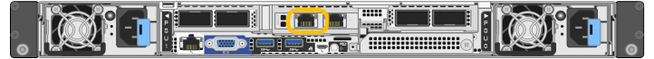

= Rufen Sie das Installationsprogramm für StorageGRID-Appliances auf
:allow-uri-read: 
:icons: font
:imagesdir: ../media/

[role="lead"]
Sie müssen auf das Installationsprogramm der StorageGRID Appliance zugreifen, um die Installationsversion zu überprüfen und die Verbindungen zwischen der Appliance und den drei StorageGRID-Netzwerken zu konfigurieren: Das Grid-Netzwerk, das Admin-Netzwerk (optional) und das Client-Netzwerk (optional).

.Bevor Sie beginnen
* Sie verwenden einen beliebigen Management-Client, der eine Verbindung zum StorageGRID-Admin-Netzwerk herstellen kann, oder Sie haben einen Service-Laptop.
* Der Client- oder Service-Laptop verfügt über einen https://docs.netapp.com/us-en/storagegrid-118/admin/web-browser-requirements.html["Unterstützter Webbrowser"^].
* Der Service Appliance oder Storage Appliance Controller ist mit allen geplanten StorageGRID-Netzwerken verbunden.
* Sie kennen die IP-Adresse, das Gateway und das Subnetz für die Service-Appliance oder den Storage-Appliance-Controller in diesen Netzwerken.
* Sie haben die geplanten Netzwerk-Switches konfiguriert.

.Über diese Aufgabe
Für den ersten Zugriff auf das Installationsprogramm der StorageGRID-Appliance können Sie die DHCP-zugewiesene IP-Adresse für den Port des Admin-Netzwerks auf der Services-Appliance oder dem Controller der Storage-Appliance verwenden (vorausgesetzt, es ist mit dem Admin-Netzwerk verbunden). Alternativ können Sie einen Service-Laptop direkt an die Service-Appliance oder den Controller der Storage-Appliance anschließen.

.Schritte
. Verwenden Sie, falls möglich, die DHCP-Adresse für den Admin-Netzwerk-Port auf der Service-Appliance oder dem Controller der Storage-Appliance. Der Admin-Netzwerkanschluss ist in der folgenden Abbildung hervorgehoben. (Verwenden Sie die IP-Adresse im Grid-Netzwerk, wenn das Admin-Netzwerk nicht verbunden ist.)
+
[role="tabbed-block"]
====
.SG100
--
image::../media/sg100_admin_network_port.png[Admin-Netzwerk-Port auf dem SG100]

--
.SG110
--
image::../media/sg6100_admin_network_port.png[Admin-Netzwerk-Port auf dem SG110]

--
.SG1000
--
image::../media/sg1000_admin_network_port.png[Admin-Netzwerk-Port auf der SG1000]

--
.SG1100
--

--
.E5700SG
--
Beim E5700SG haben Sie folgende Möglichkeiten:

** Sehen Sie sich das Sieben-Segment-Display auf dem E5700SG-Controller an. Wenn Management-Port 1 und 10/25-GbE-Ports 2 und 4 auf dem E5700SG-Controller mit Netzwerken mit DHCP-Servern verbunden sind, versucht der Controller, beim Einschalten des Gehäuses dynamisch zugewiesene IP-Adressen zu erhalten. Nachdem der Controller den Einschaltvorgang abgeschlossen hat, zeigt sein 7-Segment-Display *HO* an, gefolgt von einer sich wiederholenden Sequenz von zwei Zahlen.
+
[listing]
----
HO -- IP address for Admin Network -- IP address for Grid Network HO
----
+
In der Reihenfolge:

+
*** Der erste Zahlensatz ist die DHCP-Adresse für den Appliance-Speicherknoten im Admin-Netzwerk, sofern er verbunden ist. Diese IP-Adresse ist dem Management-Port 1 des E5700SG-Controllers zugewiesen.
*** Der zweite Zahlensatz ist die DHCP-Adresse für den Appliance-Speicherknoten im Grid-Netzwerk. Diese IP-Adresse wird 10/25-GbE-Ports 2 und 4 zugewiesen, wenn Sie das Gerät zum ersten Mal mit Strom versorgen.
+

NOTE: Wenn eine IP-Adresse nicht über DHCP zugewiesen werden konnte, wird 0.0.0.0 angezeigt.

--
.SG6000-CN
--
image::../media/sg6000_cn_admin_network_port.png[Admin-Netzwerk-Port am SG6000-CN Controller]

--
.SGF6112
--
image::../media/sg6100_admin_network_port.png[Admin-Netzwerk-Port auf der SGF6112]

--
====
+
.. Rufen Sie die DHCP-Adresse für die Appliance im Admin-Netzwerk vom Netzwerkadministrator ab.
.. Geben Sie auf dem Client diese URL für den StorageGRID-Appliance-Installer ein: +
`*https://_Appliance_IP_:8443*`
+
Für `_Appliance_IP_`Verwenden Sie die DHCP-Adresse (verwenden Sie die IP-Adresse für das Admin-Netzwerk, wenn Sie diese haben).

.. Wenn Sie aufgefordert werden, eine Sicherheitswarnung zu erhalten, zeigen Sie das Zertifikat mithilfe des Browser-Installationsassistenten an und installieren Sie es.
+
Die Meldung wird beim nächsten Zugriff auf diese URL nicht angezeigt.

+
Die Startseite des StorageGRID-Appliance-Installationsprogramms wird angezeigt. Die Informationen und Meldungen, die beim ersten Zugriff auf diese Seite angezeigt werden, hängen davon ab, wie Ihr Gerät derzeit mit StorageGRID-Netzwerken verbunden ist. Möglicherweise werden Fehlermeldungen angezeigt, die in späteren Schritten gelöst werden.

+
image::../media/appliance_installer_home_5700_5600.png[Screenshot des oberen Teils der Startseite des StorageGRID Webscale Appliance Installer]

. Wenn Sie keine IP-Adresse über DHCP erhalten können, können Sie eine Link-Local-Verbindung verwenden.
+
[role="tabbed-block"]
====
.SG100
--
Schließen Sie einen Service-Laptop mithilfe eines Ethernet-Kabels direkt an den rechtesten RJ-45-Port des Services-Geräts an.

image::../media/sg100_link_local_port.png[SG100 Link-Local-Verbindung]

--
.SG110
--
Schließen Sie einen Service-Laptop mithilfe eines Ethernet-Kabels direkt an den ganz rechts am RJ-45-Port der Appliance an.

image::../media/sg6100_link_local_port.png[SG110 Link-Local Connection]

--
.SG1000
--
Schließen Sie einen Service-Laptop mithilfe eines Ethernet-Kabels direkt an den rechtesten RJ-45-Port des Services-Geräts an.

image::../media/sg1000_link_local_port.png[SG1000-Link-Local-Verbindung]

--
.SG1100
--
Schließen Sie einen Service-Laptop mithilfe eines Ethernet-Kabels direkt an den ganz rechts am RJ-45-Port der Appliance an.

image::../media/sg1100_link_local_port.png[SG1100 Link-Local Connection]

--
.E5700SG
--
Verbinden Sie den Service-Laptop über ein Ethernet-Kabel mit dem Management-Port 2 des E5700SG Controllers.

image::../media/e5700sg_mgmt_port_2.gif[Position des Management Port 2 auf dem E5700SG Controller]

--
.SG6000-CN
--
Schließen Sie einen Service-Laptop mithilfe eines Ethernet-Kabels direkt an den rechtesten RJ-45-Anschluss des SG6000-CN Controllers an.

image::../media/sg6000_cn_link_local_port.png[Standort des Management-Ports für SG6000-CN]

--
.SGF6112
--
Schließen Sie einen Service-Laptop mithilfe eines Ethernet-Kabels direkt an den ganz rechts am RJ-45-Port der Appliance an.

image::../media/sg6100_link_local_port.png[SGF6112-Link-Local-Verbindung]

--
====
+
.. Öffnen Sie einen Webbrowser auf dem Service-Laptop.
.. Geben Sie diese URL für das StorageGRID-Appliance-Installationsprogramm ein: +
`*\https://169.254.0.1:8443*`
+
Die Startseite des StorageGRID-Appliance-Installationsprogramms wird angezeigt. Die Informationen und Meldungen, die beim ersten Zugriff auf diese Seite angezeigt werden, hängen davon ab, wie Ihr Gerät derzeit mit StorageGRID-Netzwerken verbunden ist. Möglicherweise werden Fehlermeldungen angezeigt, die in späteren Schritten gelöst werden.

+

NOTE: Wenn Sie über eine Link-Local-Verbindung nicht auf die Startseite zugreifen können, konfigurieren Sie die Service-Laptop-IP-Adresse als `169.254.0.2`, Und versuchen Sie es erneut.

.Nachdem Sie fertig sind
Nach dem Zugriff auf das Installationsprogramm der StorageGRID-Appliance:

* Überprüfen Sie, ob die Installationsversion der StorageGRID Appliance auf der Appliance mit der auf dem StorageGRID-System installierten Softwareversion übereinstimmt. Aktualisieren Sie gegebenenfalls das Installationsprogramm für StorageGRID-Appliances.
+
link:verifying-and-upgrading-storagegrid-appliance-installer-version.html["Überprüfen und Aktualisieren der Installationsversion der StorageGRID Appliance"]

* Überprüfen Sie alle Meldungen, die auf der Startseite des StorageGRID-Appliance-Installationsprogramms angezeigt werden, und konfigurieren Sie die Linkkonfiguration und die IP-Konfiguration nach Bedarf.
+
image::../media/appliance_installer_home_services_appliance.png[Appliance Installer-Startseite]

