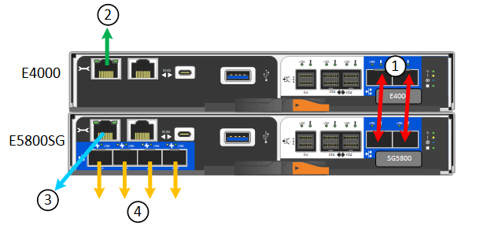

= Kabelgerät
:allow-uri-read: 
:icons: font
:imagesdir: ../media/

[role="lead"]
Verbinden Sie die Netzwerkports der Appliance oder des Controllers mit dem Grid-Netzwerk und dem optionalen Client-Netzwerk für StorageGRID. Bei einigen Appliances verbinden Sie auch den Management-Port der Appliance mit dem Service-Laptop oder stellen Verbindungen zwischen den Controller-Management-Ports her.

[role="tabbed-block"]
====
.SG100 und SG1000
--
Sie müssen den Management-Port der Appliance mit dem Service-Laptop verbinden und die Netzwerkanschlüsse der Appliance mit dem Grid-Netzwerk und dem optionalen Client-Netzwerk für StorageGRID verbinden.

.Bevor Sie beginnen
* Sie verfügen über ein RJ-45-Ethernet-Kabel zum Anschließen des Management-Ports.
* Sie haben eine der folgenden Optionen für die Netzwerkanschlüsse. Diese Gegenstände sind nicht im Lieferumfang des Geräts enthalten.
+
** Ein bis vier Twinax-Kabel zum Anschließen der vier Netzwerk-Ports.
** Für das SG100 sind ein bis vier SFP+ oder SFP28 Transceiver, wenn Sie optische Kabel für die Ports verwenden möchten.
** Für den SG1000, ein bis vier QSFP+ oder QSFP28 Transceiver, wenn Sie optische Kabel für die Ports verwenden möchten.

CAUTION: *Gefahr der Laserstrahlung* -- kein Teil eines SFP- oder QSFP-Transceivers demontieren oder entfernen. Sie können Laserstrahlung ausgesetzt sein.

.Über diese Aufgabe
Die folgenden Abbildungen zeigen die Anschlüsse auf der Rückseite des Geräts.

SG100-Port-Verbindungen:

image::../media/sg100_connections.png[SG100-Anschlüsse auf der Rückseite]

SG1000-Port-Verbindungen:

image::../media/sg1000_connections.png[SG1000-Port-Verbindungen]

[cols="1a,2a,2a,3a"]
|===
| Legende | Port | Typ des Ports | Nutzung 

 a| 
1
 a| 
BMC-Management-Port auf der Appliance
 a| 
1 GbE (RJ-45)
 a| 
Stellt eine Verbindung zum Netzwerk her, in dem Sie auf die BMC-Schnittstelle zugreifen.

 a| 
2
 a| 
Vier Netzwerkports auf der Appliance
 a| 
* Für das SG100: 10/25-GbE
* Für den SG1000: 10/25/40/100-GbE

 a| 
Stellen Sie eine Verbindung zum Grid-Netzwerk und dem Client-Netzwerk für StorageGRID her.  Siehe link:../installconfig/gathering-installation-information-sg100-and-sg1000.html#port-bond-modes["Port-Bond-Modi (Port-Bond-Modi (SG100 und SG1000)"].

 a| 
3
 a| 
Admin-Netzwerk-Port auf der Appliance (in den Abbildungen mit „P1“ gekennzeichnet)
 a| 
1 GbE (RJ-45)

*Achtung:* dieser Port arbeitet nur bei 1000 BaseT/full und unterstützt keine Geschwindigkeiten von 10 oder 100 Megabit.
 a| 
Verbindet die Appliance mit dem Admin-Netzwerk für StorageGRID.

 a| 
 a| 
Rechtmäßiger RJ-45-Anschluss am Gerät
 a| 
1 GbE (RJ-45)

*Achtung:* dieser Port arbeitet nur bei 1000 BaseT/full und unterstützt keine Geschwindigkeiten von 10 oder 100 Megabit.
 a| 
* Kann mit Verwaltungsport 1 verbunden werden, wenn Sie eine redundante Verbindung zum Admin-Netzwerk wünschen.
* Kann getrennt bleiben und für einen temporären lokalen Zugang verfügbar sein (IP 169.254.0.1).
* Während der Installation kann verwendet werden, um das Gerät an einen Service-Laptop anzuschließen, wenn DHCP-zugewiesene IP-Adressen nicht verfügbar sind.

|===
.Schritte
. Schließen Sie den BMC-Managementport der Appliance über ein Ethernet-Kabel an das Managementnetzwerk an.
+
Obwohl diese Verbindung optional ist, wird empfohlen, den Support zu erleichtern.

. Verbinden Sie die Netzwerk-Ports des Geräts mit den entsprechenden Netzwerk-Switches über Twinax-Kabel oder optische Kabel und Transceiver.
+
In der folgenden Tabelle finden Sie die für Ihre Hardware und Verbindungsgeschwindigkeit erforderlichen Geräte.

+
[cols="2a,2a"]
|===
| SG100 Verbindungsgeschwindigkeit (GbE) | Erforderliche Ausrüstung 

 a| 
10
 a| 
SFP+-Transceiver

 a| 
25
 a| 
SFP28-Transceiver

| SG1000 Link-Geschwindigkeit (GbE) | Erforderliche Ausrüstung 

 a| 
10
 a| 
QSA- und SFP+-Transceiver

 a| 
25
 a| 
QSA und SFP28 Transceiver

 a| 
40
 a| 
QSFP+ Transceiver

 a| 
100
 a| 
QFSP28-Transceiver

|===
+
** Bei Modellen, die Autonegotiate als Option für die Portgeschwindigkeit unterstützen, können Sie die Ports, die dem StorageGRID-Grid-Netzwerk zugewiesen sind, mit einer anderen Geschwindigkeit als die Ports ausführen, die dem Client-Netzwerk zugewiesen sind.
** Bei Modellen, die die Autonegotiate-Option nicht als Port-Geschwindigkeit unterstützen, müssen alle vier Netzwerkports die gleiche Link-Geschwindigkeit verwenden.
** Wenn Sie den Modus Fixed Port Bond verwenden möchten (Standard), verbinden Sie die Ports mit dem StorageGRID-Grid und den Client-Netzwerken, wie in der Tabelle dargestellt.
+
[cols="1a,2a"]
|===
| Port | Verbindung wird hergestellt mit... 

 a| 
Anschluss 1
 a| 
Client-Netzwerk (optional)

 a| 
Anschluss 2
 a| 
Grid-Netzwerk

 a| 
Anschluss 3
 a| 
Client-Netzwerk (optional)

 a| 
Anschluss 4
 a| 
Grid-Netzwerk

|===
** Wenn Sie den aggregierten Port Bond-Modus verwenden möchten, verbinden Sie einen oder mehrere Netzwerkports mit einem oder mehreren Switches. Sie sollten mindestens zwei der vier Ports verbinden, um einen Single Point of Failure zu vermeiden. Wenn Sie mehrere Switches für eine einzelne LACP-Verbindung verwenden, müssen die Switches MLAG oder Äquivalent unterstützen.

. Wenn Sie das Admin-Netzwerk für StorageGRID verwenden möchten, schließen Sie den Admin-Netzwerkport des Geräts über ein Ethernet-Kabel an das Admin-Netzwerk an.

--
.SG110 und SG1100
--
Sie verbinden den Management-Port der Appliance mit dem Service-Laptop und verbinden die Netzwerkports der Appliance mit dem Grid-Netzwerk und dem optionalen Client-Netzwerk für StorageGRID.

.Bevor Sie beginnen
* Sie verfügen über ein RJ-45-Ethernet-Kabel zum Anschließen des Management-Ports.
* Sie haben eine der folgenden Optionen für die Netzwerkanschlüsse. Diese Gegenstände sind nicht im Lieferumfang des Geräts enthalten.
+
** Ein bis vier Twinax-Kabel zum Anschließen der vier Netzwerk-Ports.
** Beim SG110 ein bis vier SFP+- oder SFP28-Transceiver, wenn Sie optische Kabel für die Ports verwenden möchten.
** Beim SG1100 ein bis vier QSFP+- oder QSFP28-Transceiver, wenn Sie optische Kabel für die Ports verwenden möchten.

CAUTION: *Gefahr der Laserstrahlung* -- kein Teil eines SFP- oder QSFP-Transceivers demontieren oder entfernen. Sie können Laserstrahlung ausgesetzt sein.

.Über diese Aufgabe
Die folgenden Abbildungen zeigen die Anschlüsse auf der Rückseite des Geräts.

SG110-Port-Verbindungen:

image::../media/sgf6112_connections.png[SG110 – rückseitige Anschlüsse]

SG1100-Port-Verbindungen:

image::../media/sg1100_connections.png[SG1000-Port-Verbindungen]

[cols="1a,2a,2a,3a"]
|===
| Legende | Port | Typ des Ports | Nutzung 

 a| 
1
 a| 
BMC-Management-Port auf der Appliance
 a| 
1 GbE (RJ-45)
 a| 
Stellt eine Verbindung zum Netzwerk her, in dem Sie auf die BMC-Schnittstelle zugreifen.

 a| 
2
 a| 
Vier Netzwerkports auf der Appliance
 a| 
* Für die SG110: 10/25-GbE
* Für die SG1100: 10/25/40/100-GbE

 a| 
Stellen Sie eine Verbindung zum Grid-Netzwerk und dem Client-Netzwerk für StorageGRID her. Siehe link:gathering-installation-information-sg110-and-sg1100.html#port-bond-modes["Port-Bond-Modi (SG110 und SG1100)"]

 a| 
3
 a| 
Admin-Netzwerk-Port auf der Appliance
 a| 
1 GbE (RJ-45)

*Wichtig:* dieser Port arbeitet nur mit 1/10-GbE (RJ-45) und unterstützt keine 100-Megabit-Geschwindigkeiten.
 a| 
Verbindet die Appliance mit dem Admin-Netzwerk für StorageGRID.

 a| 
 a| 
Rechtmäßiger RJ-45-Anschluss am Gerät
 a| 
1 GbE (RJ-45)

*Wichtig:* dieser Port arbeitet nur mit 1/10-GbE (RJ-45) und unterstützt keine 100-Megabit-Geschwindigkeiten.
 a| 
* Kann mit Verwaltungsport 1 verbunden werden, wenn Sie eine redundante Verbindung zum Admin-Netzwerk wünschen.
* Kann getrennt bleiben und für einen temporären lokalen Zugang verfügbar sein (IP 169.254.0.1).
* Während der Installation kann verwendet werden, um das Gerät an einen Service-Laptop anzuschließen, wenn DHCP-zugewiesene IP-Adressen nicht verfügbar sind.

|===
.Schritte
. Schließen Sie den BMC-Managementport der Appliance über ein Ethernet-Kabel an das Managementnetzwerk an.
+
Obwohl diese Verbindung optional ist, wird empfohlen, den Support zu erleichtern.

. Verbinden Sie die Netzwerk-Ports des Geräts mit den entsprechenden Netzwerk-Switches über Twinax-Kabel oder optische Kabel und Transceiver.
+
In der folgenden Tabelle finden Sie die für Ihre Hardware und Verbindungsgeschwindigkeit erforderlichen Geräte.

+
[cols="2a,2a"]
|===
| SG110-Verbindungsgeschwindigkeit (GbE) | Erforderliche Ausrüstung 

 a| 
10
 a| 
SFP+-Transceiver

 a| 
25
 a| 
SFP28-Transceiver

| SG1100-Verbindungsgeschwindigkeit (GbE) | Erforderliche Ausrüstung 

 a| 
10
 a| 
QSA- und SFP+-Transceiver

 a| 
25
 a| 
QSA und SFP28 Transceiver

 a| 
40
 a| 
QSFP+ Transceiver

 a| 
100
 a| 
QFSP28-Transceiver

|===
+
** Bei Modellen, die Autonegotiate als Option für die Portgeschwindigkeit unterstützen, können Sie die Ports, die dem StorageGRID-Grid-Netzwerk zugewiesen sind, mit einer anderen Geschwindigkeit als die Ports ausführen, die dem Client-Netzwerk zugewiesen sind.
** Bei Modellen, die die Autonegotiate-Option nicht als Port-Geschwindigkeit unterstützen, müssen alle vier Netzwerkports die gleiche Link-Geschwindigkeit verwenden.
** Wenn Sie den Modus Fixed Port Bond verwenden möchten (Standard), verbinden Sie die Ports mit dem StorageGRID-Grid und den Client-Netzwerken, wie in der Tabelle dargestellt.
+
[cols="1a,2a"]
|===
| Port | Verbindung wird hergestellt mit... 

 a| 
Anschluss 1
 a| 
Client-Netzwerk (optional)

 a| 
Anschluss 2
 a| 
Grid-Netzwerk

 a| 
Anschluss 3
 a| 
Client-Netzwerk (optional)

 a| 
Anschluss 4
 a| 
Grid-Netzwerk

|===
** Wenn Sie den aggregierten Port Bond-Modus verwenden möchten, verbinden Sie einen oder mehrere Netzwerkports mit einem oder mehreren Switches. Sie sollten mindestens zwei der vier Ports verbinden, um einen Single Point of Failure zu vermeiden. Wenn Sie mehrere Switches für eine einzelne LACP-Verbindung verwenden, müssen die Switches MLAG oder Äquivalent unterstützen.

. Wenn Sie das Admin-Netzwerk für StorageGRID verwenden möchten, schließen Sie den Admin-Netzwerkport des Geräts über ein Ethernet-Kabel an das Admin-Netzwerk an.

--
.SG5700
--
Sie verbinden die beiden Controller miteinander, verbinden die Management-Ports auf jedem Controller und verbinden die 10/25-GbE-Ports des E5700SG Controllers mit dem Grid-Netzwerk und dem optionalen Client-Netzwerk für StorageGRID.

.Bevor Sie beginnen
* Sie haben die folgenden Artikel ausgepackt, die im Lieferumfang des Geräts enthalten sind:
+
** Zwei Netzkabel.
** Zwei optische Kabel für die FC Interconnect-Ports an den Controllern.
** Acht SFP+-Transceiver, die entweder 10 GbE oder 16 Gbit/s FC unterstützen. Die Transceiver können mit den beiden Interconnect Ports auf beiden Controllern und mit den vier 10/25-GbE-Netzwerkports auf dem E5700SG Controller verwendet werden, vorausgesetzt, die Netzwerk-Ports benötigen eine 10-GbE-Verbindungsgeschwindigkeit.

* Sie haben folgende Produkte erhalten, die nicht im Lieferumfang des Geräts enthalten sind:
+
** Ein bis vier optische Kabel für die 10/25-GbE-Ports, die Sie verwenden möchten.
** Ein bis vier SFP28-Transceiver, wenn Sie 25-GbE-Verbindungsgeschwindigkeit verwenden möchten.
** Ethernet-Kabel für die Verbindung der Management-Ports.

CAUTION: *Gefahr der Laserstrahlung* -- keinen Teil eines SFP-Transceivers zerlegen oder entfernen. Sie können Laserstrahlung ausgesetzt sein.

.Über diese Aufgabe
Die Zahlen zeigen die beiden Controller der SG5760 und SG5760X, wobei der Storage Controller der E2800 Serie oben und der E5700SG Controller unten gezeigt werden. In den SG5712 und SG5712X befindet sich der Speicher-Controller der E2800 Serie links vom E5700SG-Controller, wenn er von hinten betrachtet wird.

SG5760-Verbindungen:

image::../media/sg5760_connections.gif[Verbindungen am SG5760 Appliance]

SG5760X-Verbindungen:

image::../media/sg5760X_connections.png[Verbindungen auf der SG5760X Appliance]

[cols="1a,2a,2a,2a"]
|===
| Legende | Port | Typ des Ports | Nutzung 

 a| 
1
 a| 
Zwei Interconnect-Ports an jedem Controller
 a| 
16 Gbit/s FC optisch SFP+
 a| 
Verbinden Sie die beiden Controller miteinander.

 a| 
2
 a| 
Management-Port 1 auf dem Controller der E2800 Serie
 a| 
1 GbE (RJ-45)
 a| 
Stellt eine Verbindung mit dem Netzwerk her, in dem Sie auf SANtricity System Manager zugreifen. Sie können das Admin-Netzwerk für StorageGRID oder ein unabhängiges Managementnetzwerk verwenden.

 a| 
2
 a| 
Management-Port 2 am Controller der E2800 Serie
 a| 
1 GbE (RJ-45)
 a| 
Reserviert für technischen Support.

 a| 
3
 a| 
Management-Port 1 auf dem E5700SG Controller
 a| 
1 GbE (RJ-45)
 a| 
Verbindet den E5700SG-Controller mit dem Admin-Netzwerk für StorageGRID.

 a| 
3
 a| 
Management-Port 2 auf dem E5700SG Controller
 a| 
1 GbE (RJ-45)
 a| 
* Kann mit Verwaltungsport 1 verbunden werden, wenn Sie eine redundante Verbindung zum Admin-Netzwerk wünschen.
* Kann unverkabelt und für temporären lokalen Zugang verfügbar sein (IP 169.254.0.1).
* Kann während der Installation verwendet werden, um den E5700SG-Controller mit einem Service-Laptop zu verbinden, wenn DHCP-zugewiesene IP-Adressen nicht verfügbar sind.

 a| 
4
 a| 
10/25-GbE-Ports 1-4 auf dem E5700SG Controller
 a| 
10-GbE oder 25-GbE

*Hinweis:* die im Lieferumfang des Geräts enthaltenen SFP+ Transceiver unterstützen 10-GbE-Verbindungsgeschwindigkeiten. Wenn Sie für die vier Netzwerk-Ports 25-GbE-Verbindungsgeschwindigkeiten verwenden möchten, müssen Sie SFP28-Transceiver bereitstellen.
 a| 
Stellen Sie eine Verbindung zum Grid-Netzwerk und dem Client-Netzwerk für StorageGRID her. Siehe link:gathering-installation-information-sg5700.html#port-bond-modes["Port-Bond-Modi (E5700SG Controller)"].

|===
.Schritte
. Verbinden Sie den E2800 Controller mit dem E5700SG Controller mithilfe von zwei optischen Kabeln und vier der acht SFP+ Transceiver.
+
[cols="1a,1a"]
|===
| Diesen Port verbinden... | Zu diesem Port... 

 a| 
Interconnect-Port 1 auf dem E2800 Controller
 a| 
Interconnect-Port 1 am E5700SG Controller

 a| 
Interconnect-Port 2 am E2800 Controller
 a| 
Interconnect-Port 2 auf dem E5700SG Controller

|===
. Wenn Sie planen, SANtricity System Manager zu verwenden, verbinden Sie Managementport 1 (P1) am E2800 Controller (der RJ-45 Port auf der linken Seite) mit dem Managementnetzwerk für SANtricity System Manager. Verwenden Sie dazu ein Ethernetkabel.
+
Verwenden Sie den Management-Port 2 (P2) nicht auf dem E2800 Controller (der RJ-45-Port auf der rechten Seite). Dieser Port ist für technischen Support reserviert.

. Wenn Sie das Admin-Netzwerk für StorageGRID verwenden möchten, verbinden Sie den Verwaltungsport 1 des E5700SG-Controllers (der RJ-45-Port links) über ein Ethernet-Kabel mit dem Admin-Netzwerk.
+
Wenn Sie den Active-Backup-Netzwerk-Bond-Modus für das Admin-Netzwerk verwenden möchten, verbinden Sie den Management-Port 2 des E5700SG-Controllers (der RJ-45-Port rechts) über ein Ethernet-Kabel mit dem Admin-Netzwerk.

. Verbinden Sie die 10/25-GbE-Ports des E5700SG Controllers mit den entsprechenden Netzwerk-Switches über optische Kabel und SFP+ oder SFP28-Transceiver.
+

NOTE: Installieren Sie SFP+-Transceiver, wenn Sie 10-GbE-Verbindungsgeschwindigkeiten verwenden möchten. Installieren Sie SFP28 Transceiver, wenn Sie 25-GbE-Linkgeschwindigkeiten verwenden möchten.

+
** Bei Modellen, die Autonegotiate als Option für die Portgeschwindigkeit unterstützen, können Sie die Ports, die dem StorageGRID-Grid-Netzwerk zugewiesen sind, mit einer anderen Geschwindigkeit als die Ports ausführen, die dem Client-Netzwerk zugewiesen sind.
** Bei Modellen, die die Autonegotiate-Option nicht als Port-Geschwindigkeit unterstützen, müssen alle vier Netzwerkports die gleiche Link-Geschwindigkeit verwenden.
** Wenn Sie den Modus Fixed Port Bond verwenden möchten (Standard), verbinden Sie die Ports mit dem StorageGRID-Grid und den Client-Netzwerken, wie in der Tabelle dargestellt.
+
[cols="1a,1a"]
|===
| Port | Verbindung wird hergestellt mit... 

 a| 
Anschluss 1
 a| 
Client-Netzwerk (optional)

 a| 
Anschluss 2
 a| 
Grid-Netzwerk

 a| 
Anschluss 3
 a| 
Client-Netzwerk (optional)

 a| 
Anschluss 4
 a| 
Grid-Netzwerk

|===
** Wenn Sie den aggregierten Port Bond-Modus verwenden möchten, verbinden Sie einen oder mehrere Netzwerkports mit einem oder mehreren Switches. Sie sollten mindestens zwei der vier Ports verbinden, um einen Single Point of Failure zu vermeiden. Wenn Sie mehrere Switches für eine einzelne LACP-Verbindung verwenden, müssen die Switches MLAG oder Äquivalent unterstützen.

--
.SG5800
--
Sie verbinden die beiden Controller miteinander, verbinden die Management-Ports auf jedem Controller und verbinden die 10/25-GbE-Ports des SG5800 Controllers mit dem Grid-Netzwerk und dem optionalen Client-Netzwerk für StorageGRID.

.Bevor Sie beginnen
* Sie haben die folgenden Artikel ausgepackt, die im Lieferumfang des Geräts enthalten sind:
+
** Zwei Netzkabel.
** Zwei Kabel für die iSCSI-Interconnect-Ports an den Controllern.

* Sie haben folgende Produkte erhalten, die nicht im Lieferumfang des Geräts enthalten sind:
+
** Ein bis vier optische oder Kupferkabel für die 10/25-GbE-Ports, die Sie verwenden möchten.
** Ein bis acht SFP+ Transceiver, wenn Sie optische Kabel und 10-GbE-Verbindungsgeschwindigkeit verwenden möchten.
** Ein bis acht SFP28 Transceiver, wenn Sie optische Kabel und 25-GbE-Link-Geschwindigkeit verwenden möchten.
** Ethernet-Kabel für die Verbindung der Management-Ports.

CAUTION: *Gefahr der Laserstrahlung* -- keinen Teil eines SFP-Transceivers zerlegen oder entfernen. Sie können Laserstrahlung ausgesetzt sein.

.Über diese Aufgabe
Die Abbildungen zeigen die beiden Controller des SG5860, wobei sich der Storage Controller der E4000 Serie oben und der SG5800 Controller unten befinden. Bei der SG5812 befindet sich der Storage Controller der Serie E4000 von der Rückseite links vom SG5800 Controller.

SG5860-Verbindungen:

[cols="1a,2a,2a,2a"]
|===
| Legende | Port | Typ des Ports | Nutzung 

 a| 
1
 a| 
Zwei Interconnect-Ports an jedem Controller
 a| 
25 GbE iSCSI (SFP28)
 a| 
Verbinden Sie die beiden Controller miteinander.

 a| 
2
 a| 
Management-Port 1 auf dem Controller der E4000-Serie
 a| 
1 GbE (RJ-45)
 a| 
Stellt eine Verbindung mit dem Netzwerk her, in dem Sie auf SANtricity System Manager zugreifen. Sie können das Admin-Netzwerk für StorageGRID oder ein unabhängiges Managementnetzwerk verwenden.

 a| 
3
 a| 
Management-Port 1 am SG5800-Controller
 a| 
1 GbE (RJ-45)
 a| 
Verbindet den SG5800-Controller mit dem Admin-Netzwerk für StorageGRID.

 a| 
4
 a| 
10/25-GbE-Ports 1-4 am SG5800 Controller
 a| 
10-GbE oder 25-GbE
 a| 
Stellen Sie eine Verbindung zum Grid-Netzwerk und dem Client-Netzwerk für StorageGRID her. Siehe link:gathering-installation-information-sg5800.html#port-bond-modes["Port-Bond-Modi (SG5800 Controller)"].

|===
.Schritte
. Schließen Sie den E4000-Controller mithilfe der beiden mitgelieferten Kabel an den SG5800-Controller an.
+
[cols="1a,1a"]
|===
| Diesen Port verbinden... | Zu diesem Port... 

 a| 
Verbindungsport 1 am E4000-Controller
 a| 
Interconnect-Port 1 am SG5800 Controller

 a| 
Verbindungsport 2 am E4000-Controller
 a| 
Interconnect-Port 2 am SG5800 Controller

|===
. Optional können Sie den Management-Port 1 (P1) des E4000-Controllers (der RJ-45-Port auf der linken Seite) über ein Ethernet-Kabel mit dem Managementnetzwerk für SANtricity System Manager verbinden.
. Wenn Sie das Admin-Netzwerk für StorageGRID verwenden möchten, verbinden Sie den Management-Port 1 des SG5800-Controllers (der RJ-45-Port auf der linken Seite) über ein Ethernet-Kabel mit dem Admin-Netzwerk.
. Verbinden Sie die 10/25-GbE-Ports des SG5800 Controllers über Kupferkabel oder optische Kabel und SFP+- oder SFP28-Transceiver mit den entsprechenden Netzwerk-Switches.
+

NOTE: Installieren Sie SFP+-Transceiver, wenn Sie 10-GbE-Verbindungsgeschwindigkeiten verwenden möchten. Installieren Sie SFP28 Transceiver, wenn Sie 25-GbE-Linkgeschwindigkeiten verwenden möchten.

+
** Bei Modellen, die Autonegotiate als Option für die Portgeschwindigkeit unterstützen, können Sie die Ports, die dem StorageGRID-Grid-Netzwerk zugewiesen sind, mit einer anderen Geschwindigkeit als die Ports ausführen, die dem Client-Netzwerk zugewiesen sind.
** Bei Modellen, die die Autonegotiate-Option nicht als Port-Geschwindigkeit unterstützen, müssen alle vier Netzwerkports die gleiche Link-Geschwindigkeit verwenden.
** Wenn Sie den Modus Fixed Port Bond verwenden möchten (Standard), verbinden Sie die Ports mit dem StorageGRID-Grid und den Client-Netzwerken, wie in der Tabelle dargestellt.
+
[cols="1a,1a"]
|===
| Port | Verbindung wird hergestellt mit... 

 a| 
Anschluss 1
 a| 
Client-Netzwerk (optional)

 a| 
Anschluss 2
 a| 
Grid-Netzwerk

 a| 
Anschluss 3
 a| 
Client-Netzwerk (optional)

 a| 
Anschluss 4
 a| 
Grid-Netzwerk

|===
** Wenn Sie den aggregierten Port Bond-Modus verwenden möchten, verbinden Sie einen oder mehrere Netzwerkports mit einem oder mehreren Switches. Sie sollten mindestens zwei der vier Ports verbinden, um einen Single Point of Failure zu vermeiden. Wenn Sie mehrere Switches für eine einzelne LACP-Verbindung verwenden, müssen die Switches MLAG oder Äquivalent unterstützen.

--
.SG6000
--
Sie verbinden die Speicher-Controller mit dem SG6000-CN-Controller, verbinden die Management-Ports aller drei Controller und verbinden die Netzwerk-Ports des SG6000-CN-Controllers mit dem Grid-Netzwerk und dem optionalen Client-Netzwerk für StorageGRID.

.Bevor Sie beginnen
* Das Gerät verfügt über die vier optischen Kabel zum Anschließen der beiden Speicher-Controller an den SG6000-CN-Controller.
* Sie verfügen über RJ-45-Ethernet-Kabel (mindestens vier) für den Anschluss der Management-Ports.
* Sie haben eine der folgenden Optionen für die Netzwerkanschlüsse. Diese Gegenstände sind nicht im Lieferumfang des Geräts enthalten.
+
** Ein bis vier Twinax-Kabel zum Anschließen der vier Netzwerk-Ports.
** Ein bis vier SFP+ oder SFP28 Transceiver, wenn Sie optische Kabel für die Ports verwenden möchten.
+

CAUTION: *Gefahr der Laserstrahlung* -- keinen Teil eines SFP-Transceivers zerlegen oder entfernen. Sie können Laserstrahlung ausgesetzt sein.

.Über diese Aufgabe
Die nachfolgende Abbildung zeigt die drei Controller in den SG6060 und SG6060X Appliances, wobei der SG6000-CN Computing-Controller oben und die beiden E2800 Storage-Controller unten dargestellt sind. Das SG6060 verwendet E2800A-Controller und das SG6060X nutzt eine von zwei E2800B-Controller-Versionen.

NOTE: Beide Versionen des E2800 Controllers haben die gleichen Spezifikationen und funktionieren mit Ausnahme der Lage der Interconnect-Ports.

CAUTION: Verwenden Sie keinen E2800A- und E2800B-Controller in derselben Appliance.

SG6060-Verbindungen:

image::../media/sg6000_e2800_connections.png[SG6060- bis E2800A-Verbindungen]

SG6060X-Verbindungen:

* Version 1
+
image::../media/sg6000x_e2800B_connections.png[SG6060- bis E2800B-Verbindungen]

* Version 2
+

NOTE: Wenn die FC-Transceiver im E2800B-Controller in den oberen FC-Verbindungsports (6) installiert sind, verschieben Sie sie auf die unteren rechten FC-Verbindungsports (7).

+
image::../media/sg6000x_e2800B2_connections.png[SG6060- bis E2800B-Verbindungen]

Die folgende Abbildung zeigt die drei Controller in der SGF6024 Appliance mit dem SG6000-CN Compute-Controller oben und den beiden EF570 Storage-Controllern nebeneinander unter dem Computing-Controller.

SGF6024-Verbindungen:

image::../media/sg6000_ef570_connections.png[SG6000- auf SGF570-Verbindungen]

[cols="1a,2a,2a,3a"]
|===
| Legende | Port | Typ des Ports | Nutzung 

 a| 
1
 a| 
BMC-Management-Port am SG6000-CN Controller
 a| 
1 GbE (RJ-45)
 a| 
Stellt eine Verbindung zum Netzwerk her, in dem Sie auf die BMC-Schnittstelle zugreifen.

 a| 
2
 a| 
FC-Verbindungs-Ports:

* 4 auf dem SG6000-CN-Controller
* 2 auf jedem Storage Controller

 a| 
Optisches 16-Gbit/s FC SFP+
 a| 
Verbinden Sie jeden Speicher-Controller mit dem SG6000-CN-Controller.

 a| 
3
 a| 
Vier Netzwerk-Ports auf dem SG6000-CN Controller
 a| 
10/25-GbE
 a| 
Stellen Sie eine Verbindung zum Grid-Netzwerk und dem Client-Netzwerk für StorageGRID her. Siehe link:../installconfig/gathering-installation-information-sg6000.html#port-bond-modes["Port-Bond-Modi (SG6000-CN-Controller)"].

 a| 
4
 a| 
Admin-Netzwerk-Port am SG6000-CN Controller (in der Abbildung mit P1 gekennzeichnet)
 a| 
1 GbE (RJ-45)

*Achtung:* dieser Port arbeitet nur bei 1000 BaseT/full und unterstützt keine Geschwindigkeiten von 10 oder 100 Megabit.
 a| 
Verbindet den SG6000-CN-Controller mit dem Admin-Netzwerk für StorageGRID.

 a| 
 a| 
Rechtmäßiger RJ-45-Anschluss am SG6000-CN-Controller
 a| 
1 GbE (RJ-45)

*Achtung:* dieser Port arbeitet nur bei 1000 BaseT/full und unterstützt keine Geschwindigkeiten von 10 oder 100 Megabit.
 a| 
* Kann mit Verwaltungsport 1 verbunden werden, wenn Sie eine redundante Verbindung zum Admin-Netzwerk wünschen.
* Kann unverkabelt und für temporären lokalen Zugang verfügbar sein (IP 169.254.0.1).
* Kann während der Installation verwendet werden, um den SG6000-CN-Controller mit einem Service-Laptop zu verbinden, wenn keine DHCP-zugewiesenen IP-Adressen verfügbar sind.

 a| 
5
 a| 
Management-Port 1 auf jedem Storage Controller
 a| 
1 GbE (RJ-45)
 a| 
Stellt eine Verbindung mit dem Netzwerk her, in dem Sie auf SANtricity System Manager zugreifen.

 a| 
 a| 
Management-Port 2 auf jedem Speicher-Controller
 a| 
1 GbE (RJ-45)
 a| 
Reserviert für technischen Support.

|===
.Schritte
. Schließen Sie den BMC-Management-Port des SG6000-CN Controllers über ein Ethernet-Kabel an das Managementnetzwerk an.
+
Obwohl diese Verbindung optional ist, wird empfohlen, den Support zu erleichtern.

. Verbinden Sie die beiden FC-Ports an jedem Speicher-Controller mit den FC-Ports des SG6000-CN Controllers. Verwenden Sie dazu vier optische Kabel und vier SFP+-Transceiver für die Speicher-Controller.
. Verbinden Sie die Netzwerk-Ports des SG6000-CN Controllers mit den entsprechenden Netzwerk-Switches über Twinax-Kabel oder optische Kabel und SFP+ oder SFP28 Transceiver.
+

NOTE: Installieren Sie SFP+-Transceiver, wenn Sie 10-GbE-Verbindungsgeschwindigkeiten verwenden möchten. Installieren Sie SFP28 Transceiver, wenn Sie 25-GbE-Linkgeschwindigkeiten verwenden möchten.

+
** Bei Modellen, die Autonegotiate als Option für die Portgeschwindigkeit unterstützen, können Sie die Ports, die dem StorageGRID-Grid-Netzwerk zugewiesen sind, mit einer anderen Geschwindigkeit als die Ports ausführen, die dem Client-Netzwerk zugewiesen sind.
** Bei Modellen, die die Autonegotiate-Option nicht als Port-Geschwindigkeit unterstützen, müssen alle vier Netzwerkports die gleiche Link-Geschwindigkeit verwenden.
** Wenn Sie den Modus Fixed Port Bond verwenden möchten (Standard), verbinden Sie die Ports mit dem StorageGRID-Grid und den Client-Netzwerken, wie in der Tabelle dargestellt.
+
[cols="1a,2a"]
|===
| Port | Verbindung wird hergestellt mit... 

 a| 
Anschluss 1
 a| 
Client-Netzwerk (optional)

 a| 
Anschluss 2
 a| 
Grid-Netzwerk

 a| 
Anschluss 3
 a| 
Client-Netzwerk (optional)

 a| 
Anschluss 4
 a| 
Grid-Netzwerk

|===
+
*** Wenn Sie den aggregierten Port Bond-Modus verwenden möchten, verbinden Sie einen oder mehrere Netzwerkports mit einem oder mehreren Switches. Sie sollten mindestens zwei der vier Ports verbinden, um einen Single Point of Failure zu vermeiden. Wenn Sie mehrere Switches für eine einzelne LACP-Verbindung verwenden, müssen die Switches MLAG oder Äquivalent unterstützen.

. Wenn Sie das Admin-Netzwerk für StorageGRID verwenden möchten, verbinden Sie den Admin-Netzwerkanschluss des SG6000-CN-Controllers über ein Ethernet-Kabel mit dem Admin-Netzwerk.
. Wenn Sie das Managementnetzwerk für SANtricity System Manager verwenden möchten, verbinden Sie Managementport 1 (P1) an jedem Storage Controller (der RJ-45-Port auf der linken Seite) mit einem Netzwerkmanagement für SANtricity System Manager.
+
Verwenden Sie den Management-Port 2 (P2) nicht auf den Speichercontrollern (der RJ-45-Port auf der rechten Seite). Dieser Port ist für technischen Support reserviert.

--
.SG6100
--
Sie verbinden den Management-Port der Appliance mit dem Service-Laptop und verbinden die Netzwerkports der Appliance mit dem Grid-Netzwerk und dem optionalen Client-Netzwerk für StorageGRID.

.Bevor Sie beginnen
* Nur SG6160: Sie erhalten ein 100-GbE- bis 4x25-GbE-Breakout-Kabel zur Verbindung der beiden Storage-Controller mit dem SG6100-CN Controller.
* Sie verfügen über RJ-45-Ethernet-Kabel:
+
** Ein RJ-45-Kabel zum Anschließen des Management-Ports.
** Nur SG6160: Bis zu vier zusätzliche RJ-45-Ethernet-Kabel für die optionalen Ports, die Sie verwenden möchten, einschließlich des zweiten Admin-Ports und des BMC-Ports am SG6100-CN sowie der Wartungsports an jedem der beiden E4000-Controller.

* Sie haben eine der folgenden Optionen für die Netzwerkanschlüsse. Diese Gegenstände sind nicht im Lieferumfang des Geräts enthalten.
+
** Ein bis vier Twinax-Kabel zum Anschließen der vier Netzwerk-Ports.
** Ein bis acht SFP+ oder SFP28 Transceiver, wenn Sie optische Kabel für die Ports verwenden möchten.

CAUTION: *Gefahr der Laserstrahlung* -- keinen Teil eines SFP-Transceivers zerlegen oder entfernen. Sie können Laserstrahlung ausgesetzt sein.

.Über diese Aufgabe
Die folgenden Abbildungen zeigen die Ports auf der Rückseite des SGF6112 und die drei Controller im SG6160-Gerät. Die SG6160 Appliance umfasst einen SG6100-CN Computing-Controller oben und zwei E4000 Storage Controller unten.

SGF6112-Verbindungen:

image::../media/sgf6112_connections.png[Rückseitige SGF6112-Anschlüsse]

SG6160-Verbindungen:

image::../media/sg6100_e4000_connections.png[Verbindungen SG6100-CN zu E4000]

[cols="1a,2a,2a,3a"]
|===
| Legende | Port | Typ des Ports | Nutzung 

 a| 
1
 a| 
BMC-Management-Port auf der Appliance
 a| 
1 GbE (RJ-45)
 a| 
Stellt eine Verbindung zum Netzwerk her, in dem Sie auf die BMC-Schnittstelle zugreifen.

 a| 
2
 a| 
Vier 10/25-GbE-Netzwerkports auf der Appliance
 a| 
 a| 
Stellen Sie eine Verbindung zum Grid-Netzwerk und dem Client-Netzwerk für StorageGRID her. Siehe link:gathering-installation-information-sg6100.html#port-bond-modes["Port-Bond-Modi (SG6100)"]

 a| 
3
 a| 
Admin-Netzwerk-Port auf der Appliance (in der Abbildung mit „P1“ gekennzeichnet)
 a| 
1/10-GbE (RJ-45)

*Wichtig:* dieser Port arbeitet nur mit 1/10-GbE (RJ-45) und unterstützt keine 100-Megabit-Geschwindigkeiten.
 a| 
Verbindet die Appliance mit dem Admin-Netzwerk für StorageGRID.

 a| 
 a| 
Rechtmäßiger RJ-45-Anschluss am Gerät
 a| 
1/10-GbE (RJ-45)

*Achtung:* dieser Port arbeitet nur mit 1/10-GbE (RJ-45) und unterstützt keine 100-Megabit-Geschwindigkeiten.
 a| 
* Kann mit Verwaltungsport 1 verbunden werden, wenn Sie eine redundante Verbindung zum Admin-Netzwerk wünschen.
* Kann getrennt bleiben und für einen temporären lokalen Zugang verfügbar sein (IP 169.254.0.1).
* Während der Installation kann verwendet werden, um das Gerät an einen Service-Laptop anzuschließen, wenn DHCP-zugewiesene IP-Adressen nicht verfügbar sind.

 a| 
4 (nur SG6160)
 a| 
Fünf Anschlüsse insgesamt
 a| 
* Ein 100-GbE-Port auf der SG6100-CN
* Zwei 10/25-GbE-Ports auf jedem der Storage Controller

 a| 
Schließen Sie jeden Speicher-Controller an den SG6100-CN-Controller an.

 a| 
5 (nur SG6160)
 a| 
Management-Port 1 auf jedem Storage Controller
 a| 
1 GbE (RJ-45)
 a| 
Stellt eine Verbindung mit dem Netzwerk her, in dem Sie auf SANtricity System Manager zugreifen.

 a| 
 a| 
Management-Port 2 auf jedem Speicher-Controller
 a| 
1 GbE (RJ-45)
 a| 
Stellt eine Verbindung mit dem Netzwerk her, in dem Sie auf SANtricity System Manager zugreifen.

|===
.Schritte
. Schließen Sie den BMC-Managementport der Appliance über ein Ethernet-Kabel an das Managementnetzwerk an.
+
Obwohl diese Verbindung optional ist, wird empfohlen, den Support zu erleichtern.

. Verbinden Sie die beiden Interconnect Ports an jedem Storage Controller mit dem 100-GbE-Port des SG6100-CN Controllers. Verwenden Sie dazu ein 100-GbE QSFP28 zu 4x25-GbE SFP28-Kabel.
. Verbinden Sie die Netzwerk-Ports des Geräts mit den entsprechenden Netzwerk-Switches über Twinax-Kabel oder optische Kabel und Transceiver.
+
[cols="2a,2a"]
|===
| Verbindungsgeschwindigkeit (GbE) | Erforderliche Ausrüstung 

 a| 
10
 a| 
SFP+-Transceiver

 a| 
25
 a| 
SFP28-Transceiver

|===
+
** Grid- und Client-Netzwerk-Ports können nur mit unterschiedlichen Geschwindigkeiten ausgeführt werden, wenn Autonegotiate als Verbindungsgeschwindigkeit ausgewählt ist und Fixed als Portbond-Modus ausgewählt ist. Andernfalls werden alle vier Ports mit der gleichen Geschwindigkeit ausgeführt.
** Wenn Sie den Modus Fixed Port Bond verwenden möchten (Standard), verbinden Sie die Ports mit dem StorageGRID-Grid und den Client-Netzwerken, wie in der Tabelle dargestellt.
+
[cols="1a,2a"]
|===
| Port | Verbindung wird hergestellt mit... 

 a| 
Anschluss 1
 a| 
Client-Netzwerk (optional)

 a| 
Anschluss 2
 a| 
Grid-Netzwerk

 a| 
Anschluss 3
 a| 
Client-Netzwerk (optional)

 a| 
Anschluss 4
 a| 
Grid-Netzwerk

|===
** Wenn Sie den aggregierten Port Bond-Modus verwenden möchten, verbinden Sie einen oder mehrere Netzwerkports mit einem oder mehreren Switches. Sie sollten mindestens zwei der vier Ports verbinden, um einen Single Point of Failure zu vermeiden. Wenn Sie mehrere Switches für eine einzelne LACP-Verbindung verwenden, müssen die Switches MLAG oder Äquivalent unterstützen.

. Wenn Sie das Admin-Netzwerk für StorageGRID verwenden möchten, schließen Sie den Admin-Netzwerkport des Geräts über ein Ethernet-Kabel an das Admin-Netzwerk an.

--
====