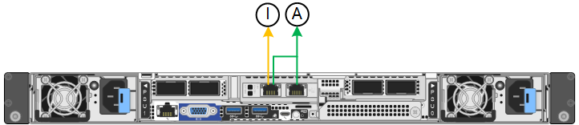
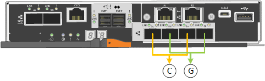

= Netzwerkverbindungen konfigurieren
:allow-uri-read: 
:icons: font
:imagesdir: ../media/

[role="lead"]
Sie können Netzwerkverbindungen für die Ports konfigurieren, die zum Verbinden der Appliance mit dem Grid-Netzwerk, dem Client-Netzwerk und dem Admin-Netzwerk verwendet werden. Sie können die Verbindungsgeschwindigkeit sowie den Port- und Netzwerk-Bond-Modus einstellen.

TIP: Wenn Sie ConfigBuilder zum Generieren einer JSON-Datei verwenden, können Sie die Netzwerkverbindungen automatisch konfigurieren. Siehe link:automating-appliance-installation-and-configuration.html["Automatisierung der Appliance-Installation und -Konfiguration"].

.Bevor Sie beginnen
* Das ist schon link:obtaining-additional-equipment-and-tools.html["Zusätzliche Ausrüstung erhalten"] Erforderlich für Ihren Kabeltyp und die Verbindungsgeschwindigkeit.
* Sie haben die richtigen Transceiver in den Ports installiert, basierend auf der Verbindungsgeschwindigkeit, die Sie verwenden möchten.
* Sie haben die Netzwerk-Ports mit Switches verbunden, die Ihre gewählte Geschwindigkeit unterstützen.

Wenn Sie den aggregierten Port Bond-Modus, den LACP Network Bond-Modus oder VLAN-Tagging verwenden möchten:

* Sie haben die Netzwerk-Ports an der Appliance mit Switches verbunden, die VLAN und LACP unterstützen.
* Wenn mehrere Switches an der LACP-Verbindung beteiligt sind, unterstützen die Switches MLAG (Multi-Chassis Link Aggregation Groups) oder eine vergleichbare Position.
* Sie wissen, wie Sie die Switches für die Verwendung von VLAN, LACP und MLAG oder Ähnliches konfigurieren.
* Sie kennen das eindeutige VLAN-Tag, das für jedes Netzwerk verwendet werden soll. Dieses VLAN-Tag wird zu jedem Netzwerkpaket hinzugefügt, um sicherzustellen, dass der Netzwerkverkehr an das richtige Netzwerk weitergeleitet wird.

.Über diese Aufgabe
Sie müssen nur die Einstellungen auf der Seite Link Configuration konfigurieren, wenn Sie eine nicht-Standardeinstellung verwenden möchten.

NOTE: Die LACP Übertragungs-Hash-Richtlinie ist layer2+3.

Die Abbildungen und Tabellen fassen die Optionen für den Port Bond-Modus und den Network Bond-Modus für jede Appliance zusammen. Weitere Informationen finden Sie im Folgenden:

* link:gathering-installation-information-sg100-and-sg1000.html#port-bond-modes["Port-Bond-Modi (SG1000 und SG100)"]
* link:gathering-installation-information-sg110-and-sg1100.html#port-bond-modes["Port-Bond-Modi (SG1100 und SG110)"]
* link:gathering-installation-information-sg5700.html#port-bond-modes["Port-Bond-Modi (E5700SG)"]
* link:gathering-installation-information-sg5800.html#port-bond-modes["Port-Bond-Modi (SG5800)"]
* link:gathering-installation-information-sg6000.html#port-bond-modes["Port-Bond-Modi (SG6000-CN)"]
* link:gathering-installation-information-sg6100.html#port-bond-modes["Port-Bond-Modi (SGF6112 und SG6100-CN)"]

[role="tabbed-block"]
====
.SG100 und SG1000
--
Bond-Modus mit festem Port (Standard)::
+
--
Die Abbildungen zeigen, wie die vier Netzwerk-Ports des SG1000 oder SG100 im Fixed Port Bond-Modus (Standardkonfiguration) verbunden sind.

SG1000:

image::../media/sg1000_fixed_port.png[SG1000 Fixed Port Bond-Modus]

SG100:

image::../media/sg100_fixed_port_draft.png[SG100-Bond-Modus mit Festanschluss]

[cols="1a,3a"]
|===
| Legende | Welche Ports sind verbunden 

 a| 
C
 a| 
Die Ports 1 und 3 sind für das Client-Netzwerk verbunden, falls dieses Netzwerk verwendet wird.

 a| 
G
 a| 
Die Ports 2 und 4 sind für das Grid-Netzwerk verbunden.

|===
In der Tabelle sind die Optionen für die Konfiguration der vier Netzwerkanschlüsse zusammengefasst. Sie müssen nur die Einstellungen auf der Seite Link Configuration konfigurieren, wenn Sie eine nicht-Standardeinstellung verwenden möchten.

[cols="1a,2a,2a"]
|===
| Netzwerk-Bond-Modus | Client-Netzwerk deaktiviert (Standard) | Client-Netzwerk aktiviert 

 a| 
Aktiv/Backup (Standard)
 a| 
* Die Ports 2 und 4 verwenden eine aktiv-Backup-Verbindung für das Grid Network.
* Die Ports 1 und 3 werden nicht verwendet.
* Ein VLAN-Tag ist optional.

 a| 
* Die Ports 2 und 4 verwenden eine aktiv-Backup-Verbindung für das Grid Network.
* Die Ports 1 und 3 verwenden eine aktiv-Backup-Verbindung für das Client-Netzwerk.
* VLAN-Tags können für beide Netzwerke festgelegt werden, damit der Netzwerkadministrator dies tun kann.

 a| 
LACP (802.3ad)
 a| 
* Die Ports 2 und 4 verwenden eine LACP-Verbindung für das Grid-Netzwerk.
* Die Ports 1 und 3 werden nicht verwendet.
* Ein VLAN-Tag ist optional.

 a| 
* Die Ports 2 und 4 verwenden eine LACP-Verbindung für das Grid-Netzwerk.
* Die Ports 1 und 3 verwenden eine LACP Bond für das Client-Netzwerk.
* VLAN-Tags können für beide Netzwerke festgelegt werden, damit der Netzwerkadministrator dies tun kann.

|===
--
Bond-Modus für aggregierten Ports::
+
--
Diese Abbildungen zeigen, wie die vier Netzwerk-Ports im aggregierten Port Bond-Modus verbunden sind.

SG1000:

image::../media/sg1000_aggregate_ports.png[Aggregierter Port Bond-Modus SG1000]

SG100:

image::../media/sg100_aggregate_ports.png[Aggregat Port Bond-Modus SG100]

[cols="1a,3a"]
|===
| Legende | Welche Ports sind verbunden 

 a| 
1
 a| 
Alle vier Ports werden in einer einzelnen LACP Bond gruppiert, sodass alle Ports für den Grid-Netzwerk- und Client-Netzwerk-Traffic verwendet werden können.

|===
In der Tabelle sind die Optionen für die Konfiguration der vier Netzwerkanschlüsse zusammengefasst. Sie müssen nur die Einstellungen auf der Seite Link Configuration konfigurieren, wenn Sie eine nicht-Standardeinstellung verwenden möchten.

[cols="1a,2a,2a"]
|===
| Netzwerk-Bond-Modus | Client-Netzwerk deaktiviert (Standard) | Client-Netzwerk aktiviert 

 a| 
Nur LACP (802.3ad
 a| 
* Die Ports 1-4 verwenden einen einzelnen LACP Bond für das Grid Network.
* Ein einzelnes VLAN-Tag identifiziert Grid-Netzwerkpakete.

 a| 
* Die Ports 1-4 verwenden eine einzelne LACP-Verbindung für das Grid-Netzwerk und das Client-Netzwerk.
* Zwei VLAN-Tags ermöglichen die Trennung von Grid-Netzwerkpaketen von Client-Netzwerkpaketen.

|===
--
Active-Backup Netzwerk-Bond-Modus für Management-Ports::
+
--
Diese Abbildungen zeigen, wie die beiden 1-GbE-Management-Ports auf den Appliances im Active-Backup-Netzwerk-Bond-Modus für das Admin-Netzwerk verbunden sind.

SG1000:

image::../media/sg1000_bonded_management_ports.png[Admin-Netzwerkports (SG1000) Bonded]

SG100:

image::../media/sg100_bonded_management_ports.png[Fest gebundene Admin-Netzwerkports SG100]

--

--
.SG110 und SG1100
--
Bond-Modus mit festem Port (Standard)::
+
--
Die Abbildungen zeigen, wie die vier Netzwerk-Ports des SG1100 oder SG110 im Fixed-Port-Bond-Modus (Standardkonfiguration) verbunden sind.

SG1100:

image::../media/sg1100_fixed_port.png[SG1100 Fixed Port Bond-Modus]

SG110:

image::../media/sgf6112_fixed_port.png[SG110 fester Port Bond-Modus]

[cols="1a,3a"]
|===
| Legende | Welche Ports sind verbunden 

 a| 
C
 a| 
Die Ports 1 und 3 sind für das Client-Netzwerk verbunden, falls dieses Netzwerk verwendet wird.

 a| 
G
 a| 
Die Ports 2 und 4 sind für das Grid-Netzwerk verbunden.

|===
In der Tabelle sind die Optionen für die Konfiguration der vier Netzwerkanschlüsse zusammengefasst. Sie müssen nur die Einstellungen auf der Seite Link Configuration konfigurieren, wenn Sie eine nicht-Standardeinstellung verwenden möchten.

[cols="1a,2a,2a"]
|===
| Netzwerk-Bond-Modus | Client-Netzwerk deaktiviert (Standard) | Client-Netzwerk aktiviert 

 a| 
Aktiv/Backup (Standard)
 a| 
* Die Ports 2 und 4 verwenden eine aktiv-Backup-Verbindung für das Grid Network.
* Die Ports 1 und 3 werden nicht verwendet.
* Ein VLAN-Tag ist optional.

 a| 
* Die Ports 2 und 4 verwenden eine aktiv-Backup-Verbindung für das Grid Network.
* Die Ports 1 und 3 verwenden eine aktiv-Backup-Verbindung für das Client-Netzwerk.
* VLAN-Tags können für beide Netzwerke festgelegt werden, damit der Netzwerkadministrator dies tun kann.

 a| 
LACP (802.3ad)
 a| 
* Die Ports 2 und 4 verwenden eine LACP-Verbindung für das Grid-Netzwerk.
* Die Ports 1 und 3 werden nicht verwendet.
* Ein VLAN-Tag ist optional.

 a| 
* Die Ports 2 und 4 verwenden eine LACP-Verbindung für das Grid-Netzwerk.
* Die Ports 1 und 3 verwenden eine LACP Bond für das Client-Netzwerk.
* VLAN-Tags können für beide Netzwerke festgelegt werden, damit der Netzwerkadministrator dies tun kann.

|===
--
Bond-Modus für aggregierten Ports::
+
--
Diese Abbildungen zeigen, wie die vier Netzwerk-Ports im aggregierten Port Bond-Modus verbunden sind.

SG1100:

image::../media/sg1100_aggregate_ports.png[Aggregierter Port Bond-Modus SG1100]

SG110:

image::../media/sgf6112_aggregate_ports.png[SG110-Gesamtanschlussmodus]

[cols="1a,3a"]
|===
| Legende | Welche Ports sind verbunden 

 a| 
1
 a| 
Alle vier Ports werden in einer einzelnen LACP Bond gruppiert, sodass alle Ports für den Grid-Netzwerk- und Client-Netzwerk-Traffic verwendet werden können.

|===
In der Tabelle sind die Optionen für die Konfiguration der Netzwerkports zusammengefasst. Sie müssen nur die Einstellungen auf der Seite Link Configuration konfigurieren, wenn Sie eine nicht-Standardeinstellung verwenden möchten.

[cols="1a,2a,2a"]
|===
| Netzwerk-Bond-Modus | Client-Netzwerk deaktiviert (Standard) | Client-Netzwerk aktiviert 

 a| 
Nur LACP (802.3ad
 a| 
* Die Ports 1-4 verwenden einen einzelnen LACP Bond für das Grid Network.
* Ein einzelnes VLAN-Tag identifiziert Grid-Netzwerkpakete.

 a| 
* Die Ports 1-4 verwenden eine einzelne LACP-Verbindung für das Grid-Netzwerk und das Client-Netzwerk.
* Zwei VLAN-Tags ermöglichen die Trennung von Grid-Netzwerkpaketen von Client-Netzwerkpaketen.

|===
--
Active-Backup Netzwerk-Bond-Modus für Management-Ports::
+
--
Diese Abbildungen zeigen, wie die beiden 1-GbE-Management-Ports auf den Appliances im Active-Backup-Netzwerk-Bond-Modus für das Admin-Netzwerk verbunden sind.

SG1100:

SG110:

image::../media/sgf6112_bonded_management_ports.png[Admin Network Ports, verbunden mit SG110]

--

--
.SG5700
--
Bond-Modus mit festem Port (Standard)::
+
--
Die Abbildung zeigt, wie die vier 10/25-GbE-Ports im Bond-Modus mit festen Ports (Standardkonfiguration) verbunden sind.

[cols="1a,3a"]
|===
| Legende | Welche Ports sind verbunden 

 a| 
C
 a| 
Die Ports 1 und 3 sind für das Client-Netzwerk verbunden, falls dieses Netzwerk verwendet wird.

 a| 
G
 a| 
Die Ports 2 und 4 sind für das Grid-Netzwerk verbunden.

|===
In der Tabelle sind die Optionen für die Konfiguration der vier 10/25-GbE-Ports zusammengefasst. Sie müssen nur die Einstellungen auf der Seite Link Configuration konfigurieren, wenn Sie eine nicht-Standardeinstellung verwenden möchten.

[cols="1a,2a,2a"]
|===
| Netzwerk-Bond-Modus | Client-Netzwerk deaktiviert (Standard) | Client-Netzwerk aktiviert 

 a| 
Aktiv/Backup (Standard)
 a| 
* Die Ports 2 und 4 verwenden eine aktiv-Backup-Verbindung für das Grid Network.
* Die Ports 1 und 3 werden nicht verwendet.
* Ein VLAN-Tag ist optional.

 a| 
* Die Ports 2 und 4 verwenden eine aktiv-Backup-Verbindung für das Grid Network.
* Die Ports 1 und 3 verwenden eine aktiv-Backup-Verbindung für das Client-Netzwerk.
* VLAN-Tags können für beide Netzwerke festgelegt werden, damit der Netzwerkadministrator dies tun kann.

 a| 
LACP (802.3ad)
 a| 
* Die Ports 2 und 4 verwenden eine LACP-Verbindung für das Grid-Netzwerk.
* Die Ports 1 und 3 werden nicht verwendet.
* Ein VLAN-Tag ist optional.

 a| 
* Die Ports 2 und 4 verwenden eine LACP-Verbindung für das Grid-Netzwerk.
* Die Ports 1 und 3 verwenden eine LACP Bond für das Client-Netzwerk.
* VLAN-Tags können für beide Netzwerke festgelegt werden, damit der Netzwerkadministrator dies tun kann.

|===
--
Bond-Modus für aggregierten Ports::
+
--
Diese Abbildung zeigt, wie die vier 10/25-GbE-Ports im Bond-Modus für aggregierte Ports verbunden sind.

image::../media/e5700sg_aggregate_port.gif[Das Bild zeigt, wie die 10/25-GbE-Ports auf dem E5700SG Controller im Aggregatmodus verbunden sind]

[cols="1a,3a"]
|===
| Legende | Welche Ports sind verbunden 

 a| 
1
 a| 
Alle vier Ports werden in einer einzelnen LACP Bond gruppiert, sodass alle Ports für den Grid-Netzwerk- und Client-Netzwerk-Traffic verwendet werden können.

|===
In der Tabelle sind die Optionen für die Konfiguration der vier 10/25-GbE-Ports zusammengefasst. Sie müssen nur die Einstellungen auf der Seite Link Configuration konfigurieren, wenn Sie eine nicht-Standardeinstellung verwenden möchten.

[cols="1a,2a,2a"]
|===
| Netzwerk-Bond-Modus | Client-Netzwerk deaktiviert (Standard) | Client-Netzwerk aktiviert 

 a| 
Nur LACP (802.3ad
 a| 
* Die Ports 1-4 verwenden einen einzelnen LACP Bond für das Grid Network.
* Ein einzelnes VLAN-Tag identifiziert Grid-Netzwerkpakete.

 a| 
* Die Ports 1-4 verwenden eine einzelne LACP-Verbindung für das Grid-Netzwerk und das Client-Netzwerk.
* Zwei VLAN-Tags ermöglichen die Trennung von Grid-Netzwerkpaketen von Client-Netzwerkpaketen.

|===
--
Active-Backup Netzwerk-Bond-Modus für Management-Ports::
+
--
Diese Abbildung zeigt, wie die zwei 1-GbE-Management-Ports auf dem E5700SG Controller im Active-Backup-Netzwerk-Bond-Modus für das Admin-Netzwerk verbunden sind.

image::../media/e5700sg_bonded_management_ports.gif[E5700SG Bonded Management Ports]

--

--
.SG5800
--
Bond-Modus mit festem Port (Standard)::
+
--
Die Abbildung zeigt, wie die vier 10/25-GbE-Ports im Bond-Modus mit festen Ports (Standardkonfiguration) verbunden sind.

image::../media/sg5800_fixed_port.png[Abbildung, die zeigt, wie die 10/25-GbE-Ports auf dem SG5800-Controller im festen Modus verbunden sind]

[cols="1a,3a"]
|===
| Legende | Welche Ports sind verbunden 

 a| 
C
 a| 
Die Ports 1 und 3 sind für das Client-Netzwerk verbunden, falls dieses Netzwerk verwendet wird.

 a| 
G
 a| 
Die Ports 2 und 4 sind für das Grid-Netzwerk verbunden.

|===
In der Tabelle sind die Optionen für die Konfiguration der vier 10/25-GbE-Ports zusammengefasst. Sie müssen nur die Einstellungen auf der Seite Link Configuration konfigurieren, wenn Sie eine nicht-Standardeinstellung verwenden möchten.

[cols="1a,2a,2a"]
|===
| Netzwerk-Bond-Modus | Client-Netzwerk deaktiviert (Standard) | Client-Netzwerk aktiviert 

 a| 
Aktiv/Backup (Standard)
 a| 
* Die Ports 2 und 4 verwenden eine aktiv-Backup-Verbindung für das Grid Network.
* Die Ports 1 und 3 werden nicht verwendet.
* Ein VLAN-Tag ist optional.

 a| 
* Die Ports 2 und 4 verwenden eine aktiv-Backup-Verbindung für das Grid Network.
* Die Ports 1 und 3 verwenden eine aktiv-Backup-Verbindung für das Client-Netzwerk.
* VLAN-Tags können für beide Netzwerke festgelegt werden, damit der Netzwerkadministrator dies tun kann.

 a| 
LACP (802.3ad)
 a| 
* Die Ports 2 und 4 verwenden eine LACP-Verbindung für das Grid-Netzwerk.
* Die Ports 1 und 3 werden nicht verwendet.
* Ein VLAN-Tag ist optional.

 a| 
* Die Ports 2 und 4 verwenden eine LACP-Verbindung für das Grid-Netzwerk.
* Die Ports 1 und 3 verwenden eine LACP Bond für das Client-Netzwerk.
* VLAN-Tags können für beide Netzwerke festgelegt werden, damit der Netzwerkadministrator dies tun kann.

|===
--
Bond-Modus für aggregierten Ports::
+
--
Diese Abbildung zeigt, wie die vier 10/25-GbE-Ports im Bond-Modus für aggregierte Ports verbunden sind.

image::../media/sg5800_aggregate_port.png[Abbildung: Verbindungen der 10/25-GbE-Ports auf dem SG5800 Controller im Aggregatmodus]

[cols="1a,3a"]
|===
| Legende | Welche Ports sind verbunden 

 a| 
1
 a| 
Alle vier Ports werden in einer einzelnen LACP Bond gruppiert, sodass alle Ports für den Grid-Netzwerk- und Client-Netzwerk-Traffic verwendet werden können.

|===
In der Tabelle sind die Optionen für die Konfiguration der vier 10/25-GbE-Ports zusammengefasst. Sie müssen nur die Einstellungen auf der Seite Link Configuration konfigurieren, wenn Sie eine nicht-Standardeinstellung verwenden möchten.

[cols="1a,2a,2a"]
|===
| Netzwerk-Bond-Modus | Client-Netzwerk deaktiviert (Standard) | Client-Netzwerk aktiviert 

 a| 
Nur LACP (802.3ad
 a| 
* Die Ports 1-4 verwenden einen einzelnen LACP Bond für das Grid Network.
* Ein einzelnes VLAN-Tag identifiziert Grid-Netzwerkpakete.

 a| 
* Die Ports 1-4 verwenden eine einzelne LACP-Verbindung für das Grid-Netzwerk und das Client-Netzwerk.
* Zwei VLAN-Tags ermöglichen die Trennung von Grid-Netzwerkpaketen von Client-Netzwerkpaketen.

|===
--

--
.SG6000
--
Bond-Modus mit festem Port (Standard)::
+
--
Diese Abbildung zeigt, wie die vier Netzwerk-Ports im Bond-Modus mit festen Ports verbunden sind (Standardkonfiguration).

image::../media/sg6000_cn_fixed_port.gif[Bild: Wie die Netzwerkanschlüsse des SG6000-CN-Controllers im festen Modus verbunden sind]

[cols="1a,3a"]
|===
| Legende | Welche Ports sind verbunden 

 a| 
C
 a| 
Die Ports 1 und 3 sind für das Client-Netzwerk verbunden, falls dieses Netzwerk verwendet wird.

 a| 
G
 a| 
Die Ports 2 und 4 sind für das Grid-Netzwerk verbunden.

|===
In der Tabelle sind die Optionen für die Konfiguration der Netzwerkports zusammengefasst. Sie müssen nur die Einstellungen auf der Seite Link Configuration konfigurieren, wenn Sie eine nicht-Standardeinstellung verwenden möchten.

[cols="1a,3a,3a"]
|===
| Netzwerk-Bond-Modus | Client-Netzwerk deaktiviert (Standard) | Client-Netzwerk aktiviert 

 a| 
Aktiv/Backup (Standard)
 a| 
* Die Ports 2 und 4 verwenden eine aktiv-Backup-Verbindung für das Grid Network.
* Die Ports 1 und 3 werden nicht verwendet.
* Ein VLAN-Tag ist optional.

 a| 
* Die Ports 2 und 4 verwenden eine aktiv-Backup-Verbindung für das Grid Network.
* Die Ports 1 und 3 verwenden eine aktiv-Backup-Verbindung für das Client-Netzwerk.
* VLAN-Tags können für beide Netzwerke festgelegt werden, damit der Netzwerkadministrator dies tun kann.

 a| 
LACP (802.3ad)
 a| 
* Die Ports 2 und 4 verwenden eine LACP-Verbindung für das Grid-Netzwerk.
* Die Ports 1 und 3 werden nicht verwendet.
* Ein VLAN-Tag ist optional.

 a| 
* Die Ports 2 und 4 verwenden eine LACP-Verbindung für das Grid-Netzwerk.
* Die Ports 1 und 3 verwenden eine LACP Bond für das Client-Netzwerk.
* VLAN-Tags können für beide Netzwerke festgelegt werden, damit der Netzwerkadministrator dies tun kann.

|===
--
Bond-Modus für aggregierten Ports::
+
--
Die Abbildung zeigt, wie die vier Netzwerk-Ports im Bond-Modus für aggregierte Ports verbunden sind.

image::../media/sg6000_cn_aggregate_port.gif[Das Bild zeigt, wie die Netzwerk-Ports auf dem SG6000-CN-Controller im Aggregatmodus verbunden sind]

[cols="1a,3a"]
|===
| Legende | Welche Ports sind verbunden 

 a| 
1
 a| 
Alle vier Ports werden in einer einzelnen LACP Bond gruppiert, sodass alle Ports für den Grid-Netzwerk- und Client-Netzwerk-Traffic verwendet werden können.

|===
In der Tabelle sind die Optionen für die Konfiguration der Netzwerkports zusammengefasst. Sie müssen nur die Einstellungen auf der Seite Link Configuration konfigurieren, wenn Sie eine nicht-Standardeinstellung verwenden möchten.

[cols="1a,3a,3a"]
|===
| Netzwerk-Bond-Modus | Client-Netzwerk deaktiviert (Standard) | Client-Netzwerk aktiviert 

 a| 
Nur LACP (802.3ad
 a| 
* Die Ports 1-4 verwenden einen einzelnen LACP Bond für das Grid Network.
* Ein einzelnes VLAN-Tag identifiziert Grid-Netzwerkpakete.

 a| 
* Die Ports 1-4 verwenden eine einzelne LACP-Verbindung für das Grid-Netzwerk und das Client-Netzwerk.
* Zwei VLAN-Tags ermöglichen die Trennung von Grid-Netzwerkpaketen von Client-Netzwerkpaketen.

|===
--
Active-Backup Netzwerk-Bond-Modus für Management-Ports::
+
--
Diese Abbildung zeigt, wie die beiden 1-GbE-Management-Ports des SG6000-CN-Controllers im Active-Backup-Netzwerk-Bond-Modus des Admin-Netzwerks verbunden sind.

image::../media/sg6000_cn_bonded_managemente_ports.png[Anschluss Der Admin-Netzwerk-Ports]

--

--
.SG6100
--
Bond-Modus mit festem Port (Standard)::
+
--
Die Abbildung zeigt, wie die vier Netzwerk-Ports im Bond-Modus mit festen Ports verbunden sind (Standardkonfiguration).

*SGF6112*:

image::../media/sgf6112_fixed_port.png[SGF6112 Bond-Modus mit festem Port]

*SG6100*:

image::../media/sg6100_cn_fixed_port.png[SG6100-CN Bond-Modus mit festem Port]

[cols="1a,3a"]
|===
| Legende | Welche Ports sind verbunden 

 a| 
C
 a| 
Die Ports 1 und 3 sind für das Client-Netzwerk verbunden, falls dieses Netzwerk verwendet wird.

 a| 
G
 a| 
Die Ports 2 und 4 sind für das Grid-Netzwerk verbunden.

|===
In der Tabelle sind die Optionen für die Konfiguration der Netzwerkports zusammengefasst. Sie müssen nur die Einstellungen auf der Seite Link Configuration konfigurieren, wenn Sie eine nicht-Standardeinstellung verwenden möchten.

[cols="1a,2a,2a"]
|===
| Netzwerk-Bond-Modus | Client-Netzwerk deaktiviert (Standard) | Client-Netzwerk aktiviert 

 a| 
Aktiv/Backup (Standard)
 a| 
* Die Ports 2 und 4 verwenden eine aktiv-Backup-Verbindung für das Grid Network.
* Die Ports 1 und 3 werden nicht verwendet.
* Ein VLAN-Tag ist optional.

 a| 
* Die Ports 2 und 4 verwenden eine aktiv-Backup-Verbindung für das Grid Network.
* Die Ports 1 und 3 verwenden eine aktiv-Backup-Verbindung für das Client-Netzwerk.
* VLAN-Tags können für beide Netzwerke festgelegt werden, damit der Netzwerkadministrator dies tun kann.

 a| 
LACP (802.3ad)
 a| 
* Die Ports 2 und 4 verwenden eine LACP-Verbindung für das Grid-Netzwerk.
* Die Ports 1 und 3 werden nicht verwendet.
* Ein VLAN-Tag ist optional.

 a| 
* Die Ports 2 und 4 verwenden eine LACP-Verbindung für das Grid-Netzwerk.
* Die Ports 1 und 3 verwenden eine LACP Bond für das Client-Netzwerk.
* VLAN-Tags können für beide Netzwerke festgelegt werden, damit der Netzwerkadministrator dies tun kann.

|===
--
Bond-Modus für aggregierten Ports::
+
--
Die Abbildung zeigt, wie die vier Netzwerk-Ports im aggregierten Port-Bond-Modus verbunden sind.

*SGF6112*:

image::../media/sgf6112_aggregate_ports.png[SGF6112 aggregierter Port Bond-Modus]

*SG6100*:

image::../media/sg6100_cn_aggregate_ports.png[SG6100-CN aggregierter Port Bond-Modus]

[cols="1a,3a"]
|===
| Legende | Welche Ports sind verbunden 

 a| 
1
 a| 
Alle vier Ports werden in einer einzelnen LACP Bond gruppiert, sodass alle Ports für den Grid-Netzwerk- und Client-Netzwerk-Traffic verwendet werden können.

|===
In der Tabelle sind die Optionen für die Konfiguration der Netzwerkports zusammengefasst. Sie müssen nur die Einstellungen auf der Seite Link Configuration konfigurieren, wenn Sie eine nicht-Standardeinstellung verwenden möchten.

[cols="1a,2a,2a"]
|===
| Netzwerk-Bond-Modus | Client-Netzwerk deaktiviert (Standard) | Client-Netzwerk aktiviert 

 a| 
Nur LACP (802.3ad
 a| 
* Die Ports 1-4 verwenden einen einzelnen LACP Bond für das Grid Network.
* Ein einzelnes VLAN-Tag identifiziert Grid-Netzwerkpakete.

 a| 
* Die Ports 1-4 verwenden eine einzelne LACP-Verbindung für das Grid-Netzwerk und das Client-Netzwerk.
* Zwei VLAN-Tags ermöglichen die Trennung von Grid-Netzwerkpaketen von Client-Netzwerkpaketen.

|===
--
Active-Backup Netzwerk-Bond-Modus für Management-Ports::
+
--
Diese Abbildung zeigt, wie die beiden 1-GbE-Management-Ports im Active-Backup-Netzwerk-Bond-Modus für das Admin-Netzwerk verbunden sind.

*SGF6112*:

image::../media/sgf6112_bonded_management_ports.png[Admin Network Ports, verbunden mit SGF6112]

*SG6100*:

image::../media/sg6100_cn_bonded_management_ports.png[Admin Network Ports, verbunden mit SG6100-CN]

--

--
====
.Schritte
. Klicken Sie in der Menüleiste des StorageGRID-Appliance-Installationsprogramms auf *Netzwerke konfigurieren* > *Link-Konfiguration*.
+
Auf der Seite Network Link Configuration wird ein Diagramm der Appliance angezeigt, in dem die Netzwerk- und Verwaltungsports nummeriert sind.

+
In der Tabelle Verbindungsstatus werden der Verbindungsstatus, die Verbindungsgeschwindigkeit und andere Statistiken der nummerierten Ports aufgeführt.

+
Das erste Mal, wenn Sie diese Seite aufrufen:

+
** *Verbindungsgeschwindigkeit* ist auf *Auto* eingestellt.
** *Port Bond Modus* ist auf *fest* eingestellt.
** *Network Bond Mode* ist für das Grid Network auf *Active-Backup* eingestellt.
** Das *Admin-Netzwerk* ist aktiviert, und der Netzwerk-Bond-Modus ist auf *unabhängig* eingestellt.
** Das *Client-Netzwerk* ist deaktiviert.

. Wählen Sie die Verbindungsgeschwindigkeit für die Netzwerkanschlüsse aus der Dropdown-Liste *Link Speed* aus.
+
Die Netzwerk-Switches, die Sie für das Grid-Netzwerk und das Client-Netzwerk verwenden, müssen ebenfalls für diese Geschwindigkeit konfiguriert sein. Für die konfigurierte Verbindungsgeschwindigkeit müssen Sie die entsprechenden Adapter oder Transceiver verwenden. Verwenden Sie die automatische Verbindungsgeschwindigkeit, wenn möglich, da diese Option sowohl die Verbindungsgeschwindigkeit als auch den FEC-Modus (Forward Error Correction) mit dem Link-Partner verhandelt.

+
Falls Sie die 25-GbE-Verbindungsgeschwindigkeit für die SG6100-, SG6000-, SG5800- oder SG5700-Netzwerkports verwenden möchten:

+
** Verwenden Sie SFP28 Transceiver und SFP28 Twinax-Kabel oder optische Kabel.
** Wählen Sie für den SG5700 *25GbE* aus der Dropdown-Liste *Link Speed* aus.
** Wählen Sie für den SG5800, SG6000 oder SG6100 aus der Dropdown-Liste *Verbindungsgeschwindigkeit* die Option *Auto* aus.

. Aktivieren oder deaktivieren Sie die StorageGRID-Netzwerke, die Sie verwenden möchten.
+
Das Grid-Netzwerk ist erforderlich. Dieses Netzwerk kann nicht deaktiviert werden.

+
.. Wenn das Gerät nicht mit dem Admin-Netzwerk verbunden ist, deaktivieren Sie das Kontrollkästchen *Netzwerk aktivieren* für das Admin-Netzwerk.
.. Wenn das Gerät mit dem Client-Netzwerk verbunden ist, aktivieren Sie das Kontrollkästchen *Netzwerk aktivieren* für das Client-Netzwerk.
+
Die Client-Netzwerkeinstellungen für die Daten-NIC-Ports werden nun angezeigt.

. In der Tabelle finden Sie Informationen zum Konfigurieren des Port-Bond-Modus und des Netzwerk-Bond-Modus.
+
Dieses Beispiel zeigt:

+
** *Aggregate* und *LACP* ausgewählt für das Grid und die Client Netzwerke. Sie müssen für jedes Netzwerk ein eindeutiges VLAN-Tag angeben. Sie können Werte zwischen 0 und 4095 auswählen.
** *Active-Backup* für das Admin-Netzwerk ausgewählt.
+
image::../media/sg1000_network_link_configuration_aggregate.png[Network Link Configuration Aggregate]

. Wenn Sie mit Ihrer Auswahl zufrieden sind, klicken Sie auf *Speichern*.
+

NOTE: Wenn Sie Änderungen am Netzwerk oder an der Verbindung vorgenommen haben, über die Sie verbunden sind, können Sie die Verbindung verlieren. Wenn die Verbindung nicht innerhalb von 1 Minute wiederhergestellt wird, geben Sie die URL für den StorageGRID-Appliance-Installer erneut ein. Verwenden Sie dazu eine der anderen IP-Adressen, die der Appliance zugewiesen sind: +
`*https://_appliance_IP_:8443*`

