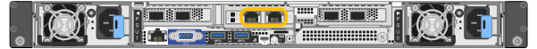
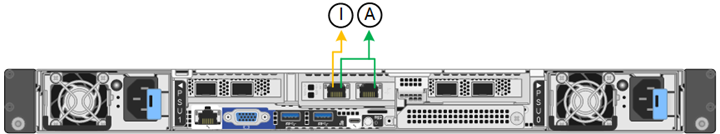

= Netzwerkinformationen erfassen (SG6100)
:allow-uri-read: 
:icons: font
:imagesdir: ../media/

[role="lead"]
Notieren Sie anhand der folgenden Tabellen die erforderlichen Informationen für jedes Netzwerk, das Sie mit dem Gerät verbinden. Diese Werte sind für die Installation und Konfiguration der Hardware erforderlich.

TIP: Verwenden Sie anstelle der Tabellen das mit ConfigBuilder bereitgestellte Arbeitsbuch. Mit der Arbeitsmappe „ConfigBuilder“ können Sie Ihre Systeminformationen hochladen und eine JSON-Datei erstellen, um einige Konfigurationsschritte im Installationsprogramm für StorageGRID-Appliances automatisch auszuführen. Siehe link:automating-appliance-installation-and-configuration.html["Automatisierung der Appliance-Installation und -Konfiguration"].

== Überprüfen Sie die StorageGRID-Version

Vergewissern Sie sich vor der Installation eines SGF6112- oder SG6160-Geräts, dass Ihr StorageGRID-System eine erforderliche Version der StorageGRID-Software verwendet.

[cols="1a,2a"]
|===
| Appliance | Erforderliche StorageGRID Version 

 a| 
SGF6112
 a| 
11.7 oder höher (neuester Hotfix empfohlen)

 a| 
SG6160
 a| 
11.8 oder höher (neuester Hotfix empfohlen)

|===

== Stellen Sie eine Verbindung mit dem SANtricity System Manager her

Sie verbinden beide Speicher-Controller der SG6160 Appliance mit dem Managementnetzwerk, das Sie für SANtricity System Manager verwenden. Controller A befindet sich oben und Controller B ist unten.

[cols="2a,1a,1a"]
|===
| Erforderliche Informationen | Ihr Wert für Controller A | Ihr Wert für Controller B 

 a| 
Ethernet-Switch-Port Sie werden eine Verbindung zu Management-Port 1 herstellen (gekennzeichnet mit P1 auf dem Controller).
 a| 
 a| 

 a| 
MAC-Adresse für Management-Port 1 (auf einem Etikett in der Nähe von Port P1 gedruckt)
 a| 
 a| 

 a| 
Über DHCP zugewiesene IP-Adresse für Management-Port 1, sofern nach dem Einschalten verfügbar

*Hinweis:* Wenn das Netzwerk, das Sie mit dem Speicher-Controller verbinden, einen DHCP-Server enthält, kann der Netzwerkadministrator die MAC-Adresse verwenden, um die vom DHCP-Server zugewiesene IP-Adresse zu ermitteln.
 a| 
 a| 

 a| 
Statische IP-Adresse, die Sie für die Appliance im Managementnetzwerk verwenden möchten
 a| 
Für IPv4:

* IPv4-Adresse:
* Subnetzmaske:
* Gateway:

Für IPv6:

* IPv6-Adresse:
* Routingfähige IP-Adresse:
* IP-Adresse des Storage Controller-Routers:

 a| 
Für IPv4:

* IPv4-Adresse:
* Subnetzmaske:
* Gateway:

Für IPv6:

* IPv6-Adresse:
* Routingfähige IP-Adresse:
* IP-Adresse des Storage Controller-Routers:

 a| 
IP-Adressformat
 a| 
Bitte auswählen:

* IPv4
* IPv6

 a| 
Bitte auswählen:

* IPv4
* IPv6

 a| 
Geschwindigkeit und Duplexmodus

*Hinweis:* Sie müssen sicherstellen, dass der Ethernet-Switch für das SANtricity-System-Manager-Managementnetzwerk auf Autonegotiation gesetzt ist.
 a| 
Muss sein:

* Autonegotiation (Standard)

 a| 
Muss sein:

* Autonegotiation (Standard)

|===

== Administrations- und Wartungs-Ports

Das Admin-Netzwerk für StorageGRID ist ein optionales Netzwerk, das zur Systemadministration und -Wartung verwendet wird. Die Appliance stellt über die folgenden 1/10-GbE-Ports auf der Appliance eine Verbindung zum Admin-Netzwerk her.

RJ-45-Ports an der SGF6112-Appliance:

RJ-45-Ports am SG6100-CN-Controller:

[cols="2a,1a"]
|===
| Erforderliche Informationen | Ihr Wert 

 a| 
Admin-Netzwerk aktiviert
 a| 
Bitte auswählen:

* Nein
* Ja (Standard)

 a| 
Netzwerk-Bond-Modus
 a| 
Bitte auswählen:

* Unabhängig (Standard)
* Aktiv/Backup

 a| 
Switch-Port für den im Diagramm eingekreisten linken Port (Standard-aktiver Port für unabhängigen Netzwerk-Bond-Modus)
 a| 

 a| 
Switch-Port für den rechten Port im Diagramm eingekreist (nur aktiv-Backup-Netzwerk-Bond-Modus)
 a| 

 a| 
DHCP-zugewiesene IP-Adresse für den Admin-Netzwerkport, sofern nach dem Einschalten verfügbar

*Hinweis:* Wenden Sie sich an Ihren Netzwerkadministrator für die Admin-Netzwerk-Port DHCP-zugewiesene IP-Adresse.
 a| 
* IPv4-Adresse (CIDR):
* Gateway:

 a| 
Statische IP-Adresse, die Sie für den Appliance-Knoten im Admin-Netzwerk verwenden möchten

*Hinweis:* Wenn Ihr Netzwerk kein Gateway hat, geben Sie die gleiche statische IPv4-Adresse für das Gateway an.
 a| 
* IPv4-Adresse (CIDR):
* Gateway:

 a| 
Admin-Netzwerk-Subnetze (CIDR)
 a| 

|===

== Netzwerkports

Die vier Netzwerkports auf der Appliance werden mit dem StorageGRID-Grid-Netzwerk und dem optionalen Client-Netzwerk verbunden.

[cols="2a,1a"]
|===
| Erforderliche Informationen | Ihr Wert 

 a| 
Verbindungsgeschwindigkeit
 a| 
Bitte auswählen:

* Auto (Standard)
* 10 GbE
* 25 GBitE
* 100 GbE (nur SG6160)

 a| 
Port Bond-Modus
 a| 
Bitte auswählen:

* Fest (Standard)
* Aggregat

 a| 
Switch-Port für Port 1 (Client-Netzwerk für festen Modus)
 a| 

 a| 
Switch-Port für Port 2 (Grid-Netzwerk für Fixed-Modus)
 a| 

 a| 
Switch-Port für Port 3 (Client-Netzwerk für festen Modus)
 a| 

 a| 
Switch-Port für Port 4 (Grid-Netzwerk für Fixed-Modus)
 a| 

|===

== Grid-Netzwerkports

Das Grid-Netzwerk für StorageGRID ist ein erforderliches Netzwerk, das für den gesamten internen StorageGRID-Datenverkehr verwendet wird. Die Appliance wird über die vier Netzwerk-Ports mit dem Grid-Netzwerk verbunden.

[cols="2a,1a"]
|===
| Erforderliche Informationen | Ihr Wert 

 a| 
Netzwerk-Bond-Modus
 a| 
Bitte auswählen:

* Aktiv/Backup (Standard)
* LACP (802.3ad)

 a| 
VLAN-Tagging aktiviert
 a| 
Bitte auswählen:

* Nein (Standard)
* Ja.

 a| 
VLAN Tag (wenn VLAN Tagging aktiviert ist)
 a| 
Geben Sie einen Wert zwischen 0 und 4095 ein:

 a| 
DHCP-zugewiesene IP-Adresse für das Grid-Netzwerk, sofern nach dem Einschalten verfügbar
 a| 
* IPv4-Adresse (CIDR):
* Gateway:

 a| 
Statische IP-Adresse, die Sie für den Appliance-Node im Grid-Netzwerk verwenden möchten

*Hinweis:* Wenn Ihr Netzwerk kein Gateway hat, geben Sie die gleiche statische IPv4-Adresse für das Gateway an.
 a| 
* IPv4-Adresse (CIDR):
* Gateway:

 a| 
Grid-Netzwerknetze (CIDRs)
 a| 

 a| 
Einstellung für maximale Übertragungseinheit (MTU) (optional). Sie können den Standardwert 1500 verwenden oder die MTU auf einen für Jumbo Frames geeigneten Wert einstellen, z. B. 9000.
 a| 

|===

== Client-Netzwerkports

Das Client-Netzwerk für StorageGRID ist ein optionales Netzwerk, das in der Regel für den Zugriff auf das Grid auf das Clientprotokoll verwendet wird. Die Appliance wird über die vier Netzwerk-Ports mit dem Client-Netzwerk verbunden.

[cols="2a,1a"]
|===
| Erforderliche Informationen | Ihr Wert 

 a| 
Client-Netzwerk aktiviert
 a| 
Bitte auswählen:

* Nein (Standard)
* Ja.

 a| 
Netzwerk-Bond-Modus
 a| 
Bitte auswählen:

* Aktiv/Backup (Standard)
* LACP (802.3ad)

 a| 
VLAN-Tagging aktiviert
 a| 
Bitte auswählen:

* Nein (Standard)
* Ja.

 a| 
VLAN-Tag (wenn VLAN-Tagging aktiviert ist)
 a| 
Geben Sie einen Wert zwischen 0 und 4095 ein:

 a| 
DHCP-zugewiesene IP-Adresse für das Client-Netzwerk, falls nach dem Einschalten verfügbar
 a| 
* IPv4-Adresse (CIDR):
* Gateway:

 a| 
Statische IP-Adresse, die Sie für den Appliance-Knoten im Client-Netzwerk verwenden möchten

*Hinweis:* Wenn das Client-Netzwerk aktiviert ist, verwendet die Standardroute auf dem Gerät das hier angegebene Gateway.
 a| 
* IPv4-Adresse (CIDR):
* Gateway:

|===

== BMC-Management-Netzwerk-Ports

Sie können auf die BMC-Schnittstelle auf der Appliance über den in der Abbildung eingekreisten 1-GbE-Managementport zugreifen. Dieser Port unterstützt die Remote-Verwaltung der Controller-Hardware über Ethernet unter Verwendung des IPMI-Standards (Intelligent Platform Management Interface).

NOTE: Sie können den Remote-IPMI-Zugriff für alle Appliances aktivieren oder deaktivieren, die einen BMC enthalten. Die Remote-IPMI-Schnittstelle ermöglicht jedem Benutzer mit einem BMC-Konto und Passwort den Zugriff auf Ihre StorageGRID-Geräte auf niedriger Ebene. Wenn Sie keinen Remote-IPMI-Zugriff auf den BMC benötigen, deaktivieren Sie diese Option mit einer der folgenden Methoden: +
Gehen Sie im Grid Manager zu *CONFIGURATION* > *Security* > *Security settings* > *Appliances* und deaktivieren Sie das Kontrollkästchen *Remote-IPMI-Zugriff aktivieren*. +
Verwenden Sie in der Grid-Management-API den privaten Endpunkt: `PUT /private/bmc`.

Die folgenden Abbildungen zeigen den BMC-Management-Port auf dem SGF6112 und SG6100-CN.

_SGF6112_

image::../media/sgf6112_cn_bmc_management_port.png[SGF6112 Management-Port]

_SG6100-CN_

image::../media/sg6100_cn_bmc_management_port.png[SG6100-CN Management-Port]

[cols="2a,1a"]
|===
| Erforderliche Informationen | Ihr Wert 

 a| 
Ethernet-Switch-Port Sie stellen eine Verbindung zum BMC-Management-Port her (im Diagramm eingekreist).
 a| 

 a| 
DHCP-zugewiesene IP-Adresse für das BMC-Managementnetzwerk, sofern nach dem Einschalten verfügbar
 a| 
* IPv4-Adresse (CIDR):
* Gateway:

 a| 
Statische IP-Adresse, die Sie für den BMC-Verwaltungsport verwenden möchten
 a| 
* IPv4-Adresse (CIDR):
* Gateway:

|===

== Port-Bond-Modi

Wenn link:configuring-network-links.html["Netzwerk-Links werden konfiguriert"] Für die SGF6112-Appliance können Sie Port-Bonding für die Ports verwenden, die mit dem Grid-Netzwerk und dem optionalen Client-Netzwerk verbunden sind, sowie für die 1/10-GbE-Management-Ports, die mit dem optionalen Admin-Netzwerk verbunden sind. Mit Port-Bonding sichern Sie Ihre Daten, indem Sie redundante Pfade zwischen StorageGRID-Netzwerken und der Appliance bereitstellen.

=== Netzwerk-Bond-Modi

Die Netzwerk-Ports auf der Appliance unterstützen den Bond-Modus für feste Ports oder den Bond-Modus für aggregierte Ports für Grid-Netzwerk- und Client-Netzwerkverbindungen.

==== Bond-Modus mit festem Port

Der Fixed-Port-Bond-Modus ist die Standardkonfiguration für die Netzwerk-Ports.

_SGF6112:_

image::../media/sgf6112_fixed_port.png[SGF6112 Bond-Modus mit festem Port]

_SG6100-CN:_

image::../media/sg6100_cn_fixed_port.png[SG6100-CN Bond-Modus mit festem Port]

[cols="1a,3a"]
|===
| Legende | Welche Ports sind verbunden 

 a| 
C
 a| 
Die Ports 1 und 3 sind für das Client-Netzwerk verbunden, falls dieses Netzwerk verwendet wird.

 a| 
G
 a| 
Die Ports 2 und 4 sind für das Grid-Netzwerk verbunden.

|===
Bei Verwendung des Bond-Modus mit festem Port können die Ports über den aktiv-Backup-Modus oder den Link Aggregation Control Protocol-Modus (LACP 802.3ad) verbunden werden.

* Im aktiv-Backup-Modus (Standard) ist jeweils nur ein Port aktiv. Wenn der aktive Port ausfällt, stellt sein Backup-Port automatisch eine Failover-Verbindung bereit. Port 4 bietet einen Sicherungspfad für Port 2 (Grid Network), und Port 3 stellt einen Sicherungspfad für Port 1 (Client Network) bereit.
* Im LACP-Modus bildet jedes Port-Paar einen logischen Channel zwischen der Appliance und dem Netzwerk, der einen höheren Durchsatz ermöglicht. Wenn ein Port ausfällt, stellt der andere Port den Kanal weiterhin bereit. Der Durchsatz wird verringert, die Konnektivität wird jedoch nicht beeinträchtigt.

NOTE: Wenn Sie keine redundanten Verbindungen benötigen, können Sie für jedes Netzwerk nur einen Port verwenden. Beachten Sie jedoch, dass die Warnung *Storage Appliance Link down* nach der Installation von StorageGRID im Grid Manager ausgelöst werden kann, was darauf hinweist, dass ein Kabel nicht angeschlossen ist. Sie können diese Warnungsregel sicher deaktivieren.

==== Bond-Modus für aggregierten Ports

Im Aggregat-Port-Bond-Modus wird der Durchsatz jedes StorageGRID-Netzwerks deutlich erhöht und zusätzliche Failover-Pfade bereitgestellt.

_SGF6112:_

image::../media/sgf6112_aggregate_ports.png[SGF6112-aggregierter Port-Bond-Modus]

_SG6100-CN:_

image::../media/sg6100_cn_aggregate_ports.png[SG6100-CN Bond-Modus für aggregierten Port]

[cols="1a,3a"]
|===
| Legende | Welche Ports sind verbunden 

 a| 
1
 a| 
Alle verbundenen Ports werden in einer einzelnen LACP Bond gruppiert, sodass alle Ports für den Grid-Netzwerk- und Client-Netzwerk-Datenverkehr verwendet werden können.

|===
Wenn Sie planen, den aggregierten Port Bond-Modus zu verwenden:

* Sie müssen LACP Network Bond-Modus verwenden.
* Sie müssen für jedes Netzwerk ein eindeutiges VLAN-Tag angeben. Dieses VLAN-Tag wird zu jedem Netzwerkpaket hinzugefügt, um sicherzustellen, dass der Netzwerkverkehr an das richtige Netzwerk weitergeleitet wird.
* Die Ports müssen mit Switches verbunden sein, die VLAN und LACP unterstützen können. Wenn mehrere Switches an der LACP-Verbindung beteiligt sind, müssen die Switches MLAG (Multi-Chassis Link Aggregation Groups) oder eine vergleichbare Position unterstützen.
* Sie wissen, wie Sie die Switches für die Verwendung von VLAN, LACP und MLAG oder gleichwertig konfigurieren.

Wenn Sie nicht alle vier Ports verwenden möchten, können Sie einen, zwei oder drei Ports verwenden. Durch die Verwendung von mehr als einem Port wird die Wahrscheinlichkeit maximiert, dass einige Netzwerkverbindungen verfügbar bleiben, wenn einer der Ports ausfällt.

NOTE: Wenn Sie weniger als vier Netzwerkanschlüsse verwenden möchten, beachten Sie, dass nach der Installation des Appliance-Knotens im Grid Manager möglicherweise eine Warnmeldung für die *Services-Appliance-Verbindung aus* ausgelöst wird, was darauf hinweist, dass ein Kabel nicht angeschlossen ist. Sie können diese Warnungsregel für die ausgelöste Warnmeldung sicher deaktivieren.

=== Network Bond-Modi für Management-Ports

Für die beiden 1/10-GbE-Management-Ports können Sie den Independent Network Bond-Modus oder den Active-Backup-Netzwerk-Bond-Modus wählen, um eine Verbindung zum optionalen Admin-Netzwerk herzustellen.

_SGF6112:_

_SG6100-CN:_

image::../media/sg6100_cn_bonded_management_ports.png[SG6100-CN Netzwerk-Management Ports]

[cols="1a,3a"]
|===
| Legende | Netzwerk-Bond-Modus 

 a| 
A
 a| 
Aktiv-Backup-Modus. Beide Management-Ports sind mit einem logischen Management-Port verbunden, der mit dem Admin-Netzwerk verbunden ist.

 a| 
ICH
 a| 
Unabhängiger Modus. Der Port auf der linken Seite ist mit dem Admin-Netzwerk verbunden. Der Anschluss rechts ist für temporäre lokale Verbindungen verfügbar (IP-Adresse 169.254.0.1).

|===
Im Independent-Modus ist nur der Management-Port links mit dem Admin-Netzwerk verbunden. Dieser Modus stellt keinen redundanten Pfad bereit. Der Management-Port auf der rechten Seite ist nicht verbunden und steht für temporäre lokale Verbindungen zur Verfügung (verwendet IP-Adresse 169.254.0.1).

Im Active-Backup-Modus sind beide Management-Ports mit dem Admin-Netzwerk verbunden. Es ist jeweils nur ein Port aktiv. Wenn der aktive Port ausfällt, stellt sein Backup-Port automatisch eine Failover-Verbindung bereit. Die Verbindung dieser beiden physischen Ports zu einem logischen Management-Port bietet einen redundanten Pfad zum Admin-Netzwerk.

NOTE: Wenn Sie eine temporäre lokale Verbindung zum Gerät herstellen müssen, wenn die 1/10-GbE-Managementports für den Active-Backup-Modus konfiguriert sind, entfernen Sie die Kabel von beiden Management-Ports, schließen Sie das temporäre Kabel an den Management-Port auf der rechten Seite an und greifen Sie über die IP-Adresse 169.254.0 auf die Appliance zu.

.Verwandte Informationen
* link:cabling-appliance.html["Kabelgerät"]
* link:setting-ip-configuration.html["Konfigurieren Sie StorageGRID-IP-Adressen"]

