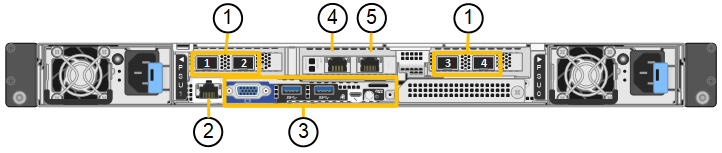

= SG110 und SG1100 Appliances: Überblick
:allow-uri-read: 
:icons: font
:imagesdir: ../media/

[role="lead"]
Die Service Appliance StorageGRID SG110 und die Service Appliance SG1100 können als Gateway-Node und als Admin-Node eingesetzt werden, um hochverfügbare Load Balancing-Services in einem StorageGRID-System bereitzustellen. Beide Appliances können gleichzeitig als Gateway-Nodes und Admin-Nodes (primär oder nicht primär) betrieben werden.

== Funktionen der Appliance

Beide Modelle der Service Appliance bieten die folgenden Funktionen:

* Gateway-Knoten oder Admin-Knoten Funktionen für ein StorageGRID-System.
* StorageGRID Appliance Installer zur Vereinfachung der Implementierung und Konfiguration von Nodes.
* Bei der Bereitstellung kann über einen vorhandenen Admin-Node oder über auf ein lokales Laufwerk heruntergeladene Software auf die StorageGRID-Software zugegriffen werden. Um den Implementierungsprozess weiter zu vereinfachen, wird während der Fertigung eine aktuelle Version der Software vorinstalliert.
* Ein Baseboard Management Controller (BMC) für das Monitoring und die Diagnose einiger Hardware des Geräts.
* Die Möglichkeit, eine Verbindung zu allen drei StorageGRID-Netzwerken herzustellen, einschließlich Grid-Netzwerk, Admin-Netzwerk und Client-Netzwerk:
+
** Das SG110 unterstützt bis zu vier 10- oder 25-GbE-Verbindungen zum Grid-Netzwerk und Client-Netzwerk.
** Die SG1100 unterstützt bis zu vier 10-, 25-, 40- oder 100-GbE-Verbindungen mit dem Grid-Netzwerk und dem Client-Netzwerk.

== SG110- und SG1100-Diagramme

Diese Abbildung zeigt die Vorderseite des SG110 und des SG1100 mit entfernter Blende. Von der Vorderseite sind die beiden Geräte identisch, mit Ausnahme des Produktnamens auf der Blende.

image::../media/sg1100_front_with_ssds.png[Vorderseite mit SSDs SG110 und SG1100]

Die beiden durch die orangefarbene Umrandung gekennzeichneten Solid State-Laufwerke (SSDs) werden zur Speicherung des StorageGRID-Betriebssystems verwendet und aus Redundanzgründen mit RAID 1 gespiegelt. Wenn die Service Appliance SG110 oder SG1100 als Admin-Node konfiguriert ist, können diese Laufwerke zum Speichern von Audit-Protokollen, Kennzahlen und Datenbanktabellen verwendet werden.

Die übrigen Laufwerksschächte sind leer.

Diese Abbildung zeigt die Position des Netzteils und die Identifizieren-LEDs auf der Rückseite des SG110 und des SG1100. Zusätzliche Status- und Aktivitäts-LEDs befinden sich an den Geräteanschlüssen. Diese LEDs können je nach Gerätelodell variieren.

image::../media/q2024_rear_leds.png[Hintere LEDs SG110 und SG1100]

[cols="1a,2a,3a"]
|===
| Legende | LED | Status 

 a| 
1
 a| 
Netzteil-LED
 a| 
* Grün, konstant: Das Gerät wird mit Strom versorgt, der Netzschalter ist eingeschaltet.
* Grün, blinkend: Das Gerät wird mit Strom versorgt, der Netzschalter ist ausgeschaltet.
* Aus: Das Gerät wird nicht mit Strom versorgt.
* Gelb: Netzteilfehler.

 a| 
2
 a| 
Identifizieren Sie die LED
 a| 
* Blau, blinkend: Identifiziert das Gerät im Schrank oder Rack.
* Blau, fest: Identifiziert das Gerät im Schrank oder Rack.
* Aus: Das Gerät ist im Schrank oder Rack nicht visuell erkennbar.

|===

== SG110-Steckverbinder

Diese Abbildung zeigt die Rückseite des SG110, einschließlich der Anschlüsse, Lüfter und Netzteile.

[cols="1a,2a,2a,2a"]
|===
| Legende | Port | Typ | Nutzung 

 a| 
1
 a| 
Netzwerkanschlüsse 1-4
 a| 
10/25-GbE, basierend auf Kabel- oder SFP-Transceiver-Typ (SFP28 und SFP+ Module werden unterstützt), Switch-Geschwindigkeit und konfigurierter Link-Geschwindigkeit
 a| 
Stellen Sie eine Verbindung zum Grid-Netzwerk und dem Client-Netzwerk für StorageGRID her.

 a| 
2
 a| 
BMC-Management-Port
 a| 
1 GbE (RJ-45)
 a| 
Stellen Sie eine Verbindung mit dem Management Controller der Hauptplatine des Geräts her.

 a| 
3
 a| 
Diagnose- und Supportports
 a| 
* VGA
* USB
* Micro-USB-Konsolenport
* Micro-SD-Steckplatzmodul

 a| 
Nur zur Verwendung durch technischen Support reserviert.

 a| 
4
 a| 
Admin-Netzwerkport 1
 a| 
1/10-GbE (RJ-45)
 a| 
Schließen Sie die Appliance an das Admin-Netzwerk für StorageGRID an.

 a| 
5
 a| 
Admin – Netzwerkanschluss 2
 a| 
1/10-GbE (RJ-45)
 a| 
Optionen:

* Verbindung mit Management-Port 1 für eine redundante Verbindung zum Admin-Netzwerk für StorageGRID.
* Lassen Sie die Verbindung getrennt und für den vorübergehenden lokalen Zugriff verfügbar (IP 169.254.0.1).
* Verwenden Sie während der Installation Port 2 für die IP-Konfiguration, wenn DHCP-zugewiesene IP-Adressen nicht verfügbar sind.

|===

== SG1100-Anschlüsse

Diese Abbildung zeigt die Anschlüsse auf der Rückseite des SG1100.

image::../media/sg1100_rear_view.png[Rückseitige Anschlüsse SG1100]

[cols="1a,2a,2a,2a"]
|===
| Legende | Port | Typ | Nutzung 

 a| 
1
 a| 
Netzwerkanschlüsse 1-4
 a| 
10/25/40/100-GbE, basierend auf Kabel- oder Transceiver-Typ, Switch-Geschwindigkeit und konfigurierter Verbindungsgeschwindigkeit. QSFP56 (beschränkt auf 100 GbE/Port), QSFP28 (100 GbE) und QSFP+ (40 GbE) werden nativ unterstützt. Optionale SFP+ (10 GbE) oder SFP28 (25 GbE) Transceiver können mit einem QSA verwendet werden (separat erhältlich).
 a| 
Stellen Sie eine Verbindung zum Grid-Netzwerk und dem Client-Netzwerk für StorageGRID her.

 a| 
2
 a| 
BMC-Management-Port
 a| 
1 GbE (RJ-45)
 a| 
Stellen Sie eine Verbindung mit dem Management Controller der Hauptplatine des Geräts her.

 a| 
3
 a| 
Diagnose- und Supportports
 a| 
* VGA
* USB
* Micro-USB-Konsolenport
* Micro-SD-Steckplatzmodul

 a| 
Nur zur Verwendung durch technischen Support reserviert.

 a| 
4
 a| 
Admin-Netzwerkport 1
 a| 
1/10-GbE (RJ-45)
 a| 
Schließen Sie die Appliance an das Admin-Netzwerk für StorageGRID an.

 a| 
5
 a| 
Admin – Netzwerkanschluss 2
 a| 
1/10-GbE (RJ-45)
 a| 
Optionen:

* Verbindung mit Management-Port 1 für eine redundante Verbindung zum Admin-Netzwerk für StorageGRID.
* Lassen Sie die Verbindung getrennt und für den vorübergehenden lokalen Zugriff verfügbar (IP 169.254.0.1).
* Verwenden Sie während der Installation Port 2 für die IP-Konfiguration, wenn DHCP-zugewiesene IP-Adressen nicht verfügbar sind.

|===

== SG110- und SG1100-Anwendungen

Die StorageGRID Services Appliances können auf unterschiedliche Weise konfiguriert werden, um Gateway Services oder Redundanz einiger Grid-Administrations-Services bereitzustellen.

Appliances können wie folgt eingesetzt werden:

* Zu einem neuen oder vorhandenen Grid als Gateway-Node hinzufügen
* Fügen Sie zu einem neuen Grid als primären oder nicht-primären Admin-Node oder zu einem vorhandenen Grid als nicht-primärer Admin-Node hinzu
* Arbeiten Sie gleichzeitig als Gateway Node und Admin Node (primär oder nicht primär)

Die Appliance erleichtert die Nutzung von Hochverfügbarkeitsgruppen (HA) und intelligentem Lastausgleich für S3- oder Swift-Datenpfadverbindungen.

In den folgenden Beispielen wird beschrieben, wie Sie die Funktionen der Appliance maximieren können:

* Verwenden Sie zwei SG110- oder zwei SG1100-Appliances, um Gateway-Services bereitzustellen, indem Sie sie als Gateway-Nodes konfigurieren.
+

IMPORTANT: Wenn Service-Appliances mit unterschiedlichen Performance-Leveln am selben Standort, wie z. B. SG100 oder SG110 mit SG1000 oder SG1100, kombiniert werden, kann dies bei Verwendung mehrerer Nodes in einer Hochverfügbarkeitsgruppe oder beim Lastausgleich der Client-Last über mehrere Service-Appliances hinweg zu unvorhersehbaren und inkonsistenten Ergebnissen führen

* Verwenden Sie zwei SG110 oder zwei SG1100 Appliances, um Redundanz einiger Grid-Administrationsdienste bereitzustellen. Konfigurieren Sie dazu jedes Gerät als Admin-Nodes.
* Verwenden Sie zwei SG110 oder zwei SG1100-Appliances, um hochverfügbare Load Balancing- und Traffic-Shaping-Services bereitzustellen, auf die über eine oder mehrere virtuelle IP-Adressen zugegriffen wird. Konfigurieren Sie die Appliances als beliebige Kombination aus Admin-Nodes oder Gateway-Nodes und fügen Sie beide Nodes derselben HA-Gruppe hinzu.
+

IMPORTANT: Wenn Sie Admin-Nodes und Gateway-Nodes in derselben HA-Gruppe verwenden, erfolgt kein Failover für den nur-Admin-Node-Port. Siehe die Anleitung für https://docs.netapp.com/us-en/storagegrid/admin/configure-high-availability-group.html["Konfigurieren von HA-Gruppen"^].

Beim Einsatz mit StorageGRID Storage Appliances können mit den Service Appliances SG110 und SG1100 nur Appliance-Grids implementiert werden, ohne dass Abhängigkeiten von externen Hypervisoren oder Computing-Hardware bestehen.
