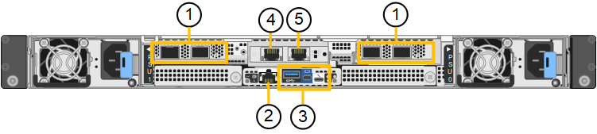

= StorageGRID SG120 und SG1200 Appliances
:allow-uri-read: 
:icons: font
:imagesdir: ../media/

[role="lead"]
Die StorageGRID SG120 Services-Appliance und die SG1200 Services-Appliance können als Gateway-Knoten und als Admin-Knoten fungieren und so hochverfügbare Lastverteilungsdienste in einem StorageGRID-System bereitstellen. Beide Appliances können gleichzeitig als Gateway-Knoten und Admin-Knoten (primär oder nicht-primär) betrieben werden.

== Funktionen der Appliance

Die Geräte SG120 und SG1200 bieten folgende Funktionen:

* Gateway-Knoten oder Admin-Knoten Funktionen für ein StorageGRID-System.
* StorageGRID Appliance Installer zur Vereinfachung der Implementierung und Konfiguration von Nodes.
* Bei der Bereitstellung kann über einen vorhandenen Admin-Node oder über auf ein lokales Laufwerk heruntergeladene Software auf die StorageGRID-Software zugegriffen werden. Um den Implementierungsprozess weiter zu vereinfachen, wird während der Fertigung eine aktuelle Version der Software vorinstalliert.
* Ein Baseboard Management Controller (BMC) für das Monitoring und die Diagnose einiger Hardware des Geräts.
* Die Möglichkeit, eine Verbindung zu allen drei StorageGRID-Netzwerken herzustellen, einschließlich Grid-Netzwerk, Admin-Netzwerk und Client-Netzwerk:
+
** Der SG120 unterstützt bis zu vier 10- oder 25-GbE-Verbindungen zum Grid-Netzwerk und zum Client-Netzwerk.
** Der SG1200 unterstützt bis zu vier 10-, 25-, 40-, 100-GbE-Verbindungen zum Grid-Netzwerk und Client-Netzwerk (oder bis zu vier 200-GbE-Verbindungen mit optionaler 200-GbE-NIC).

== SG120- und SG1200-Diagramme

Diese Abbildung zeigt die Vorderseite der SG120 und SG1200 mit entfernter Blende. Von vorn betrachtet sind die beiden Appliances bis auf den Produktnamen auf der Blende identisch.

image::../media/sg120_sg1200_front_with_ssds.png[Vorderseite mit SSDs SG120 und SG1200]

Die beiden, durch die orangefarbene Umrandung gekennzeichneten, SSDs werden zur Speicherung des StorageGRID-Betriebssystems verwendet und sind zur Redundanz mittels RAID 1 gespiegelt. Wenn die SG120- oder SG1200-Services-Appliance als Admin-Knoten konfiguriert ist, können diese Laufwerke zur Speicherung von Audit-Logs, Metriken und Datenbanktabellen verwendet werden. Die übrigen Laufwerksschächte sind leer.

Diese Abbildung zeigt die Position des Netzteils und der Identifikations-LEDs auf der Rückseite des SG120 und des SG1200. Zusätzliche Status- und Aktivitäts-LEDs befinden sich an den Appliance-Ports. Diese LEDs können je nach Appliance-Modell variieren.

image::../media/sg120_sg1200_rear_leds.png[Hintere LEDs SG120 und SG1200]

[cols="1a,2a,3a"]
|===
| Legende | LED | Status 

 a| 
1
 a| 
Netzteil-LED
 a| 
* Grün, konstant: Das Gerät wird mit Strom versorgt, der Netzschalter ist eingeschaltet.
* Grün, blinkend: Das Gerät wird mit Strom versorgt, der Netzschalter ist ausgeschaltet.
* Aus: Das Gerät wird nicht mit Strom versorgt.
* Gelb: Netzteilfehler.

 a| 
2
 a| 
Identifizieren Sie die LED
 a| 
* Blau, blinkend: Identifiziert das Gerät im Schrank oder Rack.
* Blau, fest: Identifiziert das Gerät im Schrank oder Rack.
* Aus: Das Gerät ist im Schrank oder Rack optisch nicht erkennbar.

|===

== SG120-Steckverbinder

Diese Abbildung zeigt die Rückseite des SG120, einschließlich der Anschlüsse, Lüfter und Netzteile.

[cols="1a,2a,2a,2a"]
|===
| Legende | Port | Typ | Nutzung 

 a| 
1
 a| 
Netzwerkanschlüsse 1-4
 a| 
10/25-GbE, basierend auf Kabel- oder SFP-Transceiver-Typ (SFP28 und SFP+ Module werden unterstützt), Switch-Geschwindigkeit und konfigurierter Link-Geschwindigkeit
 a| 
Stellen Sie eine Verbindung zum Grid-Netzwerk und dem Client-Netzwerk für StorageGRID her.

 a| 
2
 a| 
BMC-Management-Port
 a| 
1 GbE (RJ-45)
 a| 
Stellen Sie eine Verbindung mit dem Management Controller der Hauptplatine des Geräts her.

 a| 
3
 a| 
Diagnose- und Supportports
 a| 
* Mini-DisplayPort
* USB 3.0-Anschluss
* Micro-USB-Konsolenport

 a| 
Nur zur Verwendung durch technischen Support reserviert.

 a| 
4
 a| 
Admin-Netzwerkport 1
 a| 
1/10-GbE (RJ-45)
 a| 
Schließen Sie die Appliance an das Admin-Netzwerk für StorageGRID an.

 a| 
5
 a| 
Admin – Netzwerkanschluss 2
 a| 
1/10-GbE (RJ-45)
 a| 
Optionen:

* Verbindung mit Management-Port 1 für eine redundante Verbindung zum Admin-Netzwerk für StorageGRID.
* Lassen Sie die Verbindung getrennt und für den vorübergehenden lokalen Zugriff verfügbar (IP 169.254.0.1).
* Verwenden Sie während der Installation Port 2 für die IP-Konfiguration, wenn DHCP-zugewiesene IP-Adressen nicht verfügbar sind.

|===

== SG1200-Steckverbinder

Diese Abbildung zeigt die Anschlüsse auf der Rückseite des SG1200.

image::../media/sg1200_rear_connectors.png[Rückseitige Anschlüsse SG1200]

[cols="1a,2a,2a,2a"]
|===
| Legende | Port | Typ | Nutzung 

 a| 
1
 a| 
Netzwerkanschlüsse 1-4
 a| 
10/25/40/100/200-GbE, abhängig vom Kabel- oder Transceivertyp, der Schaltgeschwindigkeit und der konfigurierten Verbindungsgeschwindigkeit.

QSFP56 (max 200GbE/port), QSFP28 (max 100GbE/port) und QSFP+ (40GbE) werden nativ unterstützt (200GbE-Geschwindigkeiten erfordern die 200GbE-NIC-Option). Optionale SFP+ (10GbE)- oder SFP28 (25GbE)-Transceiver können mit einem QSA (separat erhältlich) verwendet werden.
 a| 
Stellen Sie eine Verbindung zum Grid-Netzwerk und dem Client-Netzwerk für StorageGRID her.

 a| 
2
 a| 
BMC-Management-Port
 a| 
1 GbE (RJ-45)
 a| 
Stellen Sie eine Verbindung mit dem Management Controller der Hauptplatine des Geräts her.

 a| 
3
 a| 
Diagnose- und Supportports
 a| 
* Mini-DisplayPort
* USB 3.0-Anschluss
* Micro-USB-Konsolenport

 a| 
Nur zur Verwendung durch technischen Support reserviert.

 a| 
4
 a| 
Admin-Netzwerkport 1
 a| 
1/10-GbE (RJ-45)
 a| 
Schließen Sie die Appliance an das Admin-Netzwerk für StorageGRID an.

 a| 
5
 a| 
Admin – Netzwerkanschluss 2
 a| 
1/10-GbE (RJ-45)
 a| 
Optionen:

* Verbindung mit Management-Port 1 für eine redundante Verbindung zum Admin-Netzwerk für StorageGRID.
* Lassen Sie die Verbindung getrennt und für den vorübergehenden lokalen Zugriff verfügbar (IP 169.254.0.1).
* Verwenden Sie während der Installation Port 2 für die IP-Konfiguration, wenn DHCP-zugewiesene IP-Adressen nicht verfügbar sind.

|===

== SG120- und SG1200-Anwendungen

Sie können die StorageGRID-Service-Appliances auf folgende Weise konfigurieren, um Gateway-Dienste sowie Redundanz für einige Grid-Verwaltungsdienste bereitzustellen.

* Zu einem neuen oder vorhandenen Grid als Gateway-Node hinzufügen
* Fügen Sie zu einem neuen Grid als primären oder nicht-primären Admin-Node oder zu einem vorhandenen Grid als nicht-primärer Admin-Node hinzu
* Arbeiten Sie gleichzeitig als Gateway Node und Admin Node (primär oder nicht primär)

Die Appliance erleichtert die Nutzung von Hochverfügbarkeitsgruppen (HA) und intelligentem Lastausgleich für S3- oder Swift-Datenpfadverbindungen.

In den folgenden Beispielen wird beschrieben, wie Sie die Funktionen der Appliance maximieren können:

* Verwenden Sie zwei SG120 oder zwei SG1200 Appliances, um Gateway-Dienste bereitzustellen, indem Sie sie als Gateway-Knoten konfigurieren.
+

IMPORTANT: Die Kombination von Services-Appliances mit unterschiedlichen Leistungsstufen am selben Standort, beispielsweise einer SG110 oder SG120 mit einer SG1100 oder SG1200, kann zu unvorhersehbaren und inkonsistenten Ergebnissen führen, wenn mehrere Knoten in einer Hochverfügbarkeitsgruppe verwendet werden oder wenn die Clientlast auf mehrere Services-Appliances verteilt wird.

* Verwenden Sie zwei SG120- oder zwei SG1200-Appliances, um Redundanz einiger Grid-Verwaltungsdienste bereitzustellen. Tun Sie dies, indem Sie jedes Appliance als Admin Node konfigurieren.
* Verwenden Sie zwei SG120- oder zwei SG1200-Geräte, um hochverfügbare Load-Balancing- und Traffic-Shaping-Dienste über eine oder mehrere virtuelle IP-Adressen bereitzustellen. Konfigurieren Sie dazu die Geräte als beliebige Kombination von Admin-Knoten oder Gateway-Knoten und fügen Sie beide Knoten derselben HA-Gruppe hinzu.
+

IMPORTANT: Wenn Sie einen Port nur für Admin-Knoten und Gateway-Knoten in derselben HA-Gruppe verwenden, findet kein Failover des Ports nur für Admin-Knoten statt. Siehe die Anweisungen für https://docs.netapp.com/us-en/storagegrid/admin/configure-high-availability-group.html["Konfigurieren von HA-Gruppen"^].

Bei Verwendung mit StorageGRID-Speichergeräten ermöglichen sowohl die SG120- als auch die SG1200-Service-Appliances die Bereitstellung von reinen Appliance-Grids ohne Abhängigkeiten von externen Hypervisoren oder Rechenhardware.
