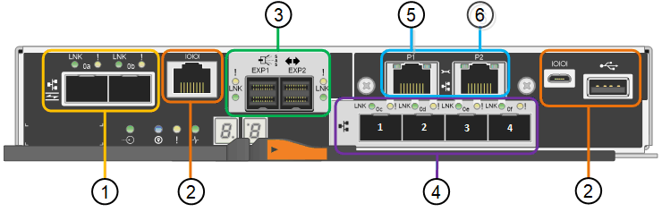

= SG5700 Appliances: Überblick
:allow-uri-read: 
:icons: font
:imagesdir: ../media/

[role="lead"]
Die SG5700 StorageGRID Appliance ist eine integrierte Storage- und Computing-Plattform, die als Storage-Node in einem StorageGRID Grid ausgeführt wird. Die Appliance kann in einer hybriden Grid-Umgebung verwendet werden, die Appliance Storage Nodes und virtuelle (softwarebasierte) Storage-Nodes kombiniert.

Die Appliance der StorageGRID SG5700 Serie bietet folgende Funktionen:

* Integrieren Sie die Storage- und Computing-Elemente für einen StorageGRID Storage Node.
* Schließen Sie das Installationsprogramm für StorageGRID Appliance an, um die Implementierung und Konfiguration von Storage-Nodes zu vereinfachen.
* Umfasst E-Series SANtricity System Manager für Hardware-Management und Monitoring.
* Unterstützung für bis zu vier 10-GbE- oder 25-GbE-Verbindungen mit dem StorageGRID-Grid-Netzwerk und dem Client-Netzwerk.
* Unterstützung für Full Disk Encryption (FDE)-Laufwerke oder FIPS-Laufwerke Wenn diese Laufwerke mit der Laufwerksicherheitsfunktion in SANtricity System Manager verwendet werden, wird ein nicht autorisierter Zugriff auf die Daten verhindert.

Das SG5700-Appliance ist in vier Modellen verfügbar: SG5712 und SG5712X sowie SG5760 und SG5760. Es gibt keine Spezifikations- oder Funktionsunterschiede zwischen dem SG5712 und SG5712X außer der Lage der Interconnect-Ports auf dem Storage Controller. Ebenso gibt es keine Spezifikations- oder Funktionsunterschiede zwischen dem SG5760 und dem SG5760X, außer dem Standort der Interconnect Ports am Storage Controller.

== SG5700 Komponenten

Die SG5700 Modelle umfassen die folgenden Komponenten:

[role="tabbed-block"]
====
.SG5712
--
Computing-Controller:: E5700SG Controller
Storage Controller:: E2800A-Controller
Chassis:: E-Series DE212C-Gehäuse, ein 2-HE-Gehäuse (Rack-Unit)
Laufwerke:: 12 NL-SAS-Laufwerke (3.5 Zoll)
Redundante Netzteile und Lüfter:: Zwei Power-Fan-Kanister

--
.SG5712X
--
Computing-Controller:: E5700SG Controller
Storage Controller:: E2800B-Controller
Chassis:: E-Series DE212C-Gehäuse, ein 2-HE-Gehäuse (Rack-Unit)
Laufwerke:: 12 NL-SAS-Laufwerke (3.5 Zoll)
Redundante Netzteile und Lüfter:: Zwei Power-Fan-Kanister

--
.SG5760
--
Computing-Controller:: E5700SG Controller
Storage Controller:: E2800A-Controller
Chassis:: E-Series DE460C Gehäuse, ein 4-HE-Gehäuse (Rack-Unit
Laufwerke:: 60 NL-SAS-Laufwerke (3.5 Zoll)
Redundante Netzteile und Lüfter:: Zwei Leistungskanister und zwei Lüfterkanister

--
.SG5760
--
Computing-Controller:: E5700SG Controller
Storage Controller:: E2800B-Controller
Chassis:: E-Series DE460C Gehäuse, ein 4-HE-Gehäuse (Rack-Unit
Laufwerke:: 60 NL-SAS-Laufwerke (3.5 Zoll)
Redundante Netzteile und Lüfter:: Zwei Leistungskanister und zwei Lüfterkanister

--
====
Der maximale Rohkapazität, der in der StorageGRID-Appliance verfügbar ist, richtet sich nach der Anzahl der Laufwerke in jedem Gehäuse. Sie können den verfügbaren Speicher nicht erweitern, indem Sie ein Shelf mit zusätzlichen Laufwerken hinzufügen.

== SG5700-Diagramme

=== SG5712 Vorder- und Rückansicht

Die Abbildungen zeigen die Vorder- und Rückseite des SG5712, einem 2-HE-Gehäuse für 12 Laufwerke.

image::../media/sg5712_front_and_back_views.gif[Vorder- und Rückseite des SG5712-Geräts]

=== SG5712 Komponenten

Die SG5712 umfasst zwei Controller und zwei Power-Fan-Kanister.

image::../media/sg5712_with_callouts.gif[Controller und Power-Fan-Behälter im SG5712-Gerät]

[cols="1a,3a"]
|===
| Legende | Beschreibung 

 a| 
1
 a| 
E2800A-Controller (Storage-Controller)

 a| 
2
 a| 
E5700SG Controller (Compute-Controller)

 a| 
3
 a| 
Power-Fan-Behälter

|===

=== SG5712X Vorder- und Rückansicht

Die Abbildungen zeigen die Vorder- und Rückseite des SG5712X, einem 2U-Gehäuse für 12 Laufwerke.

image::../media/sg5712x_front_and_back_views.gif[Vorder- und Rückseite des SG5712X-Geräts]

=== SG5712X Komponenten

Das SG5712X besteht aus zwei Controllern und zwei Power-Fan-Kanistern.

image::../media/sg5712x_with_callouts.gif[Controller und Power-Fan-Behälter im SG5712X-Gerät]

[cols="1a,3a"]
|===
| Legende | Beschreibung 

 a| 
1
 a| 
E2800B-Controller (Storage-Controller)

 a| 
2
 a| 
E5700SG Controller (Compute-Controller)

 a| 
3
 a| 
Power-Fan-Behälter

|===

=== Vorder- und Rückansicht des SG5760

Die Abbildungen zeigen die Vorder- und Rückseite des SG5760-Modells, ein 4-HE-Gehäuse für 60 Laufwerke in 5 Laufwerkseinschüben.

image::../media/sg5760_front_and_back_views.gif[Vorder- und Rückseite des SG5760-Geräts]

=== SG5760 Komponenten

Die SG5760 verfügt über zwei Controller, zwei Lüfterbehälter und zwei Strombehälter.

image::../media/sg5760_with_callouts.gif[Controller,fan canisters,and power canisters in SG5760 appliance]

[cols="1a,2a"]
|===
| Legende | Beschreibung 

 a| 
1
 a| 
E2800A-Controller (Storage-Controller)

 a| 
2
 a| 
E5700SG Controller (Compute-Controller)

 a| 
3
 a| 
Gebläsebehälter (1 von 2)

 a| 
4
 a| 
Leistungsbehälter (1 von 2)

|===

=== SG5760X Vorder- und Rückansicht

Die Abbildungen zeigen die Vorder- und Rückseite des Modells SG5760X, einem 4U-Gehäuse, das 60 Laufwerke in 5 Laufwerkseinschüben aufnehmen kann.

image::../media/sg5760x_front_and_back_views.gif[Vorder- und Rückseite des SG5760X-Geräts]

=== SG5760X Komponenten

Die SG5760X enthält zwei Controller, zwei Lüfterzangen und zwei Leistungszangen.

image::../media/sg5760x_with_callouts.gif[Controller,fan canisters,and power canisters in SG5760X appliance]

[cols="1a,3a"]
|===
| Legende | Beschreibung 

 a| 
1
 a| 
E2800B-Controller (Storage-Controller)

 a| 
2
 a| 
E5700SG Controller (Compute-Controller)

 a| 
3
 a| 
Gebläsebehälter (1 von 2)

 a| 
4
 a| 
Leistungsbehälter (1 von 2)

|===

== SG5700 Controller

Sowohl die SG5712 und SG5712X mit 12 Laufwerken als auch die SG5760 und SG5760X Modelle mit 60 Laufwerken der StorageGRID Appliance umfassen einen E5700SG Computing-Controller und einen E-Series E2800 Storage-Controller.

* Das SG5712 und SG5760 verwenden einen E2800A-Controller.
* Das SG5712X und das SG5760 verwenden einen E2800B-Controller.

Die E2800A- und E2800B-Controller sind in der Spezifikation und Funktion identisch, mit Ausnahme des Standorts der Interconnect-Ports.

=== E5700SG Compute-Controller

* Arbeitet als Computing-Server für die Appliance.
* Schließt das Installationsprogramm für StorageGRID-Appliance ein.
+

NOTE: Die StorageGRID-Software ist auf der Appliance nicht vorinstalliert. Auf diese Software wird über den Admin-Node zugegriffen, wenn Sie die Appliance bereitstellen.

* Es kann eine Verbindung zu allen drei StorageGRID-Netzwerken hergestellt werden, einschließlich dem Grid-Netzwerk, dem Admin-Netzwerk und dem Client-Netzwerk.
* Stellt eine Verbindung zum E2800 Controller her und arbeitet als Initiator.

==== E5700SG-Steckverbinder

[cols="1a,2a,2a,2a"]
|===
| Legende | Port | Typ | Nutzung 

 a| 
1
 a| 
Interconnect-Ports 1 und 2
 a| 
16 Gbit/s Fibre Channel (FC), optischer SFP
 a| 
Verbinden Sie den E5700SG Controller mit dem E2800 Controller.

 a| 
2
 a| 
Diagnose- und Supportports
 a| 
* Serieller RJ-45-Anschluss
* Serieller Micro-USB-Anschluss
* USB-Anschluss

 a| 
Reserviert für technischen Support.

 a| 
3
 a| 
Ports zur Laufwerkserweiterung
 a| 
12 GB/s SAS
 a| 
Nicht verwendet.

 a| 
4
 a| 
Netzwerkanschlüsse 1-4
 a| 
10-GbE oder 25-GbE, basierend auf SFP-Transceiver, Switch-Geschwindigkeit und konfigurierter Link-Geschwindigkeit
 a| 
Stellen Sie eine Verbindung zum Grid-Netzwerk und dem Client-Netzwerk für StorageGRID her.

 a| 
5
 a| 
Management-Port 1
 a| 
1-GB-Ethernet (RJ-45
 a| 
Stellen Sie eine Verbindung zum Admin-Netzwerk für StorageGRID her.

 a| 
6
 a| 
Management-Port 2
 a| 
1-GB-Ethernet (RJ-45
 a| 
Optionen:

* Verbindung mit Management-Port 1 für eine redundante Verbindung zum Admin-Netzwerk für StorageGRID.
* Lassen Sie nicht verdrahtet und für den vorübergehenden lokalen Zugang verfügbar (IP 169.254.0.1).
* Verwenden Sie während der Installation Port 2 für die IP-Konfiguration, wenn DHCP-zugewiesene IP-Adressen nicht verfügbar sind.

|===

=== E2800 Storage-Controller

Der E2800 Storage-Controller wurde in den SG5700 Appliances in zwei Versionen verwendet: E2800A und E2800B. Das E2800A hat keine HIC und das E2800B hat eine HIC mit vier Ports. Die beiden Controller-Versionen haben die gleichen Spezifikationen und Funktionen, mit Ausnahme der Lage der Interconnect-Ports.

Der Storage Controller der E2800 Serie verfügt über folgende Spezifikationen:

* Fungiert als Storage Controller für die Appliance.
* Verwaltet den Storage der Daten auf den Laufwerken.
* Funktioniert als Standard-E-Series-Controller im Simplexmodus.
* Beinhaltet SANtricity OS Software (Controller-Firmware)
* Enthält SANtricity System Manager für die Überwachung der Appliance-Hardware und für das Verwalten von Warnmeldungen, die AutoSupport Funktion und die Laufwerksicherheitsfunktion.
* Stellt eine Verbindung zum E5700SG-Controller her und arbeitet als Ziel.

==== E2800A-Anschlüsse

image::../media/e2800_controller_with_callouts.gif[Anschlüsse am E2800A-Controller]

==== E2800B-Anschlüsse

image::../media/e2800B_controller_with_callouts.gif[Anschlüsse am E2800B-Controller]

[cols="1a,2a,2a,2a"]
|===
| Legende | Port | Typ | Nutzung 

 a| 
1
 a| 
Interconnect-Ports 1 und 2
 a| 
Optischer 16 Gbit/s FC SFP
 a| 
Den E2800 Controller mit dem E5700SG Controller verbinden.

 a| 
2
 a| 
Management-Ports 1 und 2
 a| 
1-GB-Ethernet (RJ-45
 a| 
* Port 1-Optionen:
+
** Stellen Sie eine Verbindung zu einem Managementnetzwerk her, um direkten TCP/IP-Zugriff auf SANtricity System Manager zu ermöglichen
** Lassen Sie die Kabel, um einen Switch-Port und eine IP-Adresse zu speichern.  Zugriff auf SANtricity System Manager über den Grid-Manager oder das Storage Grid-Appliance-Installationsprogramm

*Hinweis*: Einige optionale SANtricity-Funktionen, wie z.B. NTP Sync für genaue Log-Zeitstempel, sind nicht verfügbar, wenn Sie Port 1 unverdrahtet lassen.

*Hinweis*: StorageGRID 11.5 oder höher und SANtricity 11.70 oder höher sind erforderlich, wenn Sie Port 1 unverdrahtet verlassen.

* Port 2 ist für den technischen Support reserviert.

 a| 
3
 a| 
Diagnose- und Supportports
 a| 
* Serieller RJ-45-Anschluss
* Serieller Micro-USB-Anschluss
* USB-Anschluss

 a| 
Nur zur Verwendung durch technischen Support reserviert.

 a| 
4
 a| 
Ports zur Laufwerkserweiterung:
 a| 
12 GB/s SAS
 a| 
Nicht verwendet.

|===
.Verwandte Informationen
https://docs.netapp.com/us-en/e-series-family/index.html["Dokumentation zur NetApp E-Series"^]
