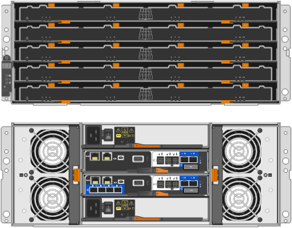

= SG5800 Appliances: Überblick
:allow-uri-read: 
:icons: font
:imagesdir: ../media/

[role="lead"]
Bei den StorageGRID Appliances der SG5800 Serie handelt es sich um integrierte Storage- und Computing-Plattformen, die als Storage-Nodes in einem StorageGRID Grid betrieben werden.

StorageGRID Appliances der SG5800 Serie bieten folgende Funktionen:

* Integrieren Sie die Storage- und Computing-Elemente für einen StorageGRID Storage Node.
* Schließen Sie das Installationsprogramm für StorageGRID Appliance an, um die Implementierung und Konfiguration von Storage-Nodes zu vereinfachen.
* E-Series SANtricity System Manager für Hardware-Management und -Überwachung
* Unterstützung für bis zu vier 10-GbE- oder 25-GbE-Verbindungen mit dem StorageGRID-Grid-Netzwerk und dem Client-Netzwerk.
* Unterstützung für Full Disk Encryption (FDE)-Laufwerke oder FIPS-Laufwerke Wenn diese Laufwerke mit der Laufwerksicherheitsfunktion in SANtricity System Manager verwendet werden, wird ein nicht autorisierter Zugriff auf die Daten verhindert.

Die SG5800 Appliance ist in zwei Modellen erhältlich: Dem SG5812 und dem SG5860.

== SG5800 Komponenten

Die SG5800 Modelle umfassen die folgenden Komponenten:

[role="tabbed-block"]
====
.SG5812
--
Computing-Controller:: SG5800 Controller
Storage Controller:: E4000-Controller
Chassis:: E-Series DE212C-Gehäuse, ein 2-HE-Gehäuse (Rack-Unit)
Laufwerke:: 12 NL-SAS-Laufwerke (3.5 Zoll)
Redundante Netzteile und Lüfter:: Zwei Power-Fan-Kanister

--
.SG5860
--
Computing-Controller:: SG5800 Controller
Storage Controller:: E4000-Controller
Chassis:: E-Series DE460C Gehäuse, ein 4-HE-Gehäuse (Rack-Unit
Laufwerke:: 60 NL-SAS-Laufwerke (3.5 Zoll)
Redundante Netzteile und Lüfter:: Zwei Leistungskanister und zwei Lüfterkanister

--
====
Der maximale Rohkapazität, der in der StorageGRID-Appliance verfügbar ist, richtet sich nach der Anzahl der Laufwerke in jedem Gehäuse. Sie können den verfügbaren Speicher nicht erweitern, indem Sie ein Shelf mit zusätzlichen Laufwerken hinzufügen.

== SG5800-Diagramme

=== SG5812 Vorder- und Rückansicht

Die Abbildungen zeigen die Vorder- und Rückseite des SG5812, einem 2U-Gehäuse für 12 Laufwerke.

image::../media/sg5812_front_and_back_views.png[Vorder- und Rückseite des SG5812-Geräts]

=== SG5812-Komponenten

Der SG5812 umfasst zwei Controller und zwei Power-Fan-Kanister.

image::../media/sg5812_with_callouts.png[Controller und Netzlüfterkanister im SG5812-Gerät]

[cols="1a,3a"]
|===
| Legende | Beschreibung 

 a| 
1
 a| 
E4000 Controller (Speicher-Controller)

 a| 
2
 a| 
SG5800 Controller (Computing-Controller)

 a| 
3
 a| 
Power-Fan-Behälter

|===

=== SG5860 Vorder- und Rückansicht

Die Abbildungen zeigen die Vorder- und Rückseite des Modells SG5860, ein 4U-Gehäuse, das 60 Laufwerke in 5 Laufwerkseinschüben aufnehmen kann.

=== SG5860 Komponenten

Der SG5860 umfasst zwei Controller, zwei Lüfterzangen und zwei Leistungszangen.

image::../media/sg5860_with_callouts.png[Controller, Lüfterzangen und Leistungszangen in SG5860-Gerät]

[cols="1a,2a"]
|===
| Legende | Beschreibung 

 a| 
1
 a| 
E4000 Controller (Speicher-Controller)

 a| 
2
 a| 
SG5800 Controller (Computing-Controller)

 a| 
3
 a| 
Gebläsebehälter (1 von 2)

 a| 
4
 a| 
Leistungsbehälter (1 von 2)

|===

== SG5800 Controller

Die SG5812 und die SG5860 60 Modelle mit 12 Laufwerken der StorageGRID Appliance umfassen einen SG5800 Computing-Controller und einen E-Series E4000 Storage Controller.

=== SG5800 Computing-Controller

* Arbeitet als Computing-Server für die Appliance.
* Schließt das Installationsprogramm für StorageGRID-Appliance ein.
+

NOTE: Die StorageGRID-Software ist auf der Appliance nicht vorinstalliert. Auf diese Software wird über den Admin-Node zugegriffen, wenn Sie die Appliance bereitstellen.

* Es kann eine Verbindung zu allen drei StorageGRID-Netzwerken hergestellt werden, einschließlich dem Grid-Netzwerk, dem Admin-Netzwerk und dem Client-Netzwerk.
* Stellt eine Verbindung zum E4000-Controller her und fungiert als Initiator.

==== SG5800-Anschlüsse

image::../media/sg5800_controller_with_callouts.png[Anschlüsse am SG5800-Controller]

[cols="1a,2a,2a,2a"]
|===
| Legende | Port | Typ | Nutzung 

 a| 
1
 a| 
Management-Port 1
 a| 
1-GB-Ethernet (RJ-45
 a| 
Stellen Sie eine Verbindung zum Admin-Netzwerk für StorageGRID her.

 a| 
2
 a| 
Diagnose- und Supportports
 a| 
* Serieller RJ-45-Anschluss
* Serieller USB-C-Anschluss
* USB-Anschluss

 a| 
Reserviert für technischen Support.

 a| 
3
 a| 
Ports zur Laufwerkserweiterung
 a| 
12 GB/s SAS
 a| 
Nicht verwendet.

 a| 
4
 a| 
Interconnect-Ports 1 und 2
 a| 
25 GbE iSCSI
 a| 
Verbinden Sie den SG5800-Controller mit dem E4000-Controller.

 a| 
5
 a| 
Netzwerkanschlüsse 1-4
 a| 
10-GbE oder 25-GbE, basierend auf SFP-Transceiver, Switch-Geschwindigkeit und konfigurierter Link-Geschwindigkeit
 a| 
Stellen Sie eine Verbindung zum Grid-Netzwerk und dem Client-Netzwerk für StorageGRID her.

|===

=== E4000 Storage Controller

Der Speicher-Controller der E4000-Serie verfügt über die folgenden Spezifikationen:

* Fungiert als Storage Controller für die Appliance.
* Verwaltet den Storage der Daten auf den Laufwerken.
* Funktioniert als Standard-E-Series-Controller im Simplexmodus.
* Beinhaltet SANtricity OS Software (Controller-Firmware)
* Enthält SANtricity System Manager für die Überwachung der Appliance-Hardware und für das Verwalten von Warnmeldungen, die AutoSupport Funktion und die Laufwerksicherheitsfunktion.
* Stellt eine Verbindung zum SG5800-Controller her und wird als Ziel ausgeführt.

==== E4000-Steckverbinder

[cols="1a,2a,2a,2a"]
|===
| Legende | Port | Typ | Nutzung 

 a| 
1
 a| 
Management-Port
 a| 
1-GB-Ethernet (RJ-45
 a| 
Anschlussoptionen:
** Verbinden Sie sich mit einem Managementnetzwerk, um direkten TCP/IP-Zugriff auf den SANtricity-Systemmanager zu ermöglichen
** Lassen Sie unverdrahtet, um einen Switch-Port und eine IP-Adresse zu speichern.  Zugriff auf SANtricity System Manager über den Grid-Manager oder das Storage Grid-Appliance-Installationsprogramm

*Hinweis*: Einige optionale SANtricity-Funktionen, wie NTP Sync für genaue Protokollzeitstempel, sind nicht verfügbar, wenn Sie den Management-Port nicht drahtgebunden lassen möchten.

*Hinweis*: StorageGRID 11.8 oder höher und SANtricity 11.8 oder höher sind erforderlich, wenn Sie den Verwaltungsport nicht verdrahtet verlassen.

 a| 
2
 a| 
Diagnose- und Supportports
 a| 
* Serieller RJ-45-Anschluss
* Serieller USB-C-Anschluss
* USB-Anschluss

 a| 
Nur zur Verwendung durch technischen Support reserviert.

 a| 
3
 a| 
Ports zur Laufwerkserweiterung:
 a| 
12 GB/s SAS
 a| 
Nicht verwendet.

 a| 
4
 a| 
Interconnect-Ports 1 und 2
 a| 
25 GbE iSCSI
 a| 
Schließen Sie den E4000-Controller an den SG5800-Controller an.

|===
.Verwandte Informationen
https://docs.netapp.com/us-en/e-series-family/index.html["Dokumentation zur NetApp E-Series"^]
