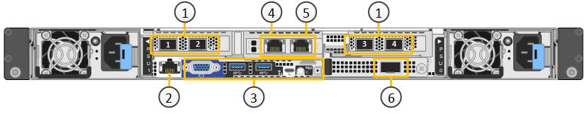
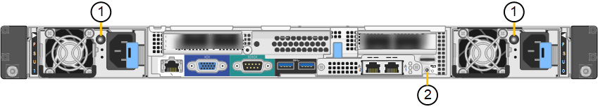

= SG6100 Appliances: Überblick
:allow-uri-read: 
:icons: font
:imagesdir: ../media/

[role="lead"]
Die StorageGRID Appliances der SG6100 Serie werden als Storage-Nodes in einem StorageGRID System ausgeführt.  Wie alle StorageGRID Appliances lassen sie sich in einer einzelnen Implementierung frei mit anderen Appliance-Modellen und rein softwarebasierten Nodes kombinieren.

Die StorageGRID SG6160 Appliance umfasst einen Computing-Controller mit einem NVMe-SSD-Paar, das als Lese-Cache fungiert, sowie ein Storage-Controller-Shelf mit zwei Storage-Controllern und 60 NL-SAS-Festplatten. Durch das Hinzufügen von bis zu zwei optionalen Erweiterungseinschüben kann es auf bis zu 180 NL-SAS-Festplatten erweitert werden. Die StorageGRID SGF6112 Appliance ist eine All-Flash-Appliance mit einem kompakten 1-HE-Formfaktor und 12 NVMe-SSDs.

Die Appliances SGF6112 und SG6160 bieten folgende Leistungsmerkmale:

* Integriert die Storage- und Computing-Elemente für einen StorageGRID Storage Node.
* Umfasst das Installationsprogramm von StorageGRID Appliance zur Vereinfachung der Bereitstellung und Konfiguration von Storage-Nodes.
* Umfasst einen Baseboard Management Controller (BMC) zur Überwachung und Diagnose der Hardware im Compute Controller.

Die SGF6112 bietet folgende Datensicherungsfunktionen:

* Funktionsfähigkeit nach Ausfall einer einzelnen SSD ohne Beeinträchtigung der Objektverfügbarkeit.
* Funktionsfähigkeit nach Ausfällen mehrerer SSDs mit einer minimalen erforderlichen Reduzierung der Objektverfügbarkeit (basierend auf dem Design des zugrunde liegenden RAID-Schemas).
+

NOTE: Je nach Ihrer konfigurierten ILM-Richtlinie können Anforderungen für lokal nicht verfügbare Objekte durch andere Nodes bearbeitet werden, sodass die Verfügbarkeit in der Regel nicht verringert wird.

* Während der Wartung ist die vollständige Recovery bei SSD-Ausfällen möglich, die keine extremen Schäden am RAID-Gehäuse des Root-Volumes des Nodes (des StorageGRID-Betriebssystems) zur Folge haben.
* Falls diverse SSD-Ausfälle zu einem lokalen Datenverlust führen, können Objektdaten automatisch aus Kopien oder Erasure Coded Brocken auf anderen Nodes wiederhergestellt werden.

Das SG6160 bietet folgende Datensicherungsfunktionen:

* Funktionsfähigkeit nach dem Ausfall von zwei Festplatten (HDDs) ohne Beeinträchtigung der Objektverfügbarkeit.
* Schnelle Evakuierung und Wiederherstellung von HDDs bei Ausfällen und Austausch (bei Konfiguration für DDP oder DDP16 während der Installation), wodurch die Datenaufbewahrung im Vergleich zu dem Standard-RAID 6 verbessert wird.
* Vollständige Recovery bei Betrieb durch den Ausfall von zwei beliebigen HDDs.
* Falls diverse HDD-Ausfälle zu einem lokalen Datenverlust führen, können Objektdaten automatisch aus Kopien oder nach Erasure Coding auf anderen Nodes wiederhergestellt werden.

== Hardwarekomponenten des SG6100

=== SGF6112-Appliance

Die Appliance SGF6112 umfasst die folgenden Komponenten:

Computing- und Storage-Plattform:: Ein Server mit einer Höheneinheit (1 HE), der Folgendes umfasst:
+
--
* Zwei 165-W-Prozessoren mit 2.1/2.6 GHz und 48 Kernen (96 Threads)
* 256 GB RAM
* 2 × 1/10 GBase-T-Ports
* 4 × 10/25-GbE-Ethernet-Ports für Grid-/Client-Netzwerkverkehr
* 1 × 256 GB internes Startlaufwerk (einschließlich StorageGRID-Software)
* Baseboard Management Controller (BMC) der das Hardware-Management vereinfacht
* Redundante Netzteile und Lüfter

--

=== SG6160 Appliance

Die SG6160 Appliance umfasst die folgenden Komponenten:

Computing-Controller:: Der SG6100-CN Controller ist ein Server mit einer Höheneinheit (1 HE), der Folgendes umfasst:
+
--
* 48 Cores (96 Threads)
* 256 GB RAM
* Bis zu 4 × 25 GbE aggregierte Ethernet-Bandbreite (oder bis zu 4 x 100 GbE mit optionaler 100G NIC SKU)
* 1 x 100-GbE-Interconnect
* Zwei NVMe SSDs für Lese-Cache
* Baseboard Management Controller (BMC) der das Hardware-Management vereinfacht
* Redundante Netzteile und Lüfter

--
Storage Controller Shelf:: Das E-Series E4000 Controller-Shelf (Storage-Array) ist ein 4-HE-Shelf mit folgenden Elementen:
+
--
* Zwei Controller der E4000 Serie (Duplex-Konfiguration) für die Unterstützung von Storage Controller Failover
* Shelf für Laufwerke mit fünf Schubladen für sechzig 3.5-Zoll-NL-SAS-Laufwerke
* Redundante Netzteile und Lüfter

--
Optional: Storage-Erweiterungs-Shelfs:: Jede SG6160 Appliance kann über ein oder zwei Erweiterungs-Shelfs für insgesamt 180 Laufwerke verfügen.
+
--

NOTE: Erweiterungs-Shelfs können während der ersten Implementierung installiert oder später hinzugefügt werden.

Das E-Series DE460C Gehäuse ist ein 4-HE-Shelf mit folgenden Komponenten:

* Zwei Eingangs-/Ausgangsmodule (IOMs)
* Fünf Schubladen mit jeweils 12 NL-SAS-Laufwerken für insgesamt 60 Laufwerke
* Redundante Netzteile und Lüfter

--

== Diagramme SGF6112 und SG6160

=== SGF6112 – Vorderansicht

Diese Abbildung zeigt die Vorderseite des SGF6112 ohne Blende. Die Appliance verfügt über eine 1-HE-Computing- und Storage-Plattform mit 12 SSD-Laufwerken.

image::../media/sgf6112_front_with_ssds.png[SGF6112, Vorderansicht]

=== SGF6112 – Rückansicht

Diese Abbildung zeigt die Rückseite des SGF6112, einschließlich der Ports, Lüfter und Netzteile.

image::../media/sgf6112_rear_view.png[SGF6112, Rückansicht]

[cols="1a,2a,2a,2a"]
|===
| Legende | Port | Typ | Nutzung 

 a| 
1
 a| 
Netzwerkanschlüsse 1-4
 a| 
10/25-GbE, basierend auf Kabel- oder SFP-Transceiver-Typ (SFP28- und SFP+-Module werden unterstützt), Switch-Geschwindigkeit und konfigurierter Link-Geschwindigkeit.
 a| 
Stellen Sie eine Verbindung zum Grid-Netzwerk und dem Client-Netzwerk für StorageGRID her.

 a| 
2
 a| 
BMC-Management-Port
 a| 
1 GbE (RJ-45)
 a| 
Stellen Sie eine Verbindung mit dem Management Controller der Hauptplatine des Geräts her.

 a| 
3
 a| 
Diagnose- und Supportports
 a| 
* VGA
* USB
* Micro-USB-Konsolenport
* Micro-SD-Steckplatzmodul

 a| 
Nur zur Verwendung durch technischen Support reserviert.

 a| 
4
 a| 
Admin-Netzwerkport 1
 a| 
1/10-GbE (RJ-45)
 a| 
Schließen Sie die Appliance an das Admin-Netzwerk für StorageGRID an.

 a| 
5
 a| 
Admin – Netzwerkanschluss 2
 a| 
1/10-GbE (RJ-45)
 a| 
Optionen:

* Verbindung mit Admin-Netzwerk-Port 1 für eine redundante Verbindung zum Admin-Netzwerk für StorageGRID.
* Lassen Sie die Verbindung getrennt und für den vorübergehenden lokalen Zugriff verfügbar (IP 169.254.0.1).
* Verwenden Sie während der Installation Port 2 für die IP-Konfiguration, wenn DHCP-zugewiesene IP-Adressen nicht verfügbar sind.

|===
Diese Abbildung zeigt die Position des Netzteils und die Identifizieren-LEDs auf der Rückseite des SGF6112. Zusätzliche Status- und Aktivitäts-LEDs befinden sich an den Geräteanschlüssen. Diese LEDs können je nach Gerätelodell variieren.

image::../media/q2024_rear_leds.png[Hintere LEDs SGF6112]

[cols="1a,2a,3a"]
|===
| Legende | LED | Status 

 a| 
1
 a| 
Netzteil-LED
 a| 
* Grün, konstant: Das Gerät wird mit Strom versorgt, der Netzschalter ist eingeschaltet.
* Grün, blinkend: Das Gerät wird mit Strom versorgt, der Netzschalter ist ausgeschaltet.
* Aus: Das Gerät wird nicht mit Strom versorgt.
* Gelb: Netzteilfehler.

 a| 
2
 a| 
Identifizieren Sie die LED
 a| 
* Blau, blinkend: Identifiziert das Gerät im Schrank oder Rack.
* Blau, fest: Identifiziert das Gerät im Schrank oder Rack.
* Aus: Das Gerät ist im Schrank oder Rack nicht visuell erkennbar.

|===

=== SG6160 – Vorderansicht

Diese Abbildung zeigt die Vorderseite des SG6160, der einen 1-HE-Computing-Controller und ein 4-HE-Shelf mit zwei Storage-Controllern und 60 Laufwerken in fünf Laufwerkseinschüben umfasst.

image::../media/sg6160_front_view_without_bezels.png[SG6160, Vorderansicht]

[cols="1a,2a"]
|===
| Legende | Beschreibung 

 a| 
1
 a| 
SG6100-CN Computing-Controller mit entfernter Frontverkleidung

 a| 
2
 a| 
E4000 Controller Shelf mit entfernter Frontverkleidung (das optionale Erweiterungs-Shelf scheint identisch zu sein)

|===

=== SG6160 – Rückansicht

Diese Abbildung zeigt die Rückseite des SG6160, einschließlich der Computing- und Storage-Controller, Lüfter und Netzteile.

image::../media/sg6160_rear_view.png[SG6160, Rückansicht]

[cols="1a,2a"]
|===
| Legende | Beschreibung 

 a| 
1
 a| 
Netzteil (1 von 2) für SG6100-CN Computing-Controller

 a| 
2
 a| 
Anschlüsse für SG6100-CN Computing-Controller

 a| 
3
 a| 
Lüfter (1 von 2) für E4000 Controller Shelf

 a| 
4
 a| 
E-Series E400 Storage Controller (1 von 2) und Anschlüsse

 a| 
5
 a| 
Netzteil (1 von 2) für E4000 Controller Shelf

|===

== SG6100 Controller

=== SG6100-CN Computing-Controller

* Stellt für die Appliance Computing-Ressourcen bereit
* Schließt das Installationsprogramm für StorageGRID-Appliance ein.
+

NOTE: Die StorageGRID-Software ist auf der Appliance nicht vorinstalliert. Diese Software wird beim Bereitstellen der Appliance vom Admin-Node abgerufen.

* Es kann eine Verbindung zu allen drei StorageGRID-Netzwerken hergestellt werden, einschließlich dem Grid-Netzwerk, dem Admin-Netzwerk und dem Client-Netzwerk.
* Stellt eine Verbindung zu den E-Series Storage Controllern her und arbeitet als Initiator.

Diese Abbildung zeigt Ports auf der Rückseite des SG6100-CN Computing-Controllers.

[cols="1a,2a,2a,3a"]
|===
| Legende | Port | Typ | Nutzung 

 a| 
1
 a| 
Netzwerkanschlüsse 1-4
 a| 
* 10/25-GbE basierend auf Kabel- oder SFP-Transceiver-Typ (SFP28- und SFP+-Module werden unterstützt), Switch-Geschwindigkeit und konfigurierter Link-Geschwindigkeit.
* Mit optionaler 100G NIC SKU (nur SG6160), 10/25/40/100-GbE basierend auf Kabel- oder Transceiver-Typ, Switch-Geschwindigkeit und konfigurierter Verbindungsgeschwindigkeit. QSFP56 (beschränkt auf 100 GbE/Port), QSFP28 (100 GbE) und QSFP+ (40 GbE) werden nativ unterstützt. Optionale SFP+ (10 GbE) oder SFP28 (25 GbE) Transceiver können mit einem QSA verwendet werden (separat erhältlich).

 a| 
Stellen Sie eine Verbindung zum Grid-Netzwerk und dem Client-Netzwerk für StorageGRID her.

 a| 
2
 a| 
BMC-Management-Port
 a| 
1 GbE (RJ-45)
 a| 
Verbinden Sie den SG6100-CN Baseboard Management Controller.

 a| 
3
 a| 
Diagnose- und Supportports
 a| 
* VGA
* USB
* Micro-USB-Konsolenport
* Micro-SD-Steckplatzmodul

 a| 
Nur zur Verwendung durch technischen Support reserviert.

 a| 
4
 a| 
Admin-Netzwerkport 1
 a| 
1/10-GbE (RJ-45)
 a| 
Verbinden Sie das SG6100-CN mit dem Admin-Netzwerk für StorageGRID.

 a| 
5
 a| 
Admin – Netzwerkanschluss 2
 a| 
1/10-GbE (RJ-45)
 a| 
Optionen:

* Verbindung mit Management-Port 1 für eine redundante Verbindung zum Admin-Netzwerk für StorageGRID.
* Lassen Sie nicht verdrahtet und für den vorübergehenden lokalen Zugang verfügbar (IP 169.254.0.1).
* Verwenden Sie während der Installation Port 2 für die IP-Konfiguration, wenn DHCP-zugewiesene IP-Adressen nicht verfügbar sind.

 a| 
6
 a| 
Interconnect-Port
 a| 
100-GBitE
 a| 
Schließen Sie den SG6100-CN-Controller an die E4000-Controller an.

|===
Diese Abbildung zeigt die Position des Netzteils und die Identifizieren-LEDs auf der Rückseite des SG6100-CN Computing-Controllers. Zusätzliche Status- und Aktivitäts-LEDs befinden sich an den Geräteanschlüssen. Diese LEDs können je nach Gerätelodell variieren.

[cols="1a,2a,3a"]
|===
| Legende | LED | Status 

 a| 
1
 a| 
Netzteil-LED
 a| 
* Grün, konstant: Das Gerät wird mit Strom versorgt, der Netzschalter ist eingeschaltet.
* Grün, blinkend: Das Gerät wird mit Strom versorgt, der Netzschalter ist ausgeschaltet.
* Aus: Das Gerät wird nicht mit Strom versorgt.
* Gelb: Netzteilfehler.

 a| 
2
 a| 
Identifizieren Sie die LED
 a| 
* Blau, blinkend: Identifiziert das Gerät im Schrank oder Rack.
* Blau, fest: Identifiziert das Gerät im Schrank oder Rack.
* Aus: Das Gerät ist im Schrank oder Rack nicht visuell erkennbar.

|===

=== SG6160: E4000 Storage Controller

* Zwei Controller für Failover-Support.
* Verwalten Sie den Speicher der Daten auf den Laufwerken.
* Funktion als standardmäßige E-Series Controller in einer Duplexkonfiguration.
* Schließen Sie die SANtricity OS Software (Controller-Firmware) an.
* Enthalten ist SANtricity System Manager für die Überwachung der Storage-Hardware und für das Warnmanagement, die AutoSupport Funktion und die Laufwerksicherheitsfunktion.
* Stellen Sie eine Verbindung zum SG6100-CN Controller her und ermöglichen Sie den Zugriff auf den Speicher.

image::../media/e4000_controller_with_callouts.png[Anschlüsse am E4000-Controller]

[cols="1a,2a,2a,3a"]
|===
| Legende | Port | Typ | Nutzung 

 a| 
1
 a| 
Management-Port 1
 a| 
1-GB-Ethernet (RJ-45
 a| 
* Port 1-Optionen:
+
** Stellen Sie eine Verbindung zu einem Managementnetzwerk her, um direkten TCP/IP-Zugriff auf SANtricity System Manager zu ermöglichen
** Lassen Sie die Kabel, um einen Switch-Port und eine IP-Adresse zu speichern.  Zugriff auf SANtricity System Manager über den Grid-Manager oder das Storage Grid-Appliance-Installationsprogramm

*Hinweis*: Einige optionale SANtricity-Funktionen, wie NTP-Sync für genaue Protokollzeitstempel, sind nicht verfügbar, wenn Sie Port 1 drahtlos verlassen möchten.

 a| 
2
 a| 
Diagnose- und Supportports
 a| 
* Serieller RJ-45-Anschluss
* Serieller Micro-USB-Anschluss
* USB-Anschluss

 a| 
Nur zur Verwendung durch technischen Support reserviert.

 a| 
3
 a| 
Festplattenerweiterungs-Ports 1 und 2
 a| 
12 GB/s SAS
 a| 
Verbinden Sie die Ports mit den Laufwerkserweiterungsports der IOMs im Erweiterungs-Shelf.

 a| 
4
 a| 
Interconnect-Ports 1 und 2
 a| 
25 GbE iSCSI
 a| 
Schließen Sie jeden der E4000-Controller an den SG6100-CN-Controller an.

Es gibt vier Verbindungen zum SG6100-CN Controller (zwei von jedem E4000).

|===

=== SG6160: IOMs für optionale Erweiterungs-Shelfs

Das Erweiterungs-Shelf enthält zwei I/O-Module (IOMs), die mit den Storage-Controllern oder anderen Erweiterungs-Shelfs verbunden sind.

==== IOM-Anschlüsse

image::../media/iom_connectors.gif[IOM – Rückseite]

[cols="1a,2a,2a,3a"]
|===
| Legende | Port | Typ | Nutzung 

 a| 
1
 a| 
Ports zur Laufwerkserweiterung 1-4
 a| 
12 GB/s SAS
 a| 
Verbinden Sie die einzelnen Ports mit den Storage-Controllern oder mit einem zusätzlichen Erweiterungs-Shelf (falls vorhanden).

|===