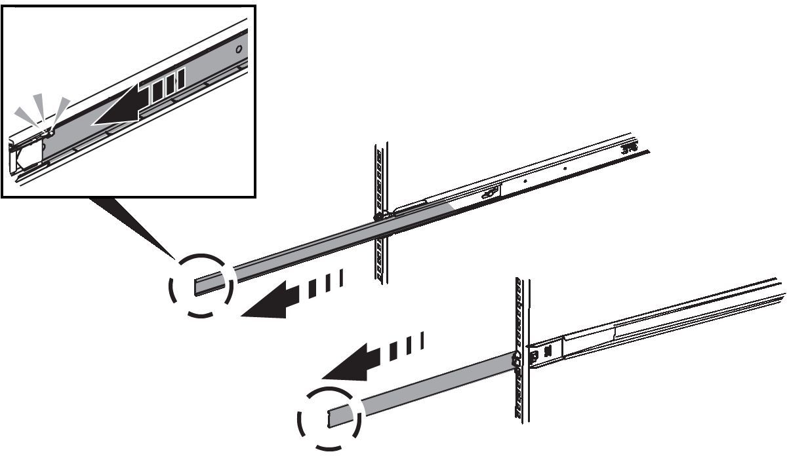

= Installieren Sie den SG120 oder SG1200 in einem Schrank oder Rack
:allow-uri-read: 
:icons: font
:imagesdir: ../media/

[role="lead"]
Sie installieren eine Reihe von Schienen für das Gerät in Ihrem Schrank oder Rack und schieben das Gerät dann auf die Schienen.

.Bevor Sie beginnen
* Sie haben das im Lieferumfang enthaltene Dokument durchgesehen https://library.netapp.com/ecm/ecm_download_file/ECMP12475945["Sicherheitshinweise"^] und die Vorsichtsmaßnahmen für das Bewegen und Installieren der Hardware verstanden.
* Sie haben die Anweisungen im Lieferumfang des Schienensatz enthalten.

.Schritte
. Befolgen Sie die Anweisungen für den Schienensatz, um die Schienen in Ihrem Schrank oder Rack zu installieren.
. Verlängern Sie auf den beiden Schienen, die im Schrank oder Rack installiert sind, die beweglichen Teile der Schienen, bis Sie ein Klicken hören.
+

. Setzen Sie das Gerät in die Schienen ein.
. Schieben Sie das Gerät in das Gehäuse oder Rack.
+
Wenn Sie das Gerät nicht weiter bewegen können, ziehen Sie an den blauen Verriegelungen auf beiden Seiten des Gehäuses, um das Gerät vollständig einzuschieben.

+
image::../media/sg6000_cn_rails_blue_button.gif[Schiebe an Schienen des Geräts]

. Ziehen Sie die unverlierbaren Schrauben an der Gerätevorderseite fest, um das Gerät im Rack zu befestigen.
+
image::../media/sg120_sg1200_rack_retaining_screws.png[Halteschrauben des Geräterracks]

+

NOTE: Befestigen Sie die Frontverkleidung erst, nachdem Sie das Gerät eingeschaltet haben.

