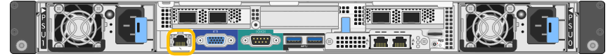

= Legen Sie die IP-Adresse für den BMC-Managementport fest
:allow-uri-read: 
:icons: font
:imagesdir: ../media/

[role="lead"]
Bevor Sie auf die BMC-Schnittstelle zugreifen können, konfigurieren Sie die IP-Adresse für den BMC-Verwaltungsport auf den SGF6112-, SG6000-CN-Controllern oder Service-Appliances.

Wenn Sie mit ConfigBuilder eine JSON-Datei erstellen, können Sie IP-Adressen automatisch konfigurieren. Siehe link:automating-appliance-installation-and-configuration.html["Automatisierung der Appliance-Installation und -Konfiguration"].

.Bevor Sie beginnen
* Der Management-Client verwendet ein https://docs.netapp.com/us-en/storagegrid-118/admin/web-browser-requirements.html["Unterstützter Webbrowser"^].
* Sie verwenden jeden Management-Client, der eine Verbindung zu einem StorageGRID-Netzwerk herstellen kann.
* Der BMC-Management-Port ist mit dem Managementnetzwerk verbunden, das Sie verwenden möchten.
+
[role="tabbed-block"]
====
.SG100
--

--
.SG1000
--
image::../media/sg1000_bmc_management_port.png[SG1000 BMC-Management-Port]

--
.SG6000
--
image::../media/sg6000_cn_bmc_management_port.gif[BMC-Management-Port am SG6000-CN Controller]

--
.SG6100
--
image::../media/sgf6112_cn_bmc_management_port.png[BMC-Management-Port SGF6112]

--
====

.Über diese Aufgabe
Zu Support-Zwecken ermöglicht der BMC-Management-Port einen niedrigen Hardwarezugriff.

NOTE: Sie sollten diesen Port nur mit einem sicheren, vertrauenswürdigen, internen Managementnetzwerk verbinden. Wenn kein solches Netzwerk verfügbar ist, lassen Sie den BMC-Port nicht verbunden oder blockiert, es sei denn, eine BMC-Verbindung wird vom technischen Support angefordert.

.Schritte
. Geben Sie auf dem Client die URL für den StorageGRID-Appliance-Installer ein: +
`*https://_Appliance_IP_:8443*`
+
Für `Appliance_IP`, Verwenden Sie die IP-Adresse für die Appliance in einem beliebigen StorageGRID-Netzwerk.

+
Die Startseite des StorageGRID-Appliance-Installationsprogramms wird angezeigt.

. Wählen Sie *Hardware konfigurieren* > *BMC-Konfiguration*.
+
image::../media/bmc_configuration_page.gif[Screenshot mit der Option „Erweitert“ > „BMC-Konfiguration“]

+
Die Seite Baseboard Management Controller Configuration wird angezeigt.

. Notieren Sie sich die automatisch angezeigte IPv4-Adresse.
+
DHCP ist die Standardmethode zum Zuweisen einer IP-Adresse zu diesem Port.

+

NOTE: Es kann einige Minuten dauern, bis die DHCP-Werte angezeigt werden.

+
image::../media/bmc_configuration_dhcp_address.gif[Konfigurationsseite für Untergeschoss Management Controller mit DHCP-Adresse]

. Legen Sie optional eine statische IP-Adresse für den BMC-Verwaltungsport fest.
+

NOTE: Sie sollten entweder eine statische IP für den BMC-Verwaltungsport zuweisen oder einen permanenten Leasing für die Adresse auf dem DHCP-Server zuweisen.

+
.. Wählen Sie *Statisch*.
.. Geben Sie die IPv4-Adresse unter Verwendung der CIDR-Schreibweise ein.
.. Geben Sie das Standard-Gateway ein.
+
image::../media/bmc_configuration_static_ip.gif[Die statische Option für die Konfiguration des Baseboard-Management-Controllers]

.. Klicken Sie Auf *Speichern*.
+
Es kann einige Minuten dauern, bis Ihre Änderungen angewendet werden.

