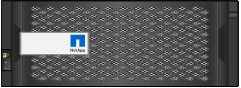
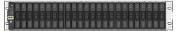

= Packen Sie die Kartons aus
:allow-uri-read: 
:icons: font
:imagesdir: ../media/

[role="lead"]
Packen Sie vor der Installation des StorageGRID-Geräts alle Kartons aus, und vergleichen Sie den Inhalt mit den Artikeln auf dem Packzettel.

[role="tabbed-block"]
====
.SG100 und SG1000
--
* *Hardware*
+
SG100 oder SG1000::
+
--
image::../media/sg6000_cn_front_without_bezel.gif[Laufwerke SG 100 oder SG1000 Services-Appliance als Front]

--
Schienensatz mit Anleitung::
+
--
image::../media/rail_kit.gif[Schienensatz]

--

* * Netzkabel*
+

TIP: Ihr Schrank verfügt möglicherweise über spezielle Netzkabel, die Sie anstelle der Netzkabel verwenden, die Sie zur Einheit mit dem Gerät anschließen.

+
Zwei Netzkabel für dein Land::
+
--
image::../media/power_cords.gif[Stromkabel]

--

--
.SG110 und SG1100
--
* *Hardware*
+
SG110 oder SG1100::
+
--
image::../media/sgf6112_front_with_ssds.png[Frontantriebsgeräte SG110 und SG1100]

--
Schienensatz mit Anleitung::
+
--
image::../media/rail_kit.gif[Schienensatz]

--
Frontblende::
+
--
image::../media/sgf_6112_front_bezel.png[Frontblende]

--

* * Netzkabel*
+

TIP: Ihr Schrank verfügt möglicherweise über spezielle Netzkabel, die Sie anstelle der Netzkabel verwenden, die Sie zur Einheit mit dem Gerät anschließen.

+
Zwei Netzkabel für dein Land::
+
--
image::../media/power_cords.gif[Stromkabel]

--

--
.SG5700
--
* *Hardware*
+
SG5712 Appliance mit installierten 12 Laufwerken::
+
--
image::../media/de212c_table_size.gif[SG5712-2-HE-Appliance]

--
SG5760 Appliance ohne installierte Laufwerke::
+
--
image::../media/de460c_table_size.gif[SG5760 4-HE-Appliance]

--
Frontverkleidung für das Gerät::
+
--
image::../media/sg5700_front_bezels.gif[Bezels der SG5712 und SG5760]

--
Schienensatz mit Anleitung::
+
--
image::../media/rail_kit.gif[Schienensatz]

--
SG5760: Sechzig Laufwerke::
+
--
image::../media/sg5760_drive.gif[Laufwerk]

--
SG5760: Griffe::
+
--
image::../media/handles.gif[Das SG5760 verarbeitet]

--
SG5760: Rückenhalterungen und Käfigmuttern für Rack-Montage mit Vierkantloch::
+
--
image::../media/back_brackets_table_size.gif[Rückenhalterungen und Käfigmuttern für SG5760]

--

* *Kabel und Anschlüsse*
+

TIP: Ihr Schrank verfügt möglicherweise über spezielle Netzkabel, die Sie anstelle der Netzkabel verwenden, die Sie zur Einheit mit dem Gerät anschließen.

+
Zwei Netzkabel für dein Land::
+
--
image::../media/power_cords.gif[Stromkabel]

--
Optische Kabel und SFP-Transceiver::
+
--
image::../media/fc_cable_and_sfp.gif[Optische Kabel und SFPs]

** Zwei optische Kabel für die FC Interconnect Ports
** Acht SFP+-Transceiver, kompatibel mit den vier 16-Gbit/s-FC-Interconnect-Ports und den vier 10-GbE-Netzwerkports

--

--
.SG6000
--
* *Hardware SG6060*
+
SG6000-CN-Controller::
+
--
image::../media/sg6000_cn_front_without_bezel.gif[SG6000-CN-Controller]

--
E2860 Controller-Shelf ohne installierte Laufwerke::
+
--
image::../media/de460c_table_size.gif[SG5760 4-HE-Appliance]

--
Zwei Frontrahmen::
+
--
image::../media/sg6000_front_bezels_for_table.gif[Vorderrahmen]

--
Zwei Schienensätze mit Anweisungen::
+
--
image::../media/rail_kit.gif[Schienensatz]

--
60 Laufwerke (2 SSD und 58 NL-SAS)::
+
--
image::../media/sg5760_drive.gif[Laufwerk]

--
Vier Griffe::
+
--
image::../media/handles.gif[Das SG5760 verarbeitet]

--
Rückhalterungen und Käfigmuttern für Rack-Montage mit Vierkantloch::
+
--
image::../media/back_brackets_table_size.gif[Rückenhalterungen und Käfigmuttern für SG5760]

--

* *SG6060-Erweiterungs-Shelf*
+
Erweiterungs-Shelf ohne Laufwerke installiert::
+
--
image::../media/de460c_table_size.gif[SG5760 4-HE-Appliance]

--
Frontblende::
+
--

--
60 NL-SAS-Laufwerke::
+
--
image::../media/sg5760_drive.gif[Laufwerk]

--
Ein Schienensatz mit Anweisungen::
+
--
image::../media/rail_kit.gif[Schienensatz]

--
Vier Griffe::
+
--
image::../media/handles.gif[Das SG5760 verarbeitet]

--
Rückhalterungen und Käfigmuttern für Rack-Montage mit Vierkantloch::
+
--
image::../media/back_brackets_table_size.gif[Rückenhalterungen und Käfigmuttern für SG5760]

--

* *Hardware SGF6024*
+
SG6000-CN-Controller::
+
--
image::../media/sg6000_cn_front_without_bezel.gif[SG6000-CN-Controller]

--
EF570 Flash-Array mit 24 installierten Solid State-Laufwerken (Flash::
+
--

--
Zwei Frontrahmen::
+
--
image::../media/sgf6024_front_bezels_for_table.png[SG6024 Vorderrahmen]

--
Zwei Schienensätze mit Anweisungen::
+
--
image::../media/rail_kit.gif[Schienensatz]

--
Endkappen für die Ablage::
+
--
image::../media/endcaps.png[Endkappen]

--

* *Kabel und Anschlüsse*
+

TIP: Ihr Schrank verfügt möglicherweise über spezielle Netzkabel, die Sie anstelle der Netzkabel verwenden, die Sie zur Einheit mit dem Gerät anschließen.

+
Vier Netzkabel für Ihr Land::
+
--
image::../media/power_cords.gif[Stromkabel]

--
Optische Kabel und SFP-Transceiver::
+
--
image::../media/fc_cable_and_sfp.gif[Optische Kabel und SFPs]

** Vier optische Kabel für die FC Interconnect Ports
** Vier SFP+-Transceiver, die 16 Gbit/s FC unterstützen

--
Optional: Zwei SAS-Kabel zum Anschluss jedes SG6060-Erweiterungs-Shelfs::
+
--
image::../media/sas_cable.gif[SAS-Kabel]

--

--
.SG6100
--
* *Hardware*
+
SGF6112::
+
--
image::../media/sgf6112_front_with_ssds.png[Frontantrieb SGF6112-Gerät]

--
Schienensatz mit Anleitung::
+
--
image::../media/rail_kit.gif[Schienensatz]

--
Frontblende::
+
--
image::../media/sgf_6112_front_bezel.png[Frontblende]

--

* * Netzkabel*
+

TIP: Ihr Schrank verfügt möglicherweise über spezielle Netzkabel, die Sie anstelle der Netzkabel verwenden, die Sie zur Einheit mit dem Gerät anschließen.

+
Zwei Netzkabel für dein Land::
+
--
image::../media/power_cords.gif[Stromkabel]

--

--
====