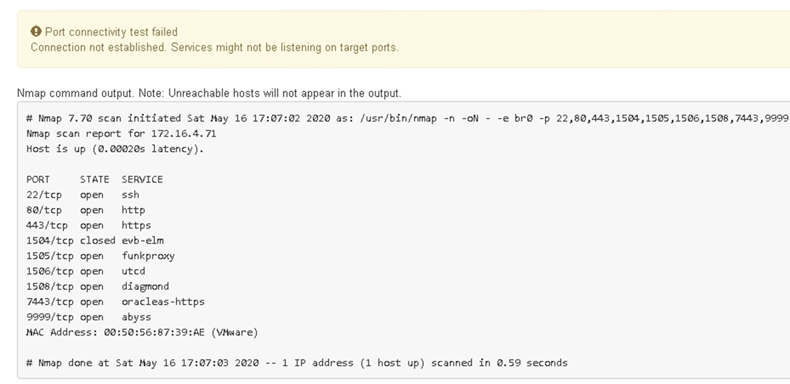

= Überprüfen Sie Netzwerkverbindungen auf Portebene
:allow-uri-read: 
:icons: font
:imagesdir: ../media/

[role="lead"]
Damit der Zugriff zwischen dem Installationsprogramm der StorageGRID Appliance und anderen Nodes nicht durch Firewalls beeinträchtigt wird, vergewissern Sie sich, dass der Installer von StorageGRID eine Verbindung zu einem bestimmten TCP-Port oder einem Satz von Ports an der angegebenen IP-Adresse oder dem angegebenen Adressbereich herstellen kann.

.Über diese Aufgabe
Mithilfe der Liste der im StorageGRID-Appliance-Installationsprogramm bereitgestellten Ports können Sie die Verbindung zwischen der Appliance und den anderen Nodes im Grid-Netzwerk testen.

Darüber hinaus können Sie die Konnektivität auf den Admin- und Client-Netzwerken sowie auf UDP-Ports testen, wie sie für externe NFS- oder DNS-Server verwendet werden. Eine Liste dieser Ports finden Sie im https://docs.netapp.com/us-en/storagegrid/network/network-port-reference.html["Netzwerkportreferenz"^].

NOTE: Die in der Tabelle für die Anschlusskonnektivität aufgeführten Netznetzwerkports sind nur für StorageGRID Version 11.7 oder höher gültig. Um zu überprüfen, welche Ports für jeden Node-Typ korrekt sind, sollten Sie immer die Netzwerkrichtlinien für Ihre Version von StorageGRID lesen.

.Schritte
. Klicken Sie im Installationsprogramm der StorageGRID-Appliance auf *Netzwerke konfigurieren* > *Port Connectivity Test (nmap)*.
+
Die Seite Port Connectivity Test wird angezeigt.

+
In der Tabelle für die Portkonnektivität werden Node-Typen aufgeführt, für die im Grid-Netzwerk TCP-Konnektivität erforderlich ist. Für jeden Node-Typ werden in der Tabelle die Grid-Netzwerkanschlüsse aufgeführt, auf die Ihre Appliance Zugriff haben sollte.

+
Sie können die Verbindung zwischen den in der Tabelle aufgeführten Appliance-Ports und den anderen Nodes im Grid-Netzwerk testen.

. Wählen Sie im Dropdown-Menü *Netzwerk* das Netzwerk aus, das Sie testen möchten: *Grid*, *Admin* oder *Client*.
. Geben Sie einen Bereich von IPv4-Adressen für die Hosts in diesem Netzwerk an.
+
Beispielsweise möchten Sie das Gateway im Netzwerk oder den primären Admin-Node aufsuchen.

+
Geben Sie einen Bereich mit einem Bindestrich an, wie im Beispiel gezeigt.

. Geben Sie eine TCP-Portnummer, eine Liste von Ports, die durch Kommas getrennt sind, oder eine Reihe von Ports ein.
+
image::../media/port_connectivity_test_start.png[Port-Konnektivitätstest]

. Klicken Sie Auf *Konnektivität Testen*.
+
** Wenn die ausgewählten Netzwerkverbindungen auf Portebene gültig sind, wird die Meldung „`Verbindungstest bestanden`“ in einem grünen Banner angezeigt. Die Ausgabe des nmap-Befehls ist unter dem Banner aufgeführt.
+
image::../media/port_connectivity_test_passed.png[Port Connectivity Test Bestanden]

** Wenn eine Netzwerkverbindung auf Portebene zum Remote-Host hergestellt wird, der Host jedoch nicht auf einem oder mehreren der ausgewählten Ports hört, wird die Meldung „`Verbindungstest fehlgeschlagen`“ in einem gelben Banner angezeigt. Die Ausgabe des nmap-Befehls ist unter dem Banner aufgeführt.
+
Jeder Remote-Port, auf den der Host nicht hört, hat den Status „`Geschlossen`“. Beispielsweise sieht dieses gelbe Banner, wenn der Node, zu dem eine Verbindung hergestellt werden soll, bereits installiert ist und der StorageGRID-NMS-Service auf diesem Node noch nicht ausgeführt wird.

+

** Wenn für einen oder mehrere ausgewählte Ports keine Netzwerkverbindung auf Portebene hergestellt werden kann, wird die Meldung „`Verbindungstest für Port fehlgeschlagen`“ in einem roten Banner angezeigt. Die Ausgabe des nmap-Befehls ist unter dem Banner aufgeführt.
+
Das rote Banner zeigt an, dass eine TCP-Verbindung zu einem Port auf dem Remote-Host hergestellt wurde, aber dem Sender wurde nichts zurückgegeben. Wenn keine Antwort zurückgegeben wird, hat der Port einen Status „gefiltert“ und wird wahrscheinlich durch eine Firewall blockiert.

+

NOTE: Ports mit „`closed`“ werden ebenfalls aufgeführt.

+
image::../media/nmap_test_red_banner.png[NMAP Test Red Banner]

