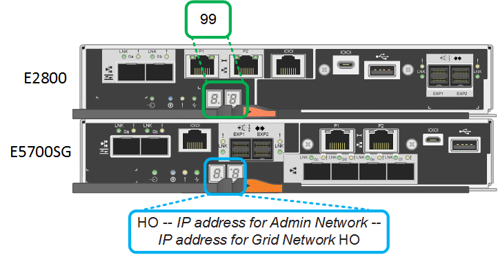

= Statusanzeigen und -Codes anzeigen
:allow-uri-read: 
:icons: font
:imagesdir: ../media/

[role="lead"]
Die Geräte und Controller enthalten Anzeigen, mit denen Sie den Status der Gerätekomponenten ermitteln können.

[role="tabbed-block"]
====
.SG100 und SG1000
--
Die Appliance enthält Anzeigen, die Ihnen beim Bestimmen des Status des Appliance-Controllers und der beiden SSDs helfen:

* <<appliance_indicators_SG100_1000,Gerätesteuchten und -Tasten>>
* <<general_boot_codes_SG100_1000,Allgemeine Startcodes>>
* <<ssd_indicators_SG100_1000,SSD-LEDs>>

Verwenden Sie diese Informationen, um zu helfen link:troubleshooting-hardware-installation-sg100-and-sg1000.html["Fehlerbehebung bei der Hardwareinstallation von SG100 und SG1000"].

[[appliance_indicators_SG100_1000]]
Gerätesteuchten und -Tasten::
+
--
Die folgende Abbildung zeigt Statusanzeigen und -Tasten des SG100 und SG1000.

image::../media/sg6000_cn_front_indicators.gif[Vordere Anzeigen - SG1000]

[cols="1a,2a,2a"]
|===
| Legende | Anzeige | Status 

 a| 
1
 a| 
Ein-/aus-Schalter
 a| 
* Blau: Das Gerät ist eingeschaltet.
* Aus: Das Gerät ist ausgeschaltet.

 a| 
2
 a| 
Reset-Taste
 a| 
Mit dieser Taste können Sie den Controller auf einen harten Reset zurücksetzen.

 a| 
3
 a| 
Schaltfläche „Identifizierung“
 a| 
Diese Taste kann auf „Blinken“, „ein“ (Festkörper) oder „aus“ eingestellt werden.

* Blau, blinkend: Identifiziert das Gerät im Schrank oder Rack.
* Blau, fest: Identifiziert das Gerät im Schrank oder Rack.
* Aus: Das Gerät ist im Schrank oder Rack nicht visuell erkennbar.

 a| 
4
 a| 
Alarm-LED
 a| 
* Gelb, konstant: Ein Fehler ist aufgetreten.
+
*Hinweis:* um die Boot-up- und Fehlercodes anzuzeigen, link:accessing-bmc-interface.html["Rufen Sie die BMC-Schnittstelle auf"].

* Aus: Es sind keine Fehler vorhanden.

|===
--

[[general_boot_codes_SG100_1000]]
Allgemeine Startcodes::
+
--
Beim Hochfahren oder nach einem harten Reset des Geräts treten folgende Aktionen auf:

. Der BMC (Baseboard Management Controller) protokolliert Codes für die Boot-Sequenz, einschließlich etwaiger Fehler.
. Der Betriebsschalter leuchtet auf.
. Wenn während des Startvorgangs Fehler auftreten, leuchtet die Alarm-LED auf.
+
So zeigen Sie die Starts- und Fehlercodes an: link:accessing-bmc-interface.html["Rufen Sie die BMC-Schnittstelle auf"].

--

[[ssd_indicators_SG100_1000]]
SSD-LEDs::
+
--
Die folgende Abbildung zeigt die SSD-Anzeigen auf dem SG100 und SG1000.

image::../media/ssd_indicators.png[SSD-Kennzahlen]

[cols="1a,2a,2a"]
|===
| LED | Anzeige | Status 

 a| 
1
 a| 
Laufwerksstatus/-Fehler
 a| 
* Blau (fest): Laufwerk ist online
* Gelb (konstant): Laufwerksausfall
* Gelb (blinkend): Laufwerksanzeige leuchtet
* Aus: Steckplatz ist leer

 a| 
2
 a| 
Laufwerk aktiv
 a| 
Blau (blinkend): Auf das Laufwerk wird zugegriffen

|===
--

--
.SG5700
--
Die Gerätesteuerung enthält Anzeigen, die Ihnen helfen, den Status des Gerätesteuerung zu bestimmen:

* <<boot_codes_sg5700,SG5700-Startstatuscodes>>
* <<status_indicators_e5700sg_controller,Statusanzeigen am E5700SG Controller>>
* <<general_boot_codes_sg5700,Allgemeine Startcodes>>
* <<boot_codes_e5700sg_controller,Boot-Codes des E5700SG-Controllers>>
* <<error_codes_e5700sg_controller,E5700SG-Controller-Fehlercodes>>

Verwenden Sie diese Informationen, um zu helfen link:troubleshooting-hardware-installation.html["Fehler bei der Installation der SG5700-Hardware beheben"].

[[boot_codes_sg5700]]
SG5700-Startstatuscodes::
+
--
Die sieben-Segment-Anzeigen auf jedem Controller zeigen Status- und Fehlercodes an, wenn das Gerät eingeschaltet wird.

Der E2800 Controller und der E5700SG Controller zeigen verschiedene Status und Fehlercodes an.

Um zu verstehen, was diese Codes bedeuten, lesen Sie die folgenden Ressourcen:

[cols="1a,2a"]
|===
| Controller | Referenz 

 a| 
E2800 Controller
 a| 
_E5700 and E2800 System Monitoring Guide_

*Hinweis:* die für den E5700 Controller der E-Series aufgeführten Codes gelten nicht für den E5700SG Controller in der Appliance.

 a| 
E5700SG Controller
 a| 
„`status-Indikatoren am E5700SG-Controller`“

|===
--

.Schritte
. Überwachen Sie während des Startvorgangs den Fortschritt, indem Sie die Codes auf den sieben Segmentanzeigen anzeigen.
+
** Das 7-Segment-Display auf dem E2800-Controller zeigt die sich wiederholende Sequenz *OS*, *SD*, `*_blank_*` Um anzugeben, dass es die Tagesbeginn-Verarbeitung durchführt.
** Das 7-Segment-Display des E5700SG-Reglers zeigt eine Sequenz von Codes an, die mit *AA* und *FF* enden.

. Bestätigen Sie, dass die sieben-Segment-Anzeigen nach dem Booten der Controller Folgendes anzeigen:
+

+
[cols="1a,2a"]
|===
| Controller | Sieben-Segment-Anzeige 

 a| 
E2800 Controller
 a| 
Zeigt 99. Dies ist die Standard-ID für ein E-Series Controller-Shelf.

 a| 
E5700SG Controller
 a| 
Zeigt *HO*, gefolgt von einer sich wiederholenden Sequenz von zwei Zahlen.

[listing]
----
HO -- IP address for Admin Network -- IP address for Grid Network HO
----
In der Sequenz ist der erste Zahlensatz die IP-Adresse, die vom DHCP für den Management-Port 1 des Controllers zugewiesen wird. Diese Adresse wird verwendet, um den Controller mit dem Admin-Netzwerk für StorageGRID zu verbinden. Die zweite Zahlengruppe ist die durch DHCP zugewiesene IP-Adresse, die zur Verbindung des Geräts mit dem Grid Network for StorageGRID verwendet wird.

*Hinweis:* konnte eine IP-Adresse nicht über DHCP zugewiesen werden, wird 0.0.0.0 angezeigt.

|===
. Wenn die sieben Segmente andere Werte anzeigen, siehe link:troubleshooting-hardware-installation.html["Fehlerbehebung bei der Hardwareinstallation (SG6000 oder SG5700)"] Und bestätigen Sie, dass Sie die Installationsschritte korrekt ausgeführt haben. Wenn das Problem nicht behoben werden kann, wenden Sie sich an den technischen Support.

[[status_indicators_e5700sg_controller]]
Statusanzeigen am E5700SG Controller::
+
--
Die sieben-Segment-Anzeige und die LEDs auf dem E5700SG-Controller zeigen Status- und Fehlercodes an, während das Gerät eingeschaltet wird und die Hardware initialisiert wird. Sie können diese Anzeigen verwenden, um den Status zu bestimmen und Fehler zu beheben.

Nach dem Starten des Installationsprogramms für StorageGRID-Appliances sollten Sie die Statusanzeigen auf dem E5700SG-Controller regelmäßig überprüfen.

Die folgende Abbildung zeigt Statusanzeigen auf dem E5700SG Controller.

image::../media/e5700sg_leds.gif[Statusanzeigen am E5700SG Controller]

[cols="1a,2a,2a"]
|===
| Legende | Anzeige | Beschreibung 

 a| 
1
 a| 
Warnungs-LED
 a| 
Gelb: Der Controller ist fehlerhaft und erfordert eine Bedienerwarnung, oder das Installationsskript wurde nicht gefunden.

Aus: Der Controller funktioniert ordnungsgemäß.

 a| 
2
 a| 
Sieben-Segment-Anzeige
 a| 
Zeigt einen Diagnosecode an

Sieben-Segment-Anzeigesequenzen ermöglichen es Ihnen, Fehler und den Betriebszustand der Appliance zu verstehen.

 a| 
3
 a| 
Warn-LEDs für den Erweiterungsport
 a| 
Gelb: Diese LEDs sind immer gelb (keine Verbindung hergestellt), da das Gerät die Erweiterungs-Ports nicht nutzt.

 a| 
4
 a| 
Status-LEDs für Host-Port-Link
 a| 
Grün: Die Verbindung ist aktiviert.

Aus: Die Verbindung ist ausgefallen.

 a| 
5
 a| 
Status-LEDs für Ethernet Link
 a| 
Grün: Es wird eine Verbindung hergestellt.

Aus: Keine Verbindung hergestellt.

 a| 
6
 a| 
LEDs für Ethernet-Aktivität
 a| 
Grün: Die Verbindung zwischen dem Management-Port und dem Gerät, mit dem er verbunden ist (z. B. ein Ethernet-Switch) ist aktiviert.

Aus: Es besteht keine Verbindung zwischen dem Controller und dem angeschlossenen Gerät.

Blinkt grün: Es gibt Ethernet-Aktivität.

|===
--

[[general_boot_codes_sg5700]]
Allgemeine Startcodes::
+
--
Beim Hochfahren oder nach einem harten Reset des Geräts treten folgende Aktionen auf:

. Die sieben-Segment-Anzeige auf dem E5700SG-Controller zeigt eine allgemeine Sequenz von Codes, die nicht spezifisch für die Steuerung ist. Die allgemeine Sequenz endet mit den Codes AA und FF.
. Startcodes, die speziell für den E5700SG-Controller gelten, werden angezeigt.

--

[[boot_codes_e5700sg_controller]]
Boot-Codes des E5700SG-Controllers::
+
--
Beim normalen Hochfahren des Geräts zeigt das siebenSegment-Display des E5700SG-Controllers die folgenden Codes in der angegebenen Reihenfolge an:

[cols="1a,3a"]
|===
| Codieren | Zeigt An 

 a| 
HI
 a| 
Das Master-Boot-Skript wurde gestartet.

 a| 
PP
 a| 
Das System prüft, ob das FPGA aktualisiert werden muss.

 a| 
HP
 a| 
Das System überprüft, ob die 10/25-GbE-Controller-Firmware aktualisiert werden muss.

 a| 
RB
 a| 
Das System wird nach dem Anwenden von Firmware-Updates neu gebootet.

 a| 
FP
 a| 
Die Update-Prüfungen der Hardware-Subsystem-Firmware wurden abgeschlossen. Die Kommunikationsdienste zwischen den Controllern werden gestartet.

 a| 
ER
 a| 
Das System wartet auf die Konnektivität mit dem E2800 Controller und synchronisiert mit dem Betriebssystem SANtricity.

*Hinweis:* Wenn dieser Bootvorgang nicht über diese Phase hinaus läuft, überprüfen Sie die Verbindungen zwischen den beiden Controllern.

 a| 
HZ
 a| 
Das System prüft gerade auf vorhandene StorageGRID Installationsdaten.

 a| 
HO
 a| 
Das Installationsprogramm für StorageGRID-Appliance wird ausgeführt.

 a| 
HOCHVERFÜGBARKEIT
 a| 
StorageGRID wird ausgeführt.

|===
--

[[error_codes_e5700sg_controller]]
E5700SG-Controller-Fehlercodes::
+
--
Diese Codes stellen Fehlerbedingungen dar, die auf dem E5700SG-Controller angezeigt werden können, wenn das Gerät hochfährt. Weitere zweistellige Hexadezimalcodes werden angezeigt, wenn bestimmte Hardware-Fehler auf niedriger Ebene auftreten. Wenn einer dieser Codes länger als ein oder zwei Sekunden andauert oder wenn Sie den Fehler nicht beheben können, indem Sie einem der vorgeschriebenen Fehlerbehebungsverfahren folgen, wenden Sie sich an den technischen Support.

[cols="1a,3a"]
|===
| Codieren | Zeigt An 

 a| 
22
 a| 
Kein Master-Boot-Datensatz auf einem Boot-Gerät gefunden.

 a| 
23
 a| 
Das interne Flash-Laufwerk ist nicht verbunden.

 a| 
2 A, 2 B
 a| 
Stuck-Bus, DIMM-SPD-Daten können nicht gelesen werden.

 a| 
40
 a| 
Ungültige DIMMs.

 a| 
41
 a| 
Ungültige DIMMs.

 a| 
42
 a| 
Speichertest fehlgeschlagen.

 a| 
51
 a| 
Fehler beim SPD-Lesen.

 a| 
92 bis 96
 a| 
PCI-Bus-Initialisierung

 a| 
A0 bis A3
 a| 
SATA-Laufwerk-Initialisierung

 a| 
AB
 a| 
Alternativer Startcode:

 a| 
AE
 a| 
Booten von OS:

 a| 
EA
 a| 
DDR4-Schulung fehlgeschlagen.

 a| 
E8
 a| 
Kein Speicher installiert.

 a| 
EU
 a| 
Das Installationsskript wurde nicht gefunden.

 a| 
EP
 a| 
Installation oder Kommunikation mit dem E2800-Controller ist fehlgeschlagen.

|===
--

.Verwandte Informationen
* https://mysupport.netapp.com/site/global/dashboard["NetApp Support"^]
* https://library.netapp.com/ecmdocs/ECMLP2588751/html/frameset.html["E5700 und E2800 – System Monitoring Guide"^]

--
.SG6000
--
Die SG6000 Appliance-Controller enthalten Anzeigen, die Ihnen helfen, den Status des Appliance-Controllers zu bestimmen:

* <<status_indicators_sg6000cn,Statusanzeigen und -Tasten am SG6000-CN-Controller>>
* <<general_boot_codes_sg6000,Allgemeine Startcodes>>
* <<boot_codes_sg6000_storage_controller,Statuscodes für das Booten der SG6000-Speicher-Controller>>

Verwenden Sie diese Informationen, um zu helfen link:troubleshooting-hardware-installation.html["Fehlerbehebung bei der SG6000 Installation"].

[[status_indicators_sg6000cn]]
Statusanzeigen und -Tasten am SG6000-CN-Controller::
+
--
Der SG6000-CN-Controller enthält Anzeigen, mit denen Sie den Status des Controllers bestimmen können, einschließlich der folgenden Anzeigen und Schaltflächen.

Die folgende Abbildung zeigt Statusanzeigen und -Tasten am SG6000-CN-Controller.

image::../media/sg6000_cn_front_indicators.gif[Frontanzeigen - SG6000-CN]

[cols="1a,2a,3a"]
|===
| Legende | Anzeige | Beschreibung 

 a| 
1
 a| 
Ein-/aus-Schalter
 a| 
* Blau: Der Controller ist eingeschaltet.
* Aus: Der Controller ist ausgeschaltet.

 a| 
2
 a| 
Reset-Taste
 a| 
_Kein Indikator_

Mit dieser Taste können Sie den Controller auf einen harten Reset zurücksetzen.

 a| 
3
 a| 
Schaltfläche „Identifizierung“
 a| 
* Blinkt oder leuchtet blau: Identifiziert den Controller im Schrank oder Rack.
* Aus: Die Steuerung ist im Schrank oder Rack nicht visuell erkennbar.

Diese Taste kann auf „Blinken“, „ein“ (Festkörper) oder „aus“ eingestellt werden.

 a| 
4
 a| 
Alarm-LED
 a| 
* Gelb: Ein Fehler ist aufgetreten.
+
*Hinweis:* um die Boot-up- und Fehlercodes anzuzeigen, link:accessing-bmc-interface.html["Rufen Sie die BMC-Schnittstelle auf"].

* Aus: Es sind keine Fehler vorhanden.

|===
--

[[general_boot_codes_sg6000]]
Allgemeine Startcodes::
+
--
Beim Hochfahren oder nach einem harten Reset des SG6000-CN-Controllers treten folgende Aktionen auf:

. Der BMC (Baseboard Management Controller) protokolliert Codes für die Boot-Sequenz, einschließlich etwaiger Fehler.
. Der Betriebsschalter leuchtet auf.
. Wenn während des Startvorgangs Fehler auftreten, leuchtet die Alarm-LED auf.
+
So zeigen Sie die Starts- und Fehlercodes an: link:accessing-bmc-interface.html["Rufen Sie die BMC-Schnittstelle auf"].

--

[[boot_codes_sg6000_storage_controller]]
Statuscodes für das Booten der SG6000-Speicher-Controller::
+
--
Jeder Storage Controller verfügt über eine Anzeige in sieben Segmenten, die Statuscodes bereitstellt, wenn der Controller heruntergefahren wird. Die Statuscodes sind sowohl für den E2800 Controller als auch für den EF570 Controller identisch.

Beschreibungen dieser Codes finden Sie in den Informationen zur Systemüberwachung der E-Series für Ihren Storage Controller-Typ.

--

.Schritte
. Überwachen Sie während des Startvorgangs den Fortschritt, indem Sie die auf der siebensegmentreichen Anzeige angezeigten Codes für jeden Storage-Controller anzeigen.
+
Die sieben-Segment-Anzeige auf jedem Speicher-Controller zeigt die sich wiederholende Sequenz *OS*, *SD*, `*_blank_*` Um anzugeben, dass der Controller die Tagesbeginn-Verarbeitung durchführt.

. Vergewissern Sie sich, dass nach dem Booten der Controller 99 angezeigt wird. Diese ist die Standard-ID für ein E-Series Controller-Shelf.
+
Vergewissern Sie sich, dass dieser Wert auf beiden Storage-Controllern angezeigt wird. Diese Abbildung zeigt in diesem Beispiel den E2800 Controller.

+
image::../media/seven_segment_display_codes_for_e2800.gif[Anzeigecodes für sieben Segmente für E2800]

. Wenn ein Controller oder beide andere Werte anzeigen, lesen Sie link:troubleshooting-hardware-installation.html["Fehlerbehebung bei der Hardwareinstallation (SG6000 oder SG5700)"] Und bestätigen Sie, dass Sie die Installationsschritte korrekt ausgeführt haben. Wenn das Problem nicht behoben werden kann, wenden Sie sich an den technischen Support.

.Verwandte Informationen
* https://mysupport.netapp.com/site/global/dashboard["NetApp Support"^]
* link:../sg6000/power-sg6000-cn-controller-off-on.html#power-on-sg6000-cn-controller-and-verify-operation["Schalten Sie den SG6000-CN Controller ein, und überprüfen Sie den Betrieb"]

--
.SG6100
--
Die Appliance enthält Anzeigen, mit denen Sie den Status des Appliance-Controllers und der SSDs ermitteln können:

* <<appliance_indicators_SG6100,Gerätesteuchten und -Tasten>>
* <<general_boot_codes_SG6100,Allgemeine Startcodes>>
* <<ssd_indicators_SG6100,SSD-LEDs>>

Verwenden Sie diese Informationen, um zu helfen link:troubleshooting-hardware-installation-sg6100.html["Fehlerbehebung bei der Installation der SG6100-Hardware"].

[[appliance_indicators_SG6100]]
Gerätesteuchten und -Tasten::
+
--
Die folgende Abbildung zeigt Anzeigen und Tasten am SGF6112-Gerät.

image::../media/sgf6112_front_indicators.png[Vordere Anzeigen - SGF6112]

[cols="1a,2a,3a"]
|===
| Legende | Anzeige | Status 

 a| 
1
 a| 
Ein-/aus-Schalter
 a| 
* Blau: Das Gerät ist eingeschaltet.
* Aus: Das Gerät ist ausgeschaltet.

 a| 
2
 a| 
Reset-Taste
 a| 
Mit dieser Taste können Sie den Controller auf einen harten Reset zurücksetzen.

 a| 
3
 a| 
Schaltfläche „Identifizierung“
 a| 
Mit dem BMC kann diese Taste auf Blinken, ein (Vollton) oder aus eingestellt werden.

* Blau, blinkend: Identifiziert das Gerät im Schrank oder Rack.
* Blau, fest: Identifiziert das Gerät im Schrank oder Rack.
* Aus: Das Gerät ist im Schrank oder Rack nicht visuell erkennbar.

 a| 
4
 a| 
Status-LED
 a| 
* Gelb, konstant: Ein Fehler ist aufgetreten.
+
*Hinweis:* um die Boot-up- und Fehlercodes anzuzeigen, link:accessing-bmc-interface.html["Rufen Sie die BMC-Schnittstelle auf"].

* Aus: Es sind keine Fehler vorhanden.

 a| 
5
 a| 
PFR
 a| 
Diese Leuchte wird vom SGF6112-Gerät nicht verwendet und bleibt ausgeschaltet.

|===
--

[[general_boot_codes_SG6100]]
Allgemeine Startcodes::
+
--
Beim Hochfahren oder nach einem harten Reset des Geräts treten folgende Aktionen auf:

. Der BMC (Baseboard Management Controller) protokolliert Codes für die Boot-Sequenz, einschließlich etwaiger Fehler.
. Der Betriebsschalter leuchtet auf.
. Wenn während des Startvorgangs Fehler auftreten, leuchtet die Alarm-LED auf.
+
So zeigen Sie die Starts- und Fehlercodes an: link:accessing-bmc-interface.html["Rufen Sie die BMC-Schnittstelle auf"].

--

[[ssd_indicators_SG6100]]
SSD-LEDs::
+
--
Die folgende Abbildung zeigt die SSD-Anzeigen auf der SGF6112-Appliance.

image::../media/ssd_indicators.png[SSD-Kennzahlen]

[cols="1a,2a,2a"]
|===
| LED | Anzeige | Status 

 a| 
1
 a| 
Laufwerksstatus/-Fehler
 a| 
* Blau (fest): Laufwerk ist online
* Gelb (konstant): Laufwerksausfall
* Aus: Steckplatz ist leer

*Hinweis:* Wenn eine neue funktionierende SSD in einen funktionierenden SGF6112 StorageGRID-Knoten eingesteckt wird, sollten die LEDs auf der SSD zunächst blinken, aber aufhören zu blinken, sobald das System feststellt, dass das Laufwerk über genügend Kapazität verfügt und funktionsfähig ist.

 a| 
2
 a| 
Laufwerk aktiv
 a| 
Blau (blinkend): Auf das Laufwerk wird zugegriffen

|===
--

--
====