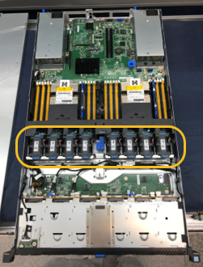

= Lüfter in SG100 oder SG1000 austauschen
:allow-uri-read: 
:icons: font
:imagesdir: ../media/

[role="lead"]
Die Service-Appliance verfügt über acht Lüfter. Wenn einer der Lüfter ausfällt, müssen Sie ihn so schnell wie möglich austauschen, um sicherzustellen, dass das Gerät ordnungsgemäß gekühlt wird.

.Bevor Sie beginnen
* Sie haben den Ersatzlüfter ausgepackt.
* Das ist schon link:locating-controller-in-data-center.html["Das Gerät befindet sich physisch"].
* Sie haben bestätigt, dass die anderen Lüfter installiert sind und ausgeführt werden.

.Über diese Aufgabe
Auf den Geräteknoten kann nicht zugegriffen werden, wenn Sie den Lüfter austauschen.

Das Foto zeigt einen Ventilator für die Service Appliance. Die Lüfter sind zugänglich, nachdem Sie die obere Abdeckung vom Gerät entfernt haben.

NOTE: Jede der beiden Netzteile enthält zudem einen Lüfter. Diese Lüfter sind in diesem Verfahren nicht enthalten.

image::../media/fan_fru.png[Lüfter-FRU]

.Schritte
. Fahren Sie das Gerät herunter.
+
.. Melden Sie sich beim Grid-Node an:
+
... Geben Sie den folgenden Befehl ein: `ssh admin@_grid_node_IP_`
... Geben Sie das im aufgeführte Passwort ein `Passwords.txt` Datei:
... Geben Sie den folgenden Befehl ein, um zum Root zu wechseln: `su -`
... Geben Sie das im aufgeführte Passwort ein `Passwords.txt` Datei:
+
Wenn Sie als root angemeldet sind, ändert sich die Eingabeaufforderung von `$` Bis `#`.

.. Schalten Sie das Service-Gerät aus: +
`*shutdown -h now*`

. Verwenden Sie eine von zwei Methoden, um zu überprüfen, ob die Stromversorgung für die Service-Appliance ausgeschaltet ist:
+
** Die Betriebsanzeige-LED an der Vorderseite des Geräts ist aus.
** Die Seite Power Control der BMC-Schnittstelle zeigt an, dass das Gerät ausgeschaltet ist.

. Ziehen Sie das Gerät aus dem Rack.
. Heben Sie die Verriegelung an der oberen Abdeckung an, und entfernen Sie die Abdeckung vom Gerät.
. Suchen Sie den Lüfter, der ausgefallen ist.
+

. Heben Sie den defekten Lüfter aus dem Gehäuse.
+
image::../media/fan_removal.png[Ausbau Des Lüfters]

. Schieben Sie den Ersatzlüfter in den offenen Steckplatz des Gehäuses.
+
Führen Sie die Kante des Lüfters mit dem Führungsstift nach oben. Der Stift ist im Foto eingekreist.

+
image::../media/fan_guide_pin.png[Stift Für Lüfterführung]

. Drücken Sie den Lüfteranschluss fest in die Leiterplatte.
+
image::../media/fan_connector_check.png[Lüfteranschluss Prüfen]

. Setzen Sie die obere Abdeckung wieder auf das Gerät, und drücken Sie die Verriegelung nach unten, um die Abdeckung zu sichern.
. Schalten Sie das Gerät ein, und überwachen Sie die Controller-LEDs und die Boot-Codes.
+
Verwenden Sie die BMC-Schnittstelle, um den Boot-up-Status zu überwachen.

. Vergewissern Sie sich, dass der Appliance-Node im Grid Manager angezeigt wird und keine Meldungen angezeigt werden.

Nach dem Austausch des Teils senden Sie das fehlerhafte Teil an NetApp zurück, wie in den mit dem Kit gelieferten RMA-Anweisungen beschrieben. Siehe https://mysupport.netapp.com/site/info/rma["Teilerückgabe  Austausch"^] Seite für weitere Informationen.
