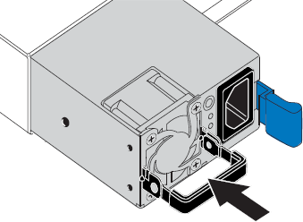

= Ersetzen Sie ein oder beide Netzteile im SG100 oder SG1000
:allow-uri-read: 
:icons: font
:imagesdir: ../media/

[role="lead"]
Das Services-Gerät verfügt über zwei Netzteile für Redundanz. Wenn eines der Netzteile ausfällt, müssen Sie es so schnell wie möglich ersetzen, um sicherzustellen, dass der Compute-Controller über redundante Stromversorgung verfügt. Beide im Controller ausgeführten Netzteile müssen das gleiche Modell und die gleiche Stromleistung aufweisen.

.Bevor Sie beginnen
* Das ist schon link:locating-controller-in-data-center.html["Physisch gelegener Controller"] Bei zu ersetzenden Netzteilen.
* Wenn Sie nur ein Netzteil ersetzen:
+
** Sie haben das Ersatznetzteil entpackt und sichergestellt, dass es das gleiche Modell und die gleiche Stromleistung wie das Netzteil ist, das Sie ersetzen.
** Sie haben bestätigt, dass das andere Netzteil installiert ist und in Betrieb ist.

* Wenn Sie beide Netzteile gleichzeitig ersetzen:
+
** Sie haben die Ersatz-Netzteile entpackt und sichergestellt, dass sie das gleiche Modell und die gleiche Wattzahl haben.

.Über diese Aufgabe
Die Abbildung zeigt die beiden Netzteile des SG100, auf die von der Rückseite des Geräts zugegriffen werden kann.

image::../media/sg1000_power_supplies.png[Rückseite des SG100 mit zwei Netzteilen]

NOTE: Die Netzteile für den SG1000 sind identisch.

.Schritte
. Wenn Sie nur ein Netzteil ersetzen, müssen Sie das Gerät nicht herunterfahren. Wechseln Sie zum <<Unplug_the_power_cord,Ziehen Sie das Netzkabel ab>> Schritt: Wenn Sie beide Netzteile gleichzeitig ersetzen, gehen Sie folgendermaßen vor, bevor Sie die Netzkabel abziehen:
+
.. link:shut-down-sg100-and-sg1000.html["Schalten Sie das Gerät aus"].

. [[Trenne den Netzstecker_Power_cordel, Start=2]]] Trennen Sie das Netzkabel von jedem zu ersetzenden Netzteil.
. Den Nockengriff an der ersten zu ersetzenden Versorgung anheben.
+
image::../media/sg6000_cn_lift_cam_handle_psu.gif[Heben Sie den Nockengriff an, um das SG6000-CN-Netzteil zu entfernen]

. Drücken Sie auf den blauen Riegel, und ziehen Sie das Netzteil heraus.
+
image::../media/sg6000_cn_remove_power_supply.gif[Entfernen eines SG6000-CN Netzteils]

. Schieben Sie das Ersatznetzteil mit der blauen Verriegelung nach rechts in das Gehäuse.
+

NOTE: Beide Netzteile müssen das gleiche Modell und die gleiche Wattzahl haben.

+
Stellen Sie sicher, dass sich die blaue Verriegelung auf der rechten Seite befindet, wenn Sie die Ersatzeinheit einschieben.

+

. Drücken Sie den Nockengriff nach unten, um die Ersatzstromversorgung zu sichern.
. Wenn Sie beide Netzteile austauschen, wiederholen Sie die Schritte 2 bis 6, um das zweite Netzteil auszutauschen.
. link:../installconfig/connecting-power-cords-and-applying-power.html["Schließen Sie die Stromkabel an die ersetzten Geräte an, und wenden Sie Strom an"].

Nach dem Austausch des Teils senden Sie das fehlerhafte Teil an NetApp zurück, wie in den mit dem Kit gelieferten RMA-Anweisungen beschrieben. Siehe https://mysupport.netapp.com/site/info/rma["Teilerückgabe  Austausch"^] Seite für weitere Informationen.
