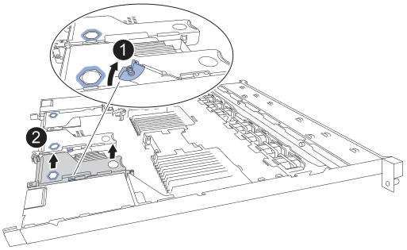

= Netzwerkkarte in einem SG120 oder SG1200 austauschen
:allow-uri-read: 
:icons: font
:imagesdir: ../media/

[role="lead"]
Möglicherweise müssen Sie die Netzwerkkarte (NIC) im SG120 oder SG1200 austauschen, wenn sie nicht optimal funktioniert oder ausgefallen ist.

.Über diese Aufgabe
Um Serviceunterbrechungen zu vermeiden, vergewissern Sie sich, dass alle anderen Speicher-Nodes mit dem Grid verbunden sind, bevor Sie den Austausch der Netzwerkschnittstellenkarte (NIC) starten oder die NIC während eines geplanten Wartungsfensters austauschen, wenn Serviceunterbrechungen akzeptabel sind. Siehe die Informationen über https://docs.netapp.com/us-en/storagegrid/monitor/monitoring-system-health.html#monitor-node-connection-states["Monitoring der Verbindungsstatus der Nodes"^].

.Bevor Sie beginnen
* Sie haben die richtige Ersatz-NIC.
* Sie haben link:locating-sg120-and-sg1200-in-data-center.html["physisch den Standort des SG120- oder SG1200-Appliance bestimmen"], wo Sie die Netzwerkkarte im Rechenzentrum austauschen.
+

NOTE: Ein link:power-sg120-and-sg1200-off-on.html#shut-down-the-sg120-or-sg1200-appliance["Kontrolliertes Herunterfahren des Geräts"] ist erforderlich, bevor das Gerät aus dem Rack entfernt wird.

* Sie haben alle Kabel getrennt und link:reinstalling-sg120-and-sg1200-cover.html["Die Geräteabdeckung entfernt"].
* Sie haben die festgelegt link:verify-component-to-replace.html["Position der zu ersetzenden NIC"].
+
Die drei Netzwerkkarten (NICs) des Geräts befinden sich in drei Riser-Baugruppen an folgenden Positionen im Gehäuse (Rückseite des Geräts bei abgenommener oberer Abdeckung abgebildet):

+
image::../media/drw_s2025_io_numbers_ieops-2554.svg[Interne NIC-Positionen im StorageGRID-Gerätegehäuse]

== Schritt 1: Netzwerkkarte entfernen

[role="tabbed-block"]
====
.NIC 1/NIC 2
--
.Schritte
. Wickeln Sie das Gurt-Ende des ESD-Armbands um Ihr Handgelenk, und befestigen Sie das Clip-Ende auf einer Metallmasse, um eine statische Entladung zu verhindern.
. Suchen Sie die Riserbaugruppe, in der sich die NIC auf der Rückseite des Geräts befindet.
. Drehen Sie den blauen Verriegelungsriegel am Steigrohr mit der defekten Netzwerkkarte nach oben und offen.
+

. Heben Sie die Riser-Baugruppe mit der defekten NIC vorsichtig an den blau markierten Löchern nach oben. Bewegen Sie die Riser-Baugruppe beim Anheben in Richtung der Vorderseite des Gehäuses, damit die externen Anschlüsse in der installierten NIC das Gehäuse freigeben.
. Platzieren Sie die Riser-Schiene mit der Metallrahmenseite nach unten auf einer ebenen, antistatischen Oberfläche, um Zugang zum NIC zu erhalten.
. Öffnen Sie die blaue Verriegelung an der defekten NIC und entnehmen Sie sie vorsichtig aus der Riser-Einheit. Bewegen Sie die NIC leicht hin und her, um sie aus dem Anschluss zu lösen. Wenden Sie dabei keine übermäßige Kraft an.
+
image:../media/drw_s2025_IO_card_replace_ieops-2557.svg["Entfernen einer E/A-Karte aus der Riser-Baugruppe"]

. Platzieren Sie das Riser und den NIC auf einer ebenen, antistatischen Oberfläche.

--
.NIC 3
--
.Schritte
. Wickeln Sie das Gurt-Ende des ESD-Armbands um Ihr Handgelenk, und befestigen Sie das Clip-Ende auf einer Metallmasse, um eine statische Entladung zu verhindern.
. Drehen Sie die blaue Verriegelung am Steigrohr mit der defekten Netzwerkkarte in die offene Position.
+
image:../media/drw_s2025_io_3_replace_ieops-2556.svg["Entfernen der Netzwerkkarte 3 aus der Riser-Baugruppe"]

. Heben Sie die Riser-Baugruppe vorsichtig an der blau markierten Öffnung und der Riser-Kante nach oben. Bewegen Sie die Riser-Baugruppe beim Anheben in Richtung der Vorderseite des Gehäuses, damit die externen Anschlüsse in der installierten NIC das Gehäuse passieren können.
. Platzieren Sie die Riser-Schiene mit der Metallrahmenseite nach unten auf einer ebenen, antistatischen Oberfläche, um Zugang zum NIC zu erhalten.
. Öffnen Sie die blaue Verriegelung an der defekten NIC und entnehmen Sie sie vorsichtig aus der Riser-Einheit. Bewegen Sie die NIC leicht hin und her, um sie aus dem Anschluss zu lösen. Wenden Sie dabei keine übermäßige Kraft an.
+
image:../media/drw_s2025_IO_card_replace_ieops-2557.svg["Entfernen einer E/A-Karte aus der Riser-Baugruppe"]

. Platzieren Sie das Riser und den NIC auf einer ebenen, antistatischen Oberfläche.

--
====

== Schritt 2: Installieren Sie die interne Netzwerkkarte neu

Installieren Sie die Ersatz-NIC an derselben Stelle wie die entfernte.

[role="tabbed-block"]
====
.NIC 1/NIC 2
--
.Schritte
. Wickeln Sie das Gurt-Ende des ESD-Armbands um Ihr Handgelenk, und befestigen Sie das Clip-Ende auf einer Metallmasse, um eine statische Entladung zu verhindern.
. Nehmen Sie die Ersatz-NIC aus der Verpackung.
. Installieren Sie die Ersatz-Netzwerkkarte in die Riser-Baugruppe.
+
.. Stellen Sie sicher, dass sich die blaue Verriegelung in der geöffneten Position befindet.
+
image:../media/drw_s2025_IO_card_replace_ieops-2557.svg["Einbau einer E/A-Karte in die Riser-Baugruppe"]

.. Richten Sie die Netzwerkkarte an ihrem Anschluss auf der Riser-Baugruppe aus. Drücken Sie die Netzwerkkarte vorsichtig in den Anschluss, bis sie vollständig eingerastet ist, und schließen Sie dann die blaue Verriegelung.

. Bauen Sie die Riser-Baugruppe wieder in das Chassis ein.
+
.. Suchen Sie die Ausrichtungsbohrung an der Riser-Baugruppe, die mit einem Führungsstift auf der Systemplatine übereinstimmt, um die korrekte Positionierung der Riser-Baugruppe sicherzustellen.
+
image:../media/drw_s2025_io_1_2_reinstall_ieops-2685.svg["Austausch von NIC 1 oder NIC 2 in der Riser-Baugruppe"]

.. Positionieren Sie die Riser-Baugruppe im Gehäuse, und achten Sie darauf, dass sie mit dem Anschluss auf der Systemplatine und dem Führungsstift ausgerichtet ist.
.. Drücken Sie die Riserbaugruppe vorsichtig entlang der Mittellinie neben den blau markierten Löchern, bis sie vollständig sitzt.

. Wenn Sie keine weiteren Wartungsmaßnahmen im Gerät durchführen müssen, setzen Sie die Geräteabdeckung wieder ein, bringen Sie das Gerät wieder in das Rack ein, schließen Sie die Kabel an und schalten Sie das Gerät mit Strom aus.

Nach dem Austausch des Teils senden Sie das defekte Teil an NetApp zurück, wie in der mit dem Kit gelieferten RMA-Anleitung beschrieben. Siehe die https://mysupport.netapp.com/site/info/rma["Teilerückgabe  -ersatz"^] Seite für weitere Informationen.

--
.NIC 3
--
.Schritte
. Wickeln Sie das Gurt-Ende des ESD-Armbands um Ihr Handgelenk, und befestigen Sie das Clip-Ende auf einer Metallmasse, um eine statische Entladung zu verhindern.
. Nehmen Sie die Ersatz-NIC aus der Verpackung.
. Installieren Sie die Ersatz-Netzwerkkarte in die Riser-Baugruppe.
+
.. Stellen Sie sicher, dass sich die blaue Verriegelung in der geöffneten Position befindet.
+
image:../media/drw_s2025_IO_card_replace_ieops-2557.svg["Einbau einer E/A-Karte in die Riser-Baugruppe"]

.. Richten Sie die Netzwerkkarte an ihrem Anschluss auf der Riser-Baugruppe aus. Drücken Sie die Netzwerkkarte vorsichtig in den Anschluss, bis sie vollständig eingerastet ist, und schließen Sie dann die blaue Verriegelung.

. Bauen Sie die Riser-Baugruppe wieder in das Chassis ein.
+
.. Positionieren Sie die Riser-Baugruppe im Gehäuse und achten Sie darauf, dass die Kanten der Riser-Baugruppe korrekt mit den Kanten des Gehäuses übereinstimmen.
+
image:../media/drw_s2025_IO_3_replace_ieops-2686.svg["Austausch von NIC 3 in der Riser-Baugruppe"]

.. Drücken Sie die Steigrohrbaugruppe vorsichtig entlang ihrer Mittellinie neben dem blau markierten Loch an ihren Platz, bis sie vollständig eingerastet ist.
.. Drehen Sie den blauen Verschluss am Steigrohr in die geschlossene Position.

. Entfernen Sie die Schutzkappen von den NIC-Ports, an denen Sie die Kabel neu installieren.
. Wenn Sie keine weiteren Wartungsmaßnahmen im Gerät durchführen müssen, setzen Sie die Geräteabdeckung wieder ein, bringen Sie das Gerät wieder in das Rack ein, schließen Sie die Kabel an und schalten Sie das Gerät mit Strom aus.

Nach dem Austausch des Teils senden Sie das defekte Teil an NetApp zurück, wie in der mit dem Kit gelieferten RMA-Anleitung beschrieben. Siehe die https://mysupport.netapp.com/site/info/rma["Teilerückgabe  -ersatz"^] Seite für weitere Informationen.

--
====