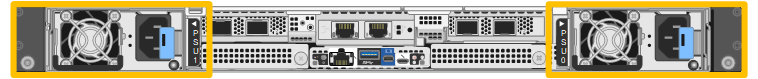

= Ersetzen Sie eines oder beide Netzteile im SG120 oder SG1200
:allow-uri-read: 
:icons: font
:imagesdir: ../media/

[role="lead"]
Die SG120 und SG1200 Appliances verfügen über zwei Netzteile zur Redundanz. Wenn eines der Netzteile ausfällt, müssen Sie es so bald wie möglich ersetzen, um sicherzustellen, dass das Appliance über redundante Stromversorgung verfügt. Beide Netzteile, die im Appliance betrieben werden, müssen vom gleichen Modell und mit der gleichen Wattzahl sein.

.Über diese Aufgabe
Die Abbildung zeigt die beiden Netzteile für die SG120 und SG1200. Die Netzteile sind von der Rückseite des Geräts zugänglich.

.Bevor Sie beginnen
* Sie haben link:locating-sg120-and-sg1200-in-data-center.html["Das Gerät befindet sich physisch"] mit dem auszutauschenden Netzteil.
* Das ist schon link:verify-component-to-replace.html["Standort des zu ersetzenden Netzteils ermittelt"].
* Wenn Sie nur ein Netzteil ersetzen:
+
** Sie haben das Ersatznetzteil entpackt und sichergestellt, dass es das gleiche Modell und die gleiche Stromleistung wie das Netzteil ist, das Sie ersetzen.
** Sie haben bestätigt, dass das andere Netzteil installiert ist und in Betrieb ist.

* Wenn Sie beide Netzteile gleichzeitig austauschen, stellen Sie sicher, dass sie das gleiche Modell und die gleiche Wattzahl haben.

.Schritte
. Wenn Sie nur ein Netzteil austauschen, müssen Sie das Gerät nicht ausschalten. Gehen Sie zum <<Unplug_the_power_cord,Ziehen Sie das Netzkabel ab>> Schritt. Wenn Sie beide Netzteile gleichzeitig austauschen, link:power-sg120-and-sg1200-off-on.html#shut-down-the-sg120-or-sg1200-appliance["Schalten Sie das Gerät aus"] bevor Sie die Netzkabel abziehen.
. [[Trenne den Netzstecker_Power_cordel, Start=2]]] Trennen Sie das Netzkabel von jedem zu ersetzenden Netzteil.
+
Von der Rückseite des Geräts aus gesehen befindet sich das Netzteil A (PSU0) auf der rechten Seite und das Netzteil B (PSU1) auf der linken Seite.

. Heben Sie den Griff am ersten zu ersetzenden Netzteil an.
+
image::../media/sg6000_cn_lift_cam_handle_psu.gif[Heben Sie den Griff an, um das Netzteil zu entfernen]

. Drücken Sie auf den blauen Riegel, und ziehen Sie das Netzteil heraus.
+
image::../media/sg6000_cn_remove_power_supply.gif[Entfernen eines Netzteils]

. Schieben Sie das Ersatznetzteil mit der blauen Verriegelung nach rechts in das Gehäuse.
+

IMPORTANT: Beide Netzteile müssen das gleiche Modell und die gleiche Wattzahl haben.

+
Stellen Sie sicher, dass sich die blaue Verriegelung auf der rechten Seite befindet, wenn Sie die Ersatzeinheit einschieben.

+
Sie werden ein Klicken spüren, wenn das Netzteil einrastet.

+
image::../media/sg6000_cn_insert_power_supply.gif[Gleitende Stromversorgung]

. Drücken Sie den Griff wieder gegen das Gehäuse des Netzteils.
. Wenn Sie beide Netzteile austauschen, wiederholen Sie die Schritte 2 bis 6, um das zweite Netzteil auszutauschen.
. link:../installconfig/connecting-power-cords-and-applying-power.html["Schließen Sie die Stromkabel an die ersetzten Geräte an, und wenden Sie Strom an"].

Nach dem Austausch des Teils senden Sie das defekte Teil an NetApp zurück, wie in der mit dem Kit gelieferten RMA-Anleitung beschrieben. Siehe die https://mysupport.netapp.com/site/info/rma["Teilerückgabe  -ersatz"^] Seite für weitere Informationen.
