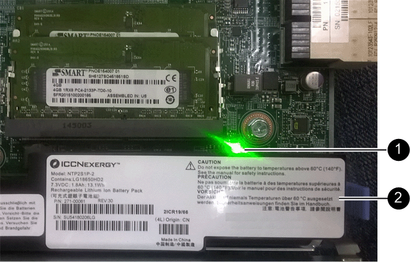

= E2800 Series Storage-Controller in der SG5700 austauschen
:allow-uri-read: 
:icons: font
:imagesdir: ../media/

[role="lead"]
Möglicherweise müssen Sie den E2800 Serie-Controller ersetzen, wenn er nicht optimal funktioniert oder ausgefallen ist.

.Bevor Sie beginnen
* Sie verfügen über einen Ersatzcontroller mit derselben Teilenummer wie der zu ersetzenden Controller.
+

NOTE: Verlassen Sie sich beim Austausch eines Controllers in der StorageGRID Appliance nicht auf die Anweisungen zur E-Series, da die Vorgehensweisen nicht identisch sind.

* Sie verfügen über Etiketten, um jedes Kabel, das mit dem Controller verbunden ist, zu identifizieren.
* Wenn alle Laufwerke gesichert sind, haben Sie die Schritte im überprüft https://docs.netapp.com/us-en/e-series/maintenance-e2800/controllers-simplex-supertask-task.html#step-1-prepare-to-replace-controller-simplex["Controller-Austauschverfahren bei der simplex E2800 Serie"^], Die das Herunterladen und Installieren der E-Serie SANtricity System Manager von der NetApp Support-Website und dann mit dem Enterprise Management Fenster (EMW), um die gesicherten Laufwerke nach dem Austausch des Controllers entsperren.
+

CAUTION: Sie können das Gerät erst dann verwenden, wenn Sie die Laufwerke mit dem gespeicherten Schlüssel entsperren.

* Sie müssen über spezifische Zugriffsberechtigungen verfügen.
* Sie müssen mit einem beim Grid Manager angemeldet sein https://docs.netapp.com/us-en/storagegrid-118/admin/web-browser-requirements.html["Unterstützter Webbrowser"^].

.Über diese Aufgabe
Sie können auf zwei Arten feststellen, ob ein ausgefallener Controller-Behälter besteht:

* Der Recovery Guru im SANtricity System Manager führt Sie dazu, den Controller zu ersetzen.
* Die gelbe Warn-LED am Controller leuchtet und gibt an, dass der Controller einen Fehler aufweist.

Auf den Appliance-Speicherknoten kann nicht zugegriffen werden, wenn Sie den Controller austauschen. Wenn der Controller der E2800 Serie ausreichend funktioniert, können Sie dies gerne tun link:../commonhardware/placing-appliance-into-maintenance-mode.html["Platzieren Sie den E5700SG Controller in den Wartungsmodus"].

Wenn Sie einen Controller austauschen, müssen Sie den Akku aus dem ursprünglichen Controller entfernen und in den Ersatzcontroller einsetzen. In einigen Fällen müssen Sie möglicherweise auch die Host-Schnittstellenkarte vom ursprünglichen Controller entfernen und im Ersatzcontroller installieren.

NOTE: Die Storage Controller in den meisten Appliance-Modellen umfassen keine Host Interface Cards (HIC).

== Schritt 1: Bereiten Sie vor, den Controller zu entfernen

Diese Abbildungen zeigen den E2800A-Controller und den E2800B-Controller. Das Verfahren zum Austausch der E2800 Controller der Serie und des EF570 Controllers ist identisch.

E2800A Storage-Controller:

image::../media/e2800_labels_on_controller.gif[MAC- und FRU-Etiketten am E2800A-Controller]

E2800B Storage-Controller:

image::../media/e2800B_labels_on_controller.gif[MAC- und FRU-Etiketten am E2800A-Controller]

[cols="1a,2a,4a"]
|===
| Etikett | Komponente | Beschreibung 

 a| 
1
 a| 
MAC-Adresse
 a| 
Die MAC-Adresse für Management-Port 1 („`P1 auf E2800A und 0a auf E2800B`"). Wenn Sie die IP-Adresse des Original-Controllers über DHCP erhalten haben, benötigen Sie diese Adresse, um eine Verbindung zum neuen Controller herzustellen.

 a| 
2
 a| 
FRU-Teilenummer
 a| 
Die FRU-Teilenummer. Diese Nummer muss der Teilenummer des derzeit installierten Controllers entsprechen.

 a| 
3
 a| 
4-Port-HIC
 a| 
Die Host Interface Card (HIC) mit 4 Ports. Diese Karte muss auf den neuen Controller verschoben werden, wenn Sie den Austausch durchführen.

*Hinweis*: Der E2800A Controller besitzt keine HIC.

|===
Befolgen Sie die Anweisungen beim Austausch des E2800 Controllers, um das Entfernen des Controllers vorzubereiten.

Sie verwenden SANtricity System Manager, um die folgenden Schritte auszuführen.

.Schritte
. Notieren Sie sich, welche Version der SANtricity OS Software derzeit auf dem Controller installiert ist.
. Notieren Sie sich, welche NVSRAM-Version derzeit installiert ist.
. Wenn die Laufwerksicherheit aktiviert ist, stellen Sie sicher, dass ein gespeicherter Schlüssel existiert und dass Sie den Passphrase kennen, der für die Installation erforderlich ist.
+

CAUTION: *Möglicher Verlust des Datenzugriffs &#8212;* Wenn alle Laufwerke in der Appliance sicherheitsaktiviert sind, kann der neue Controller erst dann auf die Appliance zugreifen, wenn Sie die gesicherten Laufwerke über das Enterprise Management Fenster in SANtricity System Manager entsperren.

. Sichern Sie die Konfigurationsdatenbank.
+
Wenn beim Entfernen eines Controllers ein Problem auftritt, können Sie die gespeicherte Datei verwenden, um Ihre Konfiguration wiederherzustellen.

. Sammeln von Support-Daten für die Appliance
+

NOTE: Durch das Erfassen von Support-Daten vor und nach dem Ersetzen einer Komponente wird sichergestellt, dass Sie einen vollständigen Satz von Protokollen an den technischen Support senden können, wenn der Austausch das Problem nicht behebt.

== Schritt 2: Den Controller offline schalten

Versetzen Sie den Controller in den Offline-Modus und vergewissern Sie sich, dass alle Vorgänge abgeschlossen sind.

.Schritte
. Wenn die StorageGRID Appliance in einem StorageGRID System ausgeführt wird, link:../commonhardware/placing-appliance-into-maintenance-mode.html["Platzieren Sie den E5700SG Controller in den Wartungsmodus"].
. Wenn der E2800 Controller ausreichend funktioniert, um ein kontrolliertes Herunterfahren zu ermöglichen, bestätigen Sie, dass alle Operationen abgeschlossen wurden.
+
.. Wählen Sie auf der Startseite des SANtricity System Managers die Option *Vorgänge in Bearbeitung anzeigen*.
.. Vergewissern Sie sich, dass alle Vorgänge abgeschlossen sind.

. Schaltet das Controller-Shelf aus.

== Schritt 3: Entfernen Sie die Steuerung

Entfernen Sie den fehlerhaften Controller aus dem Gerät.

.Schritte
. Setzen Sie ein ESD-Armband an oder ergreifen Sie andere antistatische Vorsichtsmaßnahmen.
. Beschriften Sie die Kabel, und trennen Sie dann die Kabel und SFPs.
+

NOTE: Um Leistungseinbußen zu vermeiden, sollten Sie die Kabel nicht verdrehen, falten, zusammendrücken oder treten.

. Lösen Sie die Steuerung vom Gerät, indem Sie die Verriegelung am Nockengriff so lange drücken, bis sie sich löst, und öffnen Sie dann den Nockengriff nach rechts.
. Schieben Sie den Regler mit zwei Händen und dem Nockengriff aus dem Gerät.
+

CAUTION: Verwenden Sie immer zwei Hände, um das Gewicht der Steuerung zu unterstützen.

. Stellen Sie den Controller auf eine flache, statische Oberfläche, wobei die abnehmbare Abdeckung nach oben zeigt.
. Entfernen Sie die Abdeckung, indem Sie die Taste nach unten drücken und die Abdeckung abnehmen.

== Schritt 4: Batterie auf den neuen Controller bringen

Entfernen Sie den Akku aus dem fehlerhaften Controller, und setzen Sie ihn in den Ersatz-Controller ein.

.Schritte
. Vergewissern Sie sich, dass die grüne LED im Controller (zwischen Akku und DIMMs) aus ist.
+
Wenn diese grüne LED leuchtet, wird der Controller weiterhin mit Strom versorgt. Sie müssen warten, bis diese LED erlischt, bevor Sie Komponenten entfernen.

+

+
[cols="1a,2a"]
|===
| Element | Beschreibung 

 a| 
1
 a| 
Interne LED für aktiven Cache

 a| 
2
 a| 
Batterie

|===
. Suchen Sie den blauen Freigabehebel für die Batterie.
. Entriegeln Sie den Akku, indem Sie den Entriegelungshebel nach unten und aus dem Controller entfernen.
+
image::../media/e2800_remove_battery.gif[Batterieverriegelung]

+
[cols="1a,2a"]
|===
| Element | Beschreibung 

 a| 
1
 a| 
Akkufreigaberiegel

 a| 
2
 a| 
Batterie

|===
. Heben Sie den Akku an, und schieben Sie ihn aus dem Controller.
. Entfernen Sie die Abdeckung vom Ersatzcontroller.
. Richten Sie den Ersatz-Controller so aus, dass der Steckplatz für die Batterie zu Ihnen zeigt.
. Setzen Sie den Akku in einem leichten Abwärtswinkel in den Controller ein.
+
Sie müssen den Metallflansch an der Vorderseite der Batterie in den Schlitz an der Unterseite des Controllers einsetzen und die Oberseite der Batterie unter den kleinen Ausrichtstift auf der linken Seite des Controllers schieben.

. Schieben Sie die Akkuverriegelung nach oben, um die Batterie zu sichern.
+
Wenn die Verriegelung einrastet, Haken unten an der Verriegelung in einen Metallschlitz am Gehäuse.

. Drehen Sie den Controller um, um zu bestätigen, dass der Akku korrekt installiert ist.
+

CAUTION: *Mögliche Hardware-Schäden* -- der Metallflansch an der Vorderseite der Batterie muss vollständig in den Schlitz am Controller eingesetzt werden (wie in der ersten Abbildung dargestellt). Wenn die Batterie nicht richtig eingesetzt ist (wie in der zweiten Abbildung dargestellt), kann der Metallflansch die Controllerplatine kontaktieren, was zu Schäden führt.

+
** *Korrekt -- der Metallflansch der Batterie ist vollständig in den Schlitz am Controller eingesetzt:*
+
image::../media/e2800_battery_flange_ok.gif[Batterieflansch Korrekt]

** *Falsch -- der Metallflansch der Batterie ist nicht in den Steckplatz an der Steuerung eingefügt:*
+
image::../media/e2800_battery_flange_not_ok.gif[Batterieflansch Nicht Korrekt]

. Bringen Sie die Controllerabdeckung wieder an.

== Schritt 5: Verschieben Sie HIC auf neuen Controller, falls erforderlich

Wenn der ausgefallene Controller eine Host Interface Card (HIC) enthält, verschieben Sie die HIC vom ausgefallenen Controller auf den Ersatz-Controller.

Eine separate HIC wird nur für den E2800B-Controller verwendet. Die HIC wird auf der Haupt-Controller-Platine montiert und enthält zwei SPF-Anschlüsse.

NOTE: Die Abbildungen in diesem Verfahren zeigen eine HIC mit 2 Ports. Die HIC in Ihrem Controller hat möglicherweise eine andere Anzahl von Ports.

[role="tabbed-block"]
====
.E2800A
--
Ein E2800A-Controller verfügt nicht über eine HIC.

Die Abdeckung des E2800A-Controllers wieder anbringen und mit fortfahren <<step6_replace_controller,Schritt 6: Controller austauschen>>

--
.E2800B
--
Setzen Sie die HIC vom ausgefallenen E2800B-Controller auf den Ersatz-Controller.

.Schritte
. Entfernen Sie alle SFPs von der HIC.
. Entfernen Sie mit einem #1 Kreuzschlitzschraubendreher die Schrauben, mit denen die HIC-Frontplatte am Controller befestigt ist.
+
Es gibt vier Schrauben: Eine auf der Oberseite, eine auf der Seite und zwei auf der Vorderseite.

+
image::../media/28_dwg_e2800_hic_faceplace_screws_maint-e2800.png[E2800 Frontplattenschrauben]

. Entfernen Sie die HIC-Frontplatte.
. Lösen Sie mit den Fingern oder einem Kreuzschlitzschraubendreher die drei Rändelschrauben, mit denen die HIC an der Controllerkarte befestigt ist.
. Lösen Sie die HIC vorsichtig von der Controllerkarte, indem Sie die Karte nach oben heben und wieder zurückschieben.
+

CAUTION: Achten Sie darauf, dass die Komponenten auf der Unterseite der HIC oder auf der Oberseite der Controller-Karte nicht verkratzen oder stoßen.

+
image::../media/28_dwg_e2800_hic_thumbscrews_maint-e2800.png[HIC-Rändelschrauben E2800A]

+
[cols="1a,2a"]
|===
| Etikett | Beschreibung 

 a| 
1
 a| 
Host-Schnittstellenkarte

 a| 
2
 a| 
Rändelschrauben

|===
. Platzieren Sie die HIC auf einer statischen Oberfläche.
. Entfernen Sie mit einem #1 Kreuzschlitzschraubendreher die vier Schrauben, mit denen die leere Frontplatte an der Ersatzsteuerung befestigt ist, und entfernen Sie die Frontplatte.
. Richten Sie die drei Rändelschrauben der HIC an den entsprechenden Löchern am Ersatz-Controller aus, und richten Sie den Anschluss an der Unterseite der HIC an dem HIC-Schnittstellenanschluss auf der Controllerkarte aus.
+
Achten Sie darauf, dass die Komponenten auf der Unterseite der HIC oder auf der Oberseite der Controller-Karte nicht verkratzen oder stoßen.

. Senken Sie die HIC vorsichtig ab, und setzen Sie den HIC-Anschluss ein, indem Sie vorsichtig auf die HIC drücken.
+

CAUTION: *Mögliche Geräteschäden* -- Vorsicht, den goldenen Bandanschluss für die Controller-LEDs nicht zwischen der HIC und den Rändelschrauben zu quetschen.

+
image::../media/28_dwg_e2800_hic_thumbscrews_maint-e2800.gif[HIC-Gewindestifte E2800A]

+
[cols="1a,2a"]
|===
| Etikett | Beschreibung 

 a| 
1
 a| 
Host-Schnittstellenkarte

 a| 
2
 a| 
Rändelschrauben

|===
. Ziehen Sie die HIC-Rändelschrauben manuell fest.
+
Verwenden Sie keinen Schraubendreher, da Sie die Schrauben sonst möglicherweise zu fest anziehen.

. Befestigen Sie mit einem #1 Kreuzschlitzschraubendreher die HIC-Frontplatte, die Sie vom ursprünglichen Controller entfernt haben, mit vier Schrauben an der neuen Steuerung.
+
image::../media/28_dwg_e2800_hic_faceplace_screws_maint-e2800.png[Schrauben für die E2800A-Frontplatte]

. Installieren Sie alle entfernten SFPs wieder auf der HIC.

--
====

== Schritt 6: Controller austauschen

Installieren Sie den Ersatz-Controller und überprüfen Sie, ob er wieder an das Raster angeschlossen ist.

.Schritte
. Setzen Sie den Ersatzcontroller in das Gerät ein.
+
.. Drehen Sie den Controller um, so dass die abnehmbare Abdeckung nach unten zeigt.
.. Schieben Sie den Steuerknebel in die geöffnete Stellung, und schieben Sie ihn bis zum Gerät.
.. Bewegen Sie den Nockengriff nach links, um die Steuerung zu verriegeln.
.. Ersetzen Sie die Kabel und SFPs.
.. Schalten Sie das Controller-Shelf ein.
.. Warten Sie, bis der E2800 Controller neu gestartet wurde. Vergewissern Sie sich, dass auf der 7-Segment-Anzeige ein Status von angezeigt wird `99`.
.. Legen Sie fest, wie Sie dem Ersatz-Controller eine IP-Adresse zuweisen.
+

NOTE: Die Schritte zum Zuweisen einer IP-Adresse zum Ersatz-Controller hängen davon ab, ob Sie Management-Port 1 mit einem Netzwerk mit einem DHCP-Server verbunden haben und ob alle Laufwerke gesichert sind.

+
Wenn Management-Port 1 mit einem Netzwerk über einen DHCP-Server verbunden ist, erhält der neue Controller seine IP-Adresse vom DHCP-Server. Dieser Wert kann sich von der IP-Adresse des ursprünglichen Controllers unterscheiden.

. Wenn die Appliance gesicherte Laufwerke verwendet, befolgen Sie die Anweisungen beim Austausch des E2800 Controllers, um den Sicherheitsschlüssel des Laufwerks zu importieren.
. Stellen Sie den normalen Betriebsmodus des Geräts wieder ein. Wählen Sie im Installationsprogramm der StorageGRID-Appliance die Option *Erweitert* > *Controller neu starten* aus, und wählen Sie dann *Neustart in StorageGRID* aus.
+
image::../media/reboot_controller_from_maintenance_mode.png[Booten Sie den Controller im Wartungsmodus neu]

. Überwachen Sie während des Neubootens den Status des Node, um zu bestimmen, wann er sich wieder im Raster angeschlossen hat.
+
Das Gerät wird neu gestartet und wieder in das Raster integriert. Dieser Vorgang kann bis zu 20 Minuten dauern.

. Vergewissern Sie sich, dass das Neubooten abgeschlossen ist und dass der Node wieder dem Raster beigetreten ist. Überprüfen Sie im Grid Manager, ob auf der Seite Knoten ein normaler Status angezeigt wird (grünes Häkchen-Symbol image:../media/icon_alert_green_checkmark.png["Grünes Häkchen"] Links neben dem Node-Namen) für den Appliance-Node. Dies bedeutet, dass keine Warnmeldungen aktiv sind und der Node mit dem Grid verbunden ist.
+
image::../media/nodes_menu.png[Das Raster des Appliance-Node wurde neu verbunden]

. Vom SANtricity System Manager sollte sichergestellt werden, dass der neue Controller optimal ist, und er sammelt Support-Daten.

Nach dem Austausch des Teils senden Sie das fehlerhafte Teil an NetApp zurück, wie in den mit dem Kit gelieferten RMA-Anweisungen beschrieben. Siehe https://mysupport.netapp.com/site/info/rma["Teilerückgabe  Austausch"^] Seite für weitere Informationen.
