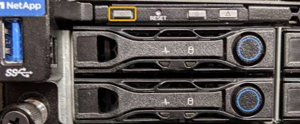

= Schalten Sie den SG6000-CN-Controller aus und ein
:allow-uri-read: 
:icons: font
:imagesdir: ../media/

[role="lead"]
Sie können den SG6000-CN-Controller herunterfahren und wieder einschalten, um Wartungsarbeiten durchzuführen.

== Fahren Sie den SG6000-CN-Controller herunter

Fahren Sie den SG6000-CN-Controller herunter, um die Hardware zu warten.

.Bevor Sie beginnen
* Der SG6000-CN Controller ist physisch zu finden, der im Datacenter gewartet werden muss. Siehe link:locating-controller-in-data-center.html["Controller im Datacenter finden"].

.Über diese Aufgabe
Um Serviceunterbrechungen zu vermeiden, vergewissern Sie sich, dass alle anderen Storage-Nodes mit dem Grid verbunden sind, bevor Sie den Controller herunterfahren oder den Controller während eines geplanten Wartungsfensters herunterfahren, wenn die Serviceunterbrechungen akzeptabel sind. Weitere Informationen finden Sie unter https://docs.netapp.com/us-en/storagegrid-118/monitor/monitoring-system-health.html#monitor-node-connection-states["Monitoring der Verbindungsstatus der Nodes"^].

CAUTION: Wenn Sie jemals eine ILM-Regel verwendet haben, die nur eine Kopie eines Objekts erstellt, müssen Sie den Controller während eines geplanten Wartungsfensters herunterfahren. Andernfalls verlieren Sie während dieses Verfahrens vorübergehend den Zugriff auf diese Objekte. +
Weitere Informationen zum Verwalten von Objekten mit Information Lifecycle Management finden Sie unter.

.Schritte
. Fahren Sie den SG6000-CN-Controller herunter.
+

CAUTION: Sie müssen ein kontrolliertes Herunterfahren des Geräts durchführen, indem Sie die unten angegebenen Befehle eingeben. Es ist eine Best Practice, nach Möglichkeit eine kontrollierte Abschaltung durchzuführen, um unnötige Warnmeldungen zu vermeiden, sicherzustellen, dass vollständige Protokolle verfügbar sind und Serviceunterbrechungen zu vermeiden.

+
.. Wenn Sie sich noch nicht beim Grid-Knoten angemeldet haben, melden Sie sich mit PuTTY oder einem anderen ssh-Client an:
+
... Geben Sie den folgenden Befehl ein: `ssh admin@_grid_node_IP_`
... Geben Sie das im aufgeführte Passwort ein `Passwords.txt` Datei:
... Geben Sie den folgenden Befehl ein, um zum Root zu wechseln: `su -`
... Geben Sie das im aufgeführte Passwort ein `Passwords.txt` Datei:
+
Wenn Sie als root angemeldet sind, ändert sich die Eingabeaufforderung von `$` Bis `#`.

.. Fahren Sie den SG6000-CN-Controller herunter: +
`*shutdown -h now*`
+
Dieser Befehl kann bis zu 10 Minuten in Anspruch nehmen.

. Überprüfen Sie anhand einer der folgenden Methoden, ob der SG6000-CN-Controller ausgeschaltet ist:
+
** Schauen Sie sich die blaue ein/aus-LED an der Vorderseite des Controllers an und bestätigen Sie, dass sie ausgeschaltet ist.
+

** Schauen Sie sich die grünen LEDs an den beiden Netzteilen auf der Rückseite des Controllers an und bestätigen Sie, dass sie mit einer normalen Geschwindigkeit (etwa ein Blinken pro Sekunde) blinken.
+
image::../media/sg6060_rear_panel_power_led_on.jpg[LED für Stromversorgung auf der Rückseite des SG6060]

** Verwenden Sie die BMC-Schnittstelle des Controllers:
+
... Greifen Sie auf die BMC-Schnittstelle des Controllers zu.
+
link:../installconfig/accessing-bmc-interface.html["Greifen Sie auf die BMC-Schnittstelle zu"]

... Wählen Sie *Power Control*.
... Stellen Sie sicher, dass die Strommaßnahmen darauf hindeuten, dass der Host derzeit ausgeschaltet ist.
+
image::../media/bmc_power_control_page_controller_off.png[BMC Power Control Seite - Controller aus]

== Schalten Sie den SG6000-CN Controller ein, und überprüfen Sie den Betrieb

Schalten Sie den Controller nach dem Abschluss der Wartung ein.

.Bevor Sie beginnen
* Der Controller wurde in einem Rack oder Rack installiert und die Daten- und Stromkabel angeschlossen.
+
link:reinstalling-sg6000-cn-controller-into-cabinet-or-rack.html["Installieren Sie den SG6000-CN Controller wieder in den Schrank oder Rack"]

* Der Controller befindet sich physisch im Datacenter.
+
link:locating-controller-in-data-center.html["Controller im Datacenter finden"]

.Schritte
. Schalten Sie den SG6000-CN-Controller ein, und überwachen Sie die Controller-LEDs und den Startcode mithilfe einer der folgenden Methoden:
+
** Drücken Sie den Netzschalter an der Vorderseite des Controllers.
+

** Verwenden Sie die BMC-Schnittstelle des Controllers:
+
... Greifen Sie auf die BMC-Schnittstelle des Controllers zu.
+
link:../installconfig/accessing-bmc-interface.html["Greifen Sie auf die BMC-Schnittstelle zu"]

... Wählen Sie *Power Control*.
... Wählen Sie *Power on Server* und dann *Perform Action*.
+
image::../media/sg6060_power_on_from_bmc.png[Schalten Sie Controller von BMC ein]

+
Verwenden Sie die BMC-Schnittstelle, um den Startstatus zu überwachen.

. Vergewissern Sie sich, dass der Appliance-Controller im Grid Manager und ohne Warnungen angezeigt wird.
+
Es kann bis zu 20 Minuten dauern, bis der Controller im Grid Manager angezeigt wird.

. Vergewissern Sie sich, dass der neue SG6000-CN-Controller voll funktionsfähig ist:
+
.. Melden Sie sich mit PuTTY oder einem anderen SSH-Client am Grid-Knoten an:
+
... Geben Sie den folgenden Befehl ein: `ssh admin@_grid_node_IP_`
... Geben Sie das im aufgeführte Passwort ein `Passwords.txt` Datei:
... Geben Sie den folgenden Befehl ein, um zum Root zu wechseln: `su -`
... Geben Sie das im aufgeführte Passwort ein `Passwords.txt` Datei:
+
Wenn Sie als root angemeldet sind, ändert sich die Eingabeaufforderung von `$` Bis `#`.

.. Geben Sie den folgenden Befehl ein, und überprüfen Sie, ob die erwartete Ausgabe zurückgegeben wird: +
`cat /sys/class/fc_host/*/port_state`
+
Erwartete Ausgabe:

+
[listing]
----
Online
Online
Online
Online
----
+
Wenn die erwartete Ausgabe nicht zurückgegeben wird, wenden Sie sich an den technischen Support.

.. Geben Sie den folgenden Befehl ein, und überprüfen Sie, ob die erwartete Ausgabe zurückgegeben wird: +
`cat /sys/class/fc_host/*/speed`
+
Erwartete Ausgabe:

+
[listing]
----
16 Gbit
16 Gbit
16 Gbit
16 Gbit
----
+
Wenn die erwartete Ausgabe nicht zurückgegeben wird, wenden Sie sich an den technischen Support.

.. Stellen Sie auf der Seite Knoten im Grid Manager sicher, dass der Appliance-Node mit dem Raster verbunden ist und keine Warnmeldungen enthält.
+

CAUTION: Nehmen Sie einen anderen Appliance-Node nur offline, wenn diese Appliance über ein grünes Symbol verfügt.

. Optional: Befestigen Sie die Frontverkleidung, falls eine entfernt wurde.

.Verwandte Informationen
* link:reinstalling-sg6000-cn-controller-into-cabinet-or-rack.html#remove-sg6000-cn-controller-from-cabinet-or-rack["Entfernen Sie den SG6000-CN Controller aus dem Schrank oder Rack"]
* link:../installconfig/viewing-status-indicators.html["Statusanzeigen anzeigen anzeigen anzeigen"]

