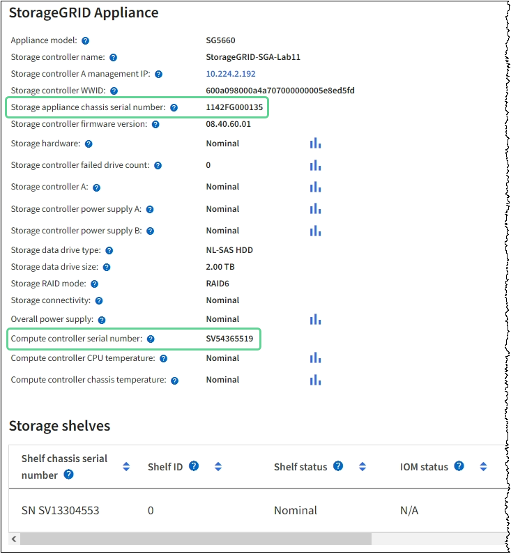

= Ersetzen Sie den Fibre-Channel-HBA in SG6000
:allow-uri-read: 
:icons: font
:imagesdir: ../media/

[role="lead"]
Sie müssen möglicherweise einen Fibre-Channel-HBA austauschen, wenn er nicht optimal funktioniert oder ausgefallen ist.

== Überprüfen Sie, ob der Fibre-Channel-HBA ersetzt werden soll

Wenn Sie sich nicht sicher sind, welcher Fibre Channel-Host Bus Adapter (HBA) ersetzt werden soll, führen Sie dieses Verfahren aus, um ihn zu identifizieren.

.Bevor Sie beginnen
* Sie haben die Seriennummer der Speicher-Appliance oder SG6000-CN-Controller, wo der Fibre Channel HBA ersetzt werden muss.
+

NOTE: Wenn die Seriennummer der Speicheranwendung, die den Fibre-Channel-HBA enthält, den Sie ersetzen, mit dem Buchstaben Q beginnt, wird sie nicht im Grid Manager aufgeführt. Sie müssen die an der Vorderseite der einzelnen SG6000-CN-Controller im Rechenzentrum angebrachten Tags überprüfen, bis Sie eine Übereinstimmung finden.

* Sie sind im Grid Manager mit einem angemeldet https://docs.netapp.com/us-en/storagegrid/admin/web-browser-requirements.html["Unterstützter Webbrowser"^].

.Schritte
. Wählen Sie im Grid Manager die Option *NODES* aus.
. Wählen Sie in der Tabelle auf der Seite Knoten einen Appliance Storage Node aus.
. Wählen Sie die Registerkarte *Hardware* aus.
+
Überprüfen Sie im Abschnitt StorageGRID-Gerät die Seriennummer * des Chassis für die Speichergeräte* und die Seriennummer für den Rechencontroller*. Finden Sie heraus, ob eine dieser Seriennummern der Storage Appliance entspricht, an der Sie den Fibre Channel HBA ersetzen. Wenn eine der Seriennummern übereinstimmt, haben Sie die richtige Appliance gefunden.

+

+
** Wenn der Abschnitt StorageGRID-Appliance nicht angezeigt wird, ist der ausgewählte Node keine StorageGRID-Appliance. Wählen Sie einen anderen Knoten in der Strukturansicht aus.
** Wenn das Appliance-Modell nicht SG6060 oder SG6060X ist, wählen Sie einen anderen Node aus der Baumstruktur aus.
** Wenn die Seriennummern nicht übereinstimmen, wählen Sie einen anderen Knoten aus der Strukturansicht aus.

. Nachdem Sie den Node gefunden haben, an dem der Fibre Channel HBA ausgetauscht werden muss, notieren Sie die BMC IP-Adresse des Computing-Controllers im Abschnitt „StorageGRID Appliance“.
+
Sie können diese IP-Adresse für verwenden link:turning-controller-identify-led-on-and-off.html["Schalten Sie die LED für die Identifizierung des Compute-Controllers ein"], Um Ihnen zu helfen, das Gerät im Rechenzentrum zu finden.

== Entfernen Sie den Fibre Channel HBA

Möglicherweise müssen Sie den Fibre-Channel-Hostbus-Adapter (HBA) im SG6000-CN-Controller ersetzen, wenn dieser nicht optimal funktioniert oder wenn er ausgefallen ist.

.Bevor Sie beginnen
* Sie haben den richtigen Fibre Channel HBA für den Austausch.
* Das ist schon link:reinstalling-fibre-channel-hba.html#verify-fibre-channel-hba-to-replace["Festgestellt, welcher SG6000-CN-Controller den zu ersetzenden Fibre-Channel-HBA enthält"].
* Das ist schon link:locating-controller-in-data-center.html["Physikalischer Standort des SG6000-CN-Controllers"] Im Datacenter zu ermöglichen.
* Das ist schon link:power-sg6000-cn-controller-off-on.html#shut-down-sg6000-cn-controller["Fahren Sie den SG6000-CN-Controller herunter"].
+

CAUTION: Vor dem Entfernen des Controllers aus dem Rack ist ein kontrolliertes Herunterfahren erforderlich.

* Das ist schon link:reinstalling-sg6000-cn-controller-into-cabinet-or-rack.html#remove-sg6000-cn-controller-from-cabinet-or-rack["Controller aus Schrank oder Rack entfernt"].
* Das ist schon link:reinstalling-sg6000-cn-controller-cover.html#remove-sg6000-cn-controller-cover["Die Controllerabdeckung entfernt"].

.Über diese Aufgabe
Um Serviceunterbrechungen zu vermeiden, vergewissern Sie sich, dass alle anderen Speicher-Nodes mit dem Grid verbunden sind, bevor Sie den Austausch des Fibre-Channel-HBA starten, oder tauschen Sie den Adapter während eines geplanten Wartungsfensters aus, wenn Serviceunterbrechungen akzeptabel sind. Siehe die Informationen über https://docs.netapp.com/us-en/storagegrid/monitor/monitoring-system-health.html#monitor-node-connection-states["Monitoring der Verbindungsstatus der Nodes"^].

CAUTION: Wenn Sie jemals eine ILM-Regel verwendet haben, die nur eine Kopie eines Objekts erstellt, müssen Sie den Fibre Channel HBA während eines geplanten Wartungsfensters ersetzen. Andernfalls verlieren Sie während dieses Verfahrens vorübergehend den Zugriff auf diese Objekte. + Siehe Informationen über https://docs.netapp.com/us-en/storagegrid/ilm/why-you-should-not-use-single-copy-replication.html["Warum sollten Sie die Single-Copy-Replizierung nicht verwenden"^].

.Schritte
. Wickeln Sie das Gurt-Ende des ESD-Armbands um Ihr Handgelenk, und befestigen Sie das Clip-Ende auf einer Metallmasse, um eine statische Entladung zu verhindern.
. Suchen Sie die Riserbaugruppe auf der Rückseite des Controllers, der den Fibre Channel HBA enthält.
+
image::../media/sg6060_riser_assembly_location.jpg[Position der SG6060 Riser-Baugruppe]

. Fassen Sie die Riserbaugruppe durch die blau markierten Löcher und heben Sie sie vorsichtig nach oben. Bewegen Sie die Riser-Baugruppe zur Vorderseite des Gehäuses, während Sie sie anheben, damit die externen Anschlüsse der installierten Adapter das Gehäuse löschen können.
. Legen Sie die Riser-Karte auf eine flache antistatische Oberfläche, wobei der Metallrahmen nach unten zeigt, um auf die Adapter zuzugreifen.
+
image::../media/sg6060_fc_hba_location.jpg[SG6060 Fibre-Channel-HBA in der Riserbaugruppe]

+
In der Riserbaugruppe befinden sich zwei Adapter: Ein Fibre-Channel-HBA und ein Ethernet-Netzwerkadapter. Der Fibre Channel HBA wird in der Abbildung angezeigt.

. Öffnen Sie die blaue Adapterverriegelung (eingekreist), und entfernen Sie den Fibre Channel HBA vorsichtig aus der Riserbaugruppe. Den Adapter leicht einrocken, um ihn aus dem Anschluss zu entfernen. Verwenden Sie keine übermäßige Kraft.
. Setzen Sie den Adapter auf eine flache antistatische Oberfläche.

.Nachdem Sie fertig sind
link:reinstalling-fibre-channel-hba.html["Installieren Sie den Ersatz-Fibre-Channel-HBA"].

Nach dem Austausch des Teils senden Sie das fehlerhafte Teil an NetApp zurück, wie in den mit dem Kit gelieferten RMA-Anweisungen beschrieben. Siehe https://mysupport.netapp.com/site/info/rma["Teilerückgabe  Austausch"^] Seite für weitere Informationen.

== Installieren Sie den Fibre Channel HBA neu

Der Ersatz-Fibre Channel HBA wird an demselben Standort installiert wie der zuvor entfernte.

.Bevor Sie beginnen
* Sie haben den richtigen Fibre Channel HBA für den Austausch.
* Sie haben den vorhandenen Fibre Channel HBA entfernt.
+
link:reinstalling-fibre-channel-hba.html#remove-fibre-channel-hba["Entfernen Sie den Fibre Channel HBA"]

.Schritte
. Wickeln Sie das Gurt-Ende des ESD-Armbands um Ihr Handgelenk, und befestigen Sie das Clip-Ende auf einer Metallmasse, um eine statische Entladung zu verhindern.
. Entfernen Sie den Ersatz-Fibre-Channel-HBA aus der Verpackung.
. Richten Sie den Fibre Channel-HBA mit seinem Anschluss an der Riserbaugruppe aus, und drücken Sie dann vorsichtig den Adapter in den Anschluss, bis er vollständig sitzt.
+
image::../media/sg6060_fc_hba_location.jpg[SG6060 Fibre-Channel-HBA in der Riserbaugruppe]

+
In der Riserbaugruppe befinden sich zwei Adapter: Ein Fibre-Channel-HBA und ein Ethernet-Netzwerkadapter. Der Fibre Channel HBA wird in der Abbildung angezeigt.

. Suchen Sie die Ausrichtbohrung an der Riserbaugruppe (eingekreist), die mit einem Führungsstift auf der Systemplatine ausgerichtet ist, um die korrekte Positionierung der Riserbaugruppe zu gewährleisten.
+
image::../media/sg6060_riser_alignment_hole.jpg[Ausrichtbohrung an SG6060 Riser-Baugruppe]

. Positionieren Sie die Riserbaugruppe im Gehäuse, und stellen Sie sicher, dass sie am Anschluss und Führungsstift auf der Systemplatine ausgerichtet ist. Setzen Sie dann die Riserbaugruppe ein.
. Drücken Sie die Riserbaugruppe vorsichtig entlang der Mittellinie neben den blau markierten Löchern, bis sie vollständig sitzt.
. Entfernen Sie die Schutzkappen von den Fibre Channel HBA-Ports, an denen Sie die Kabel neu installieren.

.Nachdem Sie fertig sind
Wenn Sie keine weiteren Wartungsmaßnahmen im Controller durchführen müssen, link:reinstalling-sg6000-cn-controller-cover.html["Bringen Sie die Controllerabdeckung wieder an"].
