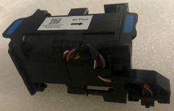
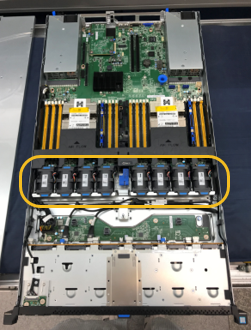
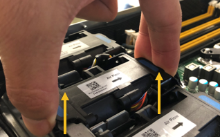
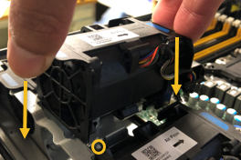
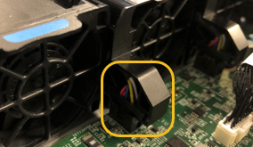

= Lüfter im SG6000-CN-Rechnercontroller ersetzen
:allow-uri-read: 
:icons: font
:imagesdir: ../media/

[role="lead"]
Der Computercontroller SG6000-CN verfügt über acht Kühllüfter.  Wenn einer der Lüfter ausfällt, müssen Sie ihn so schnell wie möglich austauschen, um eine ausreichende Kühlung des Controllers zu gewährleisten.

.Bevor Sie beginnen
* Sie haben den Ersatzlüfter ausgepackt.
* Das ist schon link:locating-controller-in-data-center.html["Das Gerät befindet sich physisch"].
* Sie haben bestätigt, dass die anderen Lüfter installiert sind und ausgeführt werden.

.Über diese Aufgabe
Während Sie den Lüfter austauschen, ist der Speicherknoten nicht zugänglich.

Das Foto zeigt einen Lüfter für den Compute Controller SG6000-CN.  Die Kühllüfter sind zugänglich, nachdem Sie die obere Abdeckung vom Controller abgenommen haben.

NOTE: Jede der beiden Netzteile enthält zudem einen Lüfter. Diese Lüfter sind in diesem Verfahren nicht enthalten.

.Schritte
. link:power-sg6000-cn-controller-off-on.html["Fahren Sie den SG6000-CN-Controller herunter"] .
. Heben Sie die Verriegelung an der oberen Abdeckung an, und entfernen Sie die Abdeckung vom Gerät.
. Suchen Sie den Lüfter, der ausgefallen ist.
+

. Heben Sie den defekten Lüfter aus dem Gehäuse.
+

. Schieben Sie den Ersatzlüfter in den offenen Steckplatz des Gehäuses.
+
Führen Sie die Kante des Lüfters mit dem Führungsstift nach oben. Der Stift ist im Foto eingekreist.

+

. Drücken Sie den Lüfteranschluss fest in die Leiterplatte.
+

. Setzen Sie die obere Abdeckung wieder auf das Gerät, und drücken Sie die Verriegelung nach unten, um die Abdeckung zu sichern.
. link:power-sg6000-cn-controller-off-on.html#poweron["Schalten Sie den SG6000-CN-Controller ein"] .
. Vergewissern Sie sich, dass der Appliance-Node im Grid Manager angezeigt wird und keine Meldungen angezeigt werden.

Nach dem Austausch des Teils senden Sie das fehlerhafte Teil an NetApp zurück, wie in den mit dem Kit gelieferten RMA-Anweisungen beschrieben. Siehe https://mysupport.netapp.com/site/info/rma["Teilerückgabe  Austausch"^] Seite für weitere Informationen.
