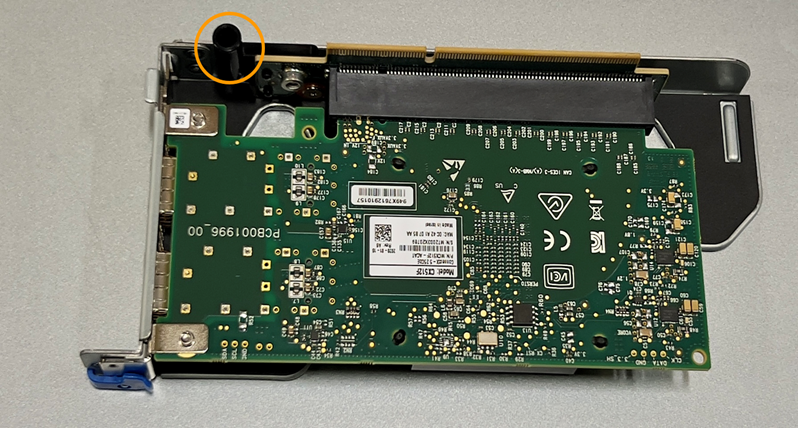

= Ersetzen Sie die interne NIC im SGF6112 oder SG6100-CN
:allow-uri-read: 
:icons: font
:imagesdir: ../media/

[role="lead"]
Möglicherweise müssen Sie eine interne Netzwerkschnittstellenkarte (NIC) im SGF6112 oder SG6100-CN ersetzen, wenn sie nicht optimal funktioniert oder ausgefallen ist.

Mit diesen Verfahren können Sie:

* Entfernen Sie die NIC
* Installieren Sie die NIC neu

== Entfernen Sie die interne NIC

.Bevor Sie beginnen
* Sie haben die richtige Ersatz-NIC.
* Sie haben die festgelegt link:verify-component-to-replace.html["Position der zu ersetzenden NIC"].
* Das ist schon link:locating-sgf6112-in-data-center.html["Physische Lage der SGF6112 Appliance oder des SG6100-CN Controllers"] Wo Sie die NIC im Rechenzentrum ersetzen.
+

NOTE: A link:power-sgf6112-off-on.html#shut-down-the-sgf6112-appliance["Kontrolliertes Herunterfahren des Geräts"] Ist erforderlich, bevor Sie das Gerät aus dem Rack entfernen.

* Sie haben alle Kabel und getrennt link:reinstalling-sgf6112-cover.html["Die Geräteabdeckung entfernt"].

.Über diese Aufgabe
Um Serviceunterbrechungen zu vermeiden, vergewissern Sie sich, dass alle anderen Speicher-Nodes mit dem Grid verbunden sind, bevor Sie den Austausch der Netzwerkschnittstellenkarte (NIC) starten oder die NIC während eines geplanten Wartungsfensters austauschen, wenn Serviceunterbrechungen akzeptabel sind. Weitere Informationen finden Sie unter https://docs.netapp.com/us-en/storagegrid-118/monitor/monitoring-system-health.html#monitor-node-connection-states["Monitoring der Verbindungsstatus der Nodes"^].

CAUTION: Wenn Sie jemals eine ILM-Regel verwendet haben, die nur eine Kopie eines Objekts erstellt, müssen Sie die NIC während eines geplanten Wartungsfensters ersetzen, da während dieses Vorgangs vorübergehend der Zugriff auf diese Objekte verloren geht. Siehe Informationen zu https://docs.netapp.com/us-en/storagegrid-118/ilm/why-you-should-not-use-single-copy-replication.html["Warum sollten Sie die Single-Copy-Replizierung nicht verwenden"^].

.Schritte
. Wickeln Sie das Gurt-Ende des ESD-Armbands um Ihr Handgelenk, und befestigen Sie das Clip-Ende auf einer Metallmasse, um eine statische Entladung zu verhindern.
. Suchen Sie die Riserbaugruppe, in der sich die NIC auf der Rückseite des Geräts befindet.
+
Die drei NICs im Gerät befinden sich in zwei Riserbaugruppen an den Positionen im Gehäuse, die auf dem Foto gezeigt werden (Rückseite des Geräts mit entfernter oberer Abdeckung):

+
image::../media/sgf6112-nic-positions.jpg[NIC-Positionen]

+
[cols="1a,2a,4a"]
|===
|  | Geräte- oder Teilename | Beschreibung 

 a| 
1
 a| 
Schluck1/Schluck2
 a| 
10/25-GbE-Ethernet-Netzwerkports in der zwei-Port-Riser-Baugruppe

 a| 
2
 a| 
Mtc1/mtc2
 a| 
1/10GBase-T-Management-Ports in der zwei-Port-Riser-Baugruppe

 a| 
3
 a| 
Hik3/hik4
 a| 
10/25-GbE-Ethernet-Netzwerkports in der ein-Port-Riser-Baugruppe

 a| 
4
 a| 
Steckplatzbaugruppe mit zwei Steckplätzen
 a| 
Unterstützung für eine der 10/25-GbE-NICs und die 1/10GBase-T-NIC

 a| 
5
 a| 
Steckplatzbaugruppe
 a| 
Unterstützung für eine der 10/25-GbE-NICs

|===
. Fassen Sie die Riser-Baugruppe mit der fehlerhaften NIC durch die blau markierten Löcher, und heben Sie sie vorsichtig nach oben. Bewegen Sie die Riser-Baugruppe beim Anheben in Richtung Gehäusevorderseite, damit die externen Anschlüsse in den installierten NICs das Gehäuse entfernen können.
. Platzieren Sie den Riser auf einer flachen antistatischen Oberfläche mit der Metallrahmen-Seite nach unten, um Zugang zu den NICs zu erhalten.
+
** *Zwei-Steckplatz-Riser-Baugruppe mit zwei NICs*
+
image::../media/two-slot-assembly-sgf6112.png[Zwei NICs in der Riserbaugruppe mit zwei Steckplätzen]

** *Einsteckmontage mit einem NIC*
+
image::../media/one-slot-assembly-sgf6112.png[NIC in Riser-Baugruppe mit einem Steckplatz]

. Öffnen Sie die blaue Verriegelung (eingekreist) auf der zu ersetzenden NIC, und entfernen Sie die NIC vorsichtig aus der Riserbaugruppe. Führen Sie die NIC leicht durch, um die NIC aus ihrem Anschluss zu entfernen. Verwenden Sie keine übermäßige Kraft.
. Stellen Sie die NIC auf eine flache antistatische Oberfläche.

== Installieren Sie die interne NIC neu

Installieren Sie die Ersatz-NIC an derselben Stelle wie die entfernte.

.Bevor Sie beginnen
* Sie haben die richtige Ersatz-NIC.
* Sie haben die vorhandene fehlerhafte NIC entfernt.

.Schritte
. Wickeln Sie das Gurt-Ende des ESD-Armbands um Ihr Handgelenk, und befestigen Sie das Clip-Ende auf einer Metallmasse, um eine statische Entladung zu verhindern.
. Nehmen Sie die Ersatz-NIC aus der Verpackung.
. Wenn Sie eine der NICs in der Riserbaugruppe mit zwei Steckplätzen austauschen, gehen Sie wie folgt vor:
+
.. Stellen Sie sicher, dass sich die blaue Verriegelung in der geöffneten Position befindet.
.. Richten Sie die NIC an ihrem Anschluss an der Riserbaugruppe aus. Drücken Sie die NIC vorsichtig in den Anschluss, bis sie vollständig eingesetzt ist, wie auf dem Foto gezeigt, und schließen Sie dann die blaue Verriegelung.
+
image::../media/two-slot-assembly-sgf6112.png[Zwei NICs in der Riserbaugruppe mit zwei Steckplätzen]

.. Suchen Sie die Ausrichtungsbohrung auf der Riserbaugruppe mit zwei Steckplätzen (eingekreist), die mit einem Führungsstift auf der Systemplatine ausgerichtet ist, um sicherzustellen, dass die Riserbaugruppe richtig positioniert ist.
+
image::../media/sgf6112_two-slot-riser_alignment_hole.png[Ausrichtungsbohrung auf der großen Riserbaugruppe]

.. Suchen Sie den Führungsstift auf der Systemplatine
+
image::../media/sgf6112_two-slot-riser_guide-pin.png[Führungsstift für Steckerbaugruppe mit zwei Steckplätzen]

.. Positionieren Sie die Riser-Baugruppe im Gehäuse, und achten Sie darauf, dass sie mit dem Anschluss auf der Systemplatine und dem Führungsstift ausgerichtet ist.
.. Drücken Sie die Steckerbaugruppe mit zwei Steckplätzen vorsichtig entlang der Mittellinie neben den blau markierten Löchern, bis sie vollständig eingesetzt ist.

. Wenn Sie die NIC in der Einsteckkarte austauschen, gehen Sie wie folgt vor:
+
.. Stellen Sie sicher, dass sich die blaue Verriegelung in der geöffneten Position befindet.
.. Richten Sie die NIC an ihrem Anschluss an der Riserbaugruppe aus. Drücken Sie die NIC vorsichtig in den Anschluss, bis sie wie auf dem Foto gezeigt vollständig eingesetzt ist, und schließen Sie die blaue Verriegelung.
+
image::../media/one-slot-assembly-sgf6112.png[NIC in Riser-Baugruppe mit einem Steckplatz]

.. Suchen Sie die Ausrichtungsbohrung auf der Einsteckkarte (eingekreist), die mit einem Führungsstift auf der Systemplatine ausgerichtet ist, um sicherzustellen, dass die Riserbaugruppe richtig positioniert ist.
+

.. Suchen Sie den Führungsstift auf der Systemplatine
+
image::../media/sgf6112_one-slot-riser_system-pin.png[Führungsstift an der Steckplatzbaugruppe]

.. Positionieren Sie die Steckplatzbaugruppe im Gehäuse, und achten Sie darauf, dass sie mit dem Anschluss auf der Systemplatine und dem Führungsstift ausgerichtet ist.
.. Drücken Sie die Steckerbaugruppe mit einem Steckplatz vorsichtig entlang der Mittellinie neben den blau markierten Löchern, bis sie vollständig eingesetzt ist.

. Entfernen Sie die Schutzkappen von den NIC-Ports, an denen Sie die Kabel neu installieren.

.Nachdem Sie fertig sind
Wenn Sie keine weiteren Wartungsmaßnahmen im Gerät durchführen müssen, setzen Sie die Geräteabdeckung wieder ein, bringen Sie das Gerät wieder in das Rack ein, schließen Sie die Kabel an und schalten Sie das Gerät mit Strom aus.

Nach dem Austausch des Teils senden Sie das fehlerhafte Teil an NetApp zurück, wie in den mit dem Kit gelieferten RMA-Anweisungen beschrieben. Siehe https://mysupport.netapp.com/site/info/rma["Teilerückgabe  Austausch"^] Seite für weitere Informationen.
