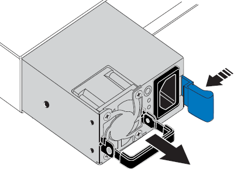

= Tauschen Sie eines oder beide Netzteile im SGF6212 oder SG6200-CN aus.
:allow-uri-read: 
:icons: font
:imagesdir: ../media/

[role="lead"]
Die Appliance SGF6212 und der Compute-Node SG6200-CN verfügen über zwei Netzteile für Redundanz. Fällt eines der Netzteile aus, muss es so bald wie möglich ausgetauscht werden, um sicherzustellen, dass die Appliance über redundante Stromversorgung verfügt. Beide in der Appliance betriebenen Netzteile müssen vom gleichen Modell und mit der gleichen Wattzahl sein.

.Über diese Aufgabe
Die Abbildung zeigt die Position der beiden Netzteile. Die Netzteile sind von der Rückseite des Geräts zugänglich.

image::../media/sgf6212_power_supplies.png[Rückseite des SGF6212 oder SG6200-CN mit zwei Netzteilen]

+ HINWEIS: Das Bild zeigt das SGF6212 appliance, die Netzteile befinden sich jedoch an der gleichen Position auf dem SG6200-CN compute node.

.Bevor Sie beginnen
* Sie haben link:locating-sg6200-in-data-center.html["Das Gerät befindet sich physisch"] mit dem auszutauschenden Netzteil.
* Das ist schon link:verify-component-to-replace.html["Standort des zu ersetzenden Netzteils ermittelt"].
* Wenn Sie nur ein Netzteil ersetzen:
+
** Sie haben das Ersatznetzteil entpackt und sichergestellt, dass es das gleiche Modell und die gleiche Stromleistung wie das Netzteil ist, das Sie ersetzen.
** Sie haben bestätigt, dass das andere Netzteil installiert ist und in Betrieb ist.

* Wenn Sie beide Netzteile gleichzeitig ersetzen:
+
** Sie haben die Ersatz-Netzteile entpackt und sichergestellt, dass sie das gleiche Modell und die gleiche Wattzahl haben.

.Schritte
. Wenn Sie nur ein Netzteil ersetzen, müssen Sie das Gerät nicht herunterfahren. Wechseln Sie zum <<Unplug_the_power_cord,Ziehen Sie das Netzkabel ab>> Schritt: Wenn Sie beide Netzteile gleichzeitig ersetzen, gehen Sie folgendermaßen vor, bevor Sie die Netzkabel abziehen:
+
.. link:power-sg6200-off-on.html#shut-down-the-sgf6212-appliance-or-sg6200-cn-controller["Schalten Sie das Gerät aus"].
+

CAUTION: Wenn Sie jemals eine ILM-Regel verwendet haben, die nur eine Kopie eines Objekts erstellt und beide Netzteile gleichzeitig austauschen, müssen Sie die Netzteile während eines geplanten Wartungsfensters austauschen, da bei diesem Vorgang der Zugriff auf diese Objekte vorübergehend unterbrochen werden kann. Siehe Informationen über https://docs.netapp.com/us-en/storagegrid/ilm/why-you-should-not-use-single-copy-replication.html["Warum sollten Sie die Single-Copy-Replizierung nicht verwenden"^].

. [[Trenne den Netzstecker_Power_cordel, Start=2]]] Trennen Sie das Netzkabel von jedem zu ersetzenden Netzteil.
+
Von der Rückseite des Geräts aus gesehen befindet sich das Netzteil A (PSU0) auf der rechten Seite und das Netzteil B (PSU1) auf der linken Seite.

. Heben Sie den Griff am ersten zu ersetzenden Netzteil an.
+
image::../media/sg6000_cn_lift_cam_handle_psu.gif[Heben Sie den Griff an, um das Netzteil zu entfernen]

. Drücken Sie auf den blauen Riegel, und ziehen Sie das Netzteil heraus.
+

. Schieben Sie das Ersatznetzteil mit der blauen Verriegelung nach rechts in das Gehäuse.
+

NOTE: Beide Netzteile müssen das gleiche Modell und die gleiche Wattzahl haben.

+
Stellen Sie sicher, dass sich die blaue Verriegelung auf der rechten Seite befindet, wenn Sie die Ersatzeinheit einschieben.

+
Sie werden ein Klicken spüren, wenn das Netzteil einrastet.

+
image::../media/sg6000_cn_insert_power_supply.gif[Gleitende Stromversorgung]

. Drücken Sie den Griff wieder gegen das Gehäuse des Netzteils.
. Wenn Sie beide Netzteile austauschen, wiederholen Sie die Schritte 2 bis 6, um das zweite Netzteil auszutauschen.
. link:../installconfig/connecting-power-cords-and-applying-power.html["Schließen Sie die Stromkabel an die ersetzten Geräte an, und wenden Sie Strom an"].

Nach dem Austausch des Teils senden Sie das defekte Teil an NetApp zurück, wie in der mit dem Kit gelieferten RMA-Anleitung beschrieben. Siehe die https://mysupport.netapp.com/site/info/rma["Teilerückgabe  -ersatz"^] Seite für weitere Informationen.
